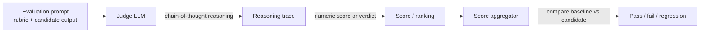

## Definition

**LLM-as-judge** is an evaluation methodology in which a powerful language model (the "judge") scores or ranks the outputs of another model (the "candidate"). Because human annotation is expensive and slow, LLM judges offer a scalable alternative that correlates surprisingly well with human preference — provided the judge and its biases are properly understood.

The judge receives a rubric — a set of criteria such as accuracy, coherence, helpfulness, or safety — and produces either a scalar score, a pass/fail verdict, or a ranking. The rubric can be generic (is this response helpful?) or task-specific (does this SQL query return the correct rows?).

Three dominant patterns have emerged:
- **G-Eval**: Criteria-based scoring with chain-of-thought; the judge reasons through each criterion before producing a numeric score on a 1–5 or 1–10 scale.
- **Pairwise comparison**: Two responses are shown side-by-side; the judge picks the better one. Aggregated over many pairs this produces a ranking analogous to an Elo ladder.
- **Reference-guided scoring**: The judge compares the candidate output to a gold reference answer and scores faithfulness or completeness.

## How it works

The evaluation prompt packages the rubric, the candidate output, and optionally a reference answer. The judge reasons step-by-step (chain-of-thought) before producing a score, which reduces anchoring errors. Scores across a test dataset are aggregated into a mean or pass-rate metric and compared against a baseline version.

## When to use / When NOT to use

| Scenario | Use LLM-as-judge | Use other method |
|---|---|---|
| No ground-truth reference available | Yes — LLM judges shine on open-ended tasks | No — if you have references, BERTScore or exact match are cheaper |
| Need to evaluate at scale (>1K samples/day) | Yes — far cheaper than human annotation | No — for small datasets, human review is more trustworthy |
| Judging creative writing quality | Yes — nuanced rubrics capture style and tone | No — lexical metrics (BLEU) are useless for creativity |
| Safety evaluation (harmful content) | Yes — specialized safety judges (Llama Guard) | No — general-purpose judges miss subtle policy violations |
| The candidate and judge are the same model | No — self-preference bias inflates scores | Yes — use a different judge model |

## Known biases and mitigations

| Bias | Description | Mitigation |
|---|---|---|
| Verbosity bias | Judges prefer longer, more detailed answers regardless of quality | Length-normalize prompts; use rubric that explicitly penalizes padding |
| Self-preference | A model judges its own outputs more favorably | Always use a different model as judge |
| Position bias | In pairwise, the first response is favored | Run both orderings (A vs B and B vs A) and average |
| Sycophancy | Judge inflates scores when candidate seems confident | Use adversarial test cases where confident-sounding outputs are wrong |
| Reference anchoring | If a gold reference is shown, judge anchors too heavily on it | Evaluate reference-free and reference-guided separately |

## Validation checklist

Before deploying an LLM judge in production:
1. Sample 100–200 examples and have humans annotate them.
2. Compute correlation (Spearman or Kendall-τ) between judge scores and human scores.
3. Verify there is no significant position or verbosity bias on your specific rubric.
4. Set a minimum correlation threshold (e.g. ρ > 0.7) before trusting the judge at scale.

## Sources

- [G-Eval paper — NLG evaluation with GPT-4](https://arxiv.org/abs/2303.16634) — original G-Eval criteria + chain-of-thought judge paper (Yang et al., 2023)
- [DeepEval — LLM-as-a-judge guide](https://deepeval.com/guides/guides-llm-as-a-judge) — practical guide to G-Eval and ArenaGEval pairwise judging
- [Rubric-based evals and judge bias — Adnan Masood](https://medium.com/@adnanmasood/rubric-based-evals-llm-as-a-judge-methodologies-and-empirical-validation-in-domain-context-71936b989e80) — 2026 survey of bias types and empirical validation approaches
- [Chatbot Arena — LMSYS](https://lmsys.org/blog/2023-05-03-arena/) — pairwise evaluation at scale producing Elo rankings

## See also

- [Evals](/docs/evals)
- [Eval frameworks](/docs/evals/eval-frameworks)
- [Benchmark contamination](/docs/evals/benchmark-contamination)
- [Evaluation metrics](/docs/evaluation-metrics)
