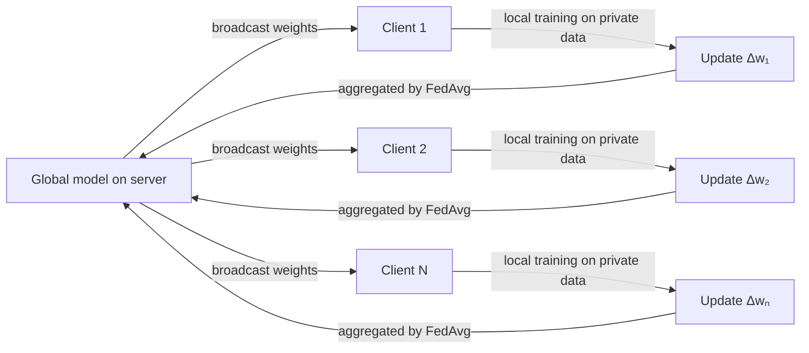

## Definition

Federated learning (FL) is a distributed machine learning paradigm where a model is trained across many devices or organizational silos without the raw data ever leaving its source. Instead of centralizing sensitive data on a server, each participant trains locally and shares only model updates — gradients or weight deltas — with a central coordinator. The coordinator aggregates these updates to improve a shared global model, then redistributes it for the next round.

The approach was introduced by Google (McMahan et al., 2017) to train next-word prediction models on Android phones without uploading user keystrokes. The key privacy benefit is that raw data remains on the device or within the organization's boundary. However, model updates can still leak information about training data through inference attacks; techniques such as **differential privacy** (adding calibrated noise to updates) and **secure aggregation** (cryptographic aggregation that prevents the server from seeing individual updates) provide stronger guarantees.

Federated learning is used whenever data is legally, ethically, or practically constrained from being pooled — healthcare institutions collaborating on diagnostic models, banks training fraud detectors across branches, or smartphones improving on-device language models. It intersects with [machine learning](/docs/fundamentals/machine-learning) fundamentals and raises important concerns discussed in [AI ethics](/docs/ai-ethics). Key challenges include **statistical heterogeneity** (non-IID data across clients), **system heterogeneity** (varying device compute and availability), and **communication efficiency** (minimizing bandwidth for update transmission).

## How it works

### The federated round

Each training round follows the same pattern: the server broadcasts the current global model, selected clients train locally, and their updates are sent back and aggregated.



### FedAvg aggregation

The most common aggregation algorithm, **FedAvg**, computes a weighted average of client model weights, where each client is weighted by the size of its local dataset:

```
w_global = Σ (nₖ / n_total) · wₖ
```

Clients run multiple local SGD steps before sending updates, reducing communication rounds.

### Privacy enhancements

**Differential privacy (DP)** clips each client's gradient and adds Gaussian noise before transmission, bounding the influence any single user's data can have on the model. **Secure aggregation** uses cryptographic protocols so the server only sees the sum of updates, never individual client updates.

### Challenges

**Non-IID data** means local datasets may be highly skewed (e.g., a hospital that only sees rare diseases), causing local models to diverge from the global optimum. Algorithms like FedProx and SCAFFOLD add proximal terms or control variates to counteract this drift. **Client dropout** (devices going offline mid-round) requires robust aggregation that handles partial participation.

## When to use / When NOT to use

| Scenario | Use federated learning | Avoid federated learning |
|---|---|---|
| Data cannot leave its source (legal, regulatory) | Yes — core use case | No — if data can be pooled, centralized training is simpler |
| Mobile/edge devices with local data | Yes — phones, wearables, IoT sensors | No — if devices lack compute for local training |
| Cross-organization collaboration on sensitive data | Yes — hospitals, banks, government agencies | No — if organizations are unwilling to share even model updates |
| Small number of participants with stable connections | Partial — FL works but adds overhead | Prefer centralized training if data sharing is permitted |
| Real-time, low-latency model updates | No — multi-round communication adds delay | — |

## Comparisons

| Approach | Data location | Privacy | Communication cost | Scalability |
|---|---|---|---|---|
| Centralized training | Central server | Low (data exposed) | Low | High |
| Federated learning | On-device / silo | Medium–High | High | Medium |
| Split learning | Distributed layers | Medium | Medium | Medium |
| FL + differential privacy | On-device / silo | High | High | Medium |

## Pros and cons

| Pros | Cons |
|---|---|
| Raw data never leaves the device or organization | Model updates can still leak private information |
| Enables collaboration without data sharing | Non-IID data causes client drift, degrading convergence |
| Scales to millions of devices (e.g., Android) | High communication overhead across many rounds |
| Compatible with differential privacy for stronger guarantees | Stragglers and dropped clients complicate aggregation |

## Code examples

Simulated federated training with FedAvg using Flower:

```python
import flwr as fl
import torch
import torch.nn as nn
from torch.utils.data import DataLoader, TensorDataset

# Simple model
class Net(nn.Module):
    def __init__(self):
        super().__init__()
        self.fc = nn.Linear(20, 1)
    def forward(self, x):
        return self.fc(x)

# Flower client: wraps local training
class FedClient(fl.client.NumPyClient):
    def __init__(self, data):
        self.model = Net()
        self.loader = DataLoader(data, batch_size=32, shuffle=True)

    def get_parameters(self, config):
        return [p.detach().numpy() for p in self.model.parameters()]

    def set_parameters(self, parameters):
        for p, w in zip(self.model.parameters(), parameters):
            p.data = torch.tensor(w)

    def fit(self, parameters, config):
        self.set_parameters(parameters)
        opt = torch.optim.SGD(self.model.parameters(), lr=0.01)
        loss_fn = nn.MSELoss()
        for x, y in self.loader:
            opt.zero_grad()
            loss_fn(self.model(x), y).backward()
            opt.step()
        return self.get_parameters(config), len(self.loader.dataset), {}

    def evaluate(self, parameters, config):
        self.set_parameters(parameters)
        # Simplified: return dummy loss
        return 0.0, len(self.loader.dataset), {"accuracy": 0.0}

# Simulate client with synthetic data
data = TensorDataset(torch.randn(100, 20), torch.randn(100, 1))
client = FedClient(data)

# Start Flower client (connect to a running Flower server)
# fl.client.start_numpy_client(server_address="localhost:8080", client=client)
print("Client ready. In a real scenario, call fl.client.start_numpy_client().")
```

## Practical resources

- [Communication-Efficient Learning of Deep Networks (McMahan et al., 2017)](https://arxiv.org/abs/1602.05629) — Original FedAvg paper from Google
- [TensorFlow Federated](https://www.tensorflow.org/federated) — Google's open-source framework for federated computations
- [Flower (flwr)](https://flower.dev/) — Framework-agnostic FL library supporting PyTorch, TensorFlow, JAX
- [PySyft](https://github.com/OpenMined/PySyft) — Privacy-preserving ML with differential privacy and secure aggregation

## See also

- [Machine learning](/docs/fundamentals/machine-learning)
- [Privacy and AI ethics](/docs/ai-ethics)
