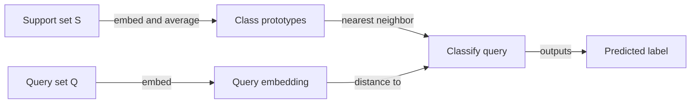
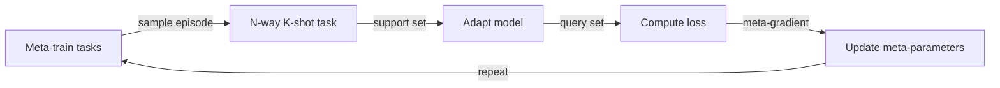

## Definition

Few-shot learning is the ability of a model to generalize to new tasks or classes from a very small number of labeled examples — typically 1 to 5 per class (1-shot, 5-shot). Rather than requiring hundreds or thousands of labeled samples, few-shot learning systems leverage prior knowledge (from pretraining or meta-training) to extract maximum signal from minimal data. The challenge is distinct from standard supervised learning: the model must **adapt quickly** at test time, not just fit a large training set.

Two main paradigms have emerged. **Meta-learning** (learning to learn) trains models over many different few-shot tasks sampled from a meta-train set, so the model explicitly learns how to adapt. MAML (Model-Agnostic Meta-Learning) optimizes for a parameter initialization that can be fine-tuned in a few gradient steps on any new task. **Metric-based** methods (Prototypical Networks, Matching Networks) learn an embedding space where classification reduces to nearest-neighbor search relative to class prototypes computed from support examples.

The third paradigm — **in-context learning** — is specific to large [LLMs](/docs/llms): the support examples are simply prepended to the prompt as demonstrations, and the model conditions on them without any gradient updates. GPT-3 popularized this approach, demonstrating that sufficiently large language models can perform novel tasks from just a handful of examples in the context window. Few-shot learning sits between [transfer learning](/docs/transfer-learning) (which requires more labeled target data) and [zero-shot learning](/docs/zero-shot-learning) (which requires none).

## How it works

### Episodic task structure

Every few-shot task is defined by a **support set** (N classes × K examples = N-way K-shot) and a **query set** (examples to classify). The model adapts to the support set and predicts labels for the query set.

### Meta-learning (MAML)

MAML learns a model initialization θ such that a few gradient steps on the support set of any new task yields good performance on that task's query set. The meta-objective is: update θ so that θ − α·∇L_task is good across all sampled tasks.

### Metric-based methods

Prototypical Networks compute a **prototype** for each class by averaging the embeddings of its support examples. Query examples are classified by their distance to the nearest prototype in the embedding space.

### In-context few-shot (LLMs)

No gradient updates occur. The prompt contains the support examples formatted as demonstrations, and the model completes the query based on pattern matching from pretraining.



### Episodic training



## When to use / When NOT to use

| Scenario | Use few-shot learning | Avoid few-shot learning |
|---|---|---|
| Only 1–20 labeled examples per class | Yes — purpose-built for data scarcity | No — standard supervised learning if data is sufficient |
| LLM inference with examples in the prompt | Yes — in-context few-shot is free at inference | No — fine-tuning is better for consistent, high-volume tasks |
| Rapid adaptation to new classes without retraining | Yes — prototypical networks or MAML | No — if new classes are stable and labeled data can be collected |
| Entirely new domain with no pretrained model | No — pretraining is a prerequisite | — |
| High accuracy on a fixed, well-labeled dataset | No — supervised learning outperforms | — |

## Comparisons

| Approach | Examples needed | Adaptation mechanism | Gradient updates at test time |
|---|---|---|---|
| Zero-shot learning | 0 | Prompt / text description | No |
| Few-shot learning (in-context) | 1–10 | In-context demonstrations | No |
| Few-shot learning (MAML) | 1–10 | Inner-loop gradient steps | Yes (few steps) |
| Transfer learning / fine-tuning | 100–10K+ | Full or partial fine-tuning | Yes (many steps) |
| Supervised learning | 1K–1M+ | Standard SGD | Yes |

## Pros and cons

| Pros | Cons |
|---|---|
| Generalizes to new tasks with minimal labeled data | Performance typically below fully supervised approaches |
| In-context few-shot requires no training — just prompting | Sensitive to prompt format and example order for LLMs |
| Meta-learning enables fast adaptation across domains | Meta-training is compute-intensive (many tasks required) |
| Useful for rare categories and personalization | Support set quality heavily impacts predictions |

## Code examples

Prototypical Network inference (few-shot image classification):

```python
import torch
import torch.nn as nn

class PrototypicalNet(nn.Module):
    """Simple CNN encoder for few-shot image classification."""
    def __init__(self, embedding_dim=64):
        super().__init__()
        self.encoder = nn.Sequential(
            nn.Conv2d(1, 32, 3, padding=1), nn.ReLU(), nn.MaxPool2d(2),
            nn.Conv2d(32, 64, 3, padding=1), nn.ReLU(), nn.AdaptiveAvgPool2d(4),
            nn.Flatten(),
            nn.Linear(64 * 4 * 4, embedding_dim),
        )

    def forward(self, x):
        return self.encoder(x)

def prototypical_predict(model, support_images, support_labels, query_images, n_classes):
    """
    support_images: (N*K, C, H, W) — K examples per class, N classes
    support_labels: (N*K,)
    query_images:   (Q, C, H, W)
    Returns predicted labels for query_images.
    """
    model.eval()
    with torch.no_grad():
        support_emb = model(support_images)   # (N*K, D)
        query_emb   = model(query_images)     # (Q, D)

        # Compute class prototypes (mean embedding per class)
        prototypes = torch.stack([
            support_emb[support_labels == c].mean(0)
            for c in range(n_classes)
        ])  # (N, D)

        # Euclidean distance from each query to each prototype
        dists = torch.cdist(query_emb, prototypes)  # (Q, N)
        return dists.argmin(dim=1)  # Nearest prototype = predicted class

# Example: 5-way 1-shot, 10 query images (28x28 grayscale)
model = PrototypicalNet(embedding_dim=64)
support = torch.randn(5, 1, 28, 28)   # 1 example per class
labels  = torch.arange(5)             # Classes 0–4
queries = torch.randn(10, 1, 28, 28)

preds = prototypical_predict(model, support, labels, queries, n_classes=5)
print("Predicted labels:", preds)
```

In-context few-shot with an LLM via the OpenAI API:

```python
from openai import OpenAI

client = OpenAI()

# 3-shot sentiment classification via chat messages
response = client.chat.completions.create(
    model="gpt-4o-mini",
    messages=[
        {"role": "system", "content": "Classify the sentiment as positive or negative."},
        {"role": "user",   "content": "Review: 'Absolutely loved this movie!' Sentiment:"},
        {"role": "assistant", "content": "positive"},
        {"role": "user",   "content": "Review: 'Terrible experience, never coming back.' Sentiment:"},
        {"role": "assistant", "content": "negative"},
        {"role": "user",   "content": "Review: 'Best product I have ever bought.' Sentiment:"},
        {"role": "assistant", "content": "positive"},
        {"role": "user",   "content": "Review: 'Waste of money, very disappointed.' Sentiment:"},
    ]
)
print(response.choices[0].message.content)  # Expected: negative
```

## Practical resources

- [Model-Agnostic Meta-Learning (MAML) (Finn et al., 2017)](https://arxiv.org/abs/1703.03400) — Foundational meta-learning paper for fast few-shot adaptation
- [Prototypical Networks (Snell et al., 2017)](https://arxiv.org/abs/1703.05175) — Simple and effective metric-based few-shot classification
- [Language Models are Few-Shot Learners (Brown et al., 2020)](https://arxiv.org/abs/2005.14165) — GPT-3 paper demonstrating in-context few-shot learning at scale
- [learn2learn library](https://learn2learn.net/) — PyTorch toolkit for meta-learning algorithms including MAML

## See also

- [Zero-shot learning](/docs/zero-shot-learning)
- [LLMs](/docs/llms)
- [Transfer learning](/docs/transfer-learning)
