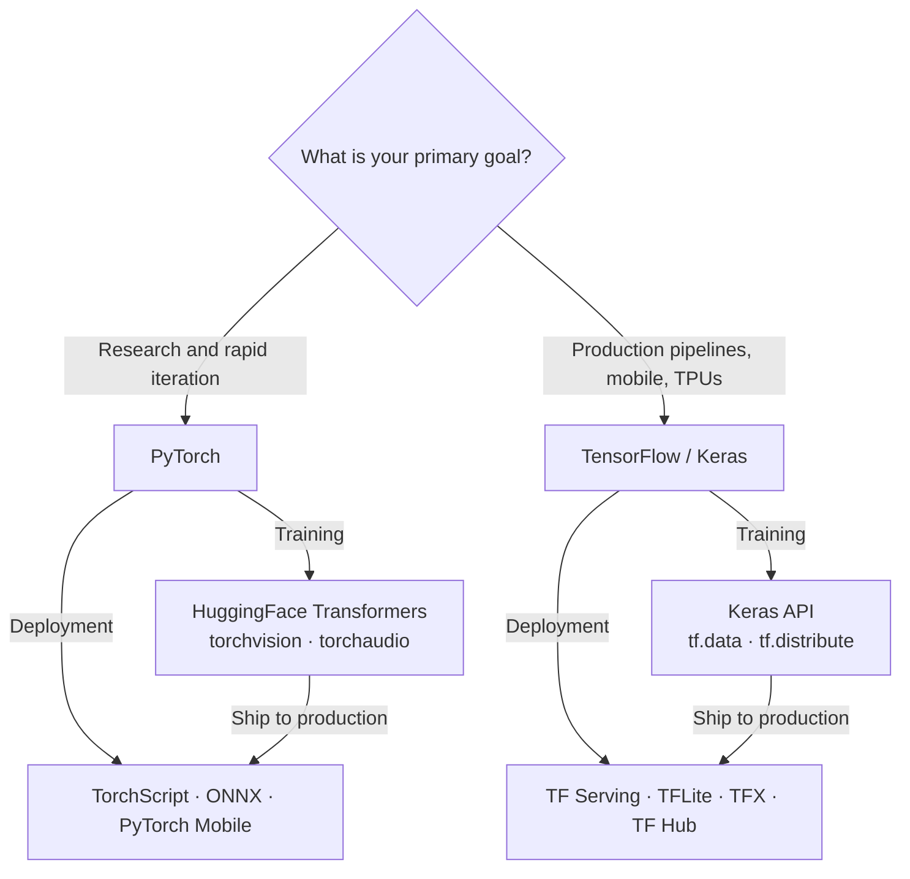

## Definition

A **deep learning framework** is a software library that provides abstractions for building, training, and deploying neural networks. The two dominant frameworks are **PyTorch** (Meta AI, 2016) and **TensorFlow** (Google, 2015). Both support automatic differentiation, GPU acceleration, and distributed training, but they have different design philosophies, strengths, and ecosystems that make them suitable for different contexts.

PyTorch uses a dynamic computation graph that is built on the fly during the forward pass, making it straightforward to debug and iterate on with standard Python tools. TensorFlow originally used static graphs (define-then-run), though TensorFlow 2.x adopted eager execution as the default. Despite convergence in day-to-day experience, the broader ecosystems — tooling, deployment targets, and community focus — remain meaningfully different.

## How it works

### Framework landscape



### Shared training abstractions

Both frameworks share the same conceptual training loop:

1. **Define** a model (layers, weights).
2. **Forward pass** — compute predictions from inputs.
3. **Loss** — measure error between predictions and labels.
4. **Backward pass** — compute gradients via automatic differentiation.
5. **Optimizer step** — update weights using the gradients.

The difference lies in API style: PyTorch uses an explicit Python loop; TensorFlow wraps this in `model.fit()` via Keras, or exposes `tf.GradientTape` for custom loops.

## When to use / When NOT to use

| Scenario | Use PyTorch | Use TensorFlow |
|---|---|---|
| Research and new architecture experiments | Yes — eager mode, Python-native debugging | — |
| Fine-tuning HuggingFace models | Yes — default backend | — |
| LLM training and inference | Yes — dominant in the LLM ecosystem | — |
| Mobile / edge deployment (iOS, Android, MCUs) | — | Yes — TFLite is first-class |
| Google Cloud and TPU training | — | Yes — first-class TPU support |
| Production pipelines with versioned serving | — | Yes — TF Serving + SavedModel + TFX |
| Academic paper reproduction | Yes — most papers ship PyTorch code | — |
| Multilingual and regional ML teams at Google scale | — | Yes — mature enterprise tooling |

## Comparisons

| Feature | PyTorch | TensorFlow / Keras |
|---|---|---|
| Execution mode | Eager (default) + TorchScript | Eager (default) + `tf.function` |
| High-level API | Lightning, Ignite (third-party) | Keras (built-in) |
| Mobile / edge | PyTorch Mobile (experimental) | TFLite (first-class) |
| TPU support | Via PyTorch/XLA | First-class |
| HuggingFace ecosystem | Default backend | Supported but secondary |
| Research adoption | Dominant | Decreasing |
| Production serving | TorchServe (growing) | TF Serving (mature) |
| Model serialization | TorchScript, ONNX | SavedModel (portable, versioned) |

## Pros and cons

| | PyTorch | TensorFlow |
|---|---|---|
| **Strengths** | Python-native debugging; dominant in research and LLM ecosystem; HuggingFace default | Mature production stack (TF Serving, TFX, TFLite); first-class TPU support; Keras simplicity |
| **Weaknesses** | Mobile deployment less mature; no built-in high-level training API | `tf.function` can obscure errors; HuggingFace ecosystem defaults to PyTorch; steeper for custom research |

## Code examples

```python
# --- PyTorch: minimal training loop ---
import torch
import torch.nn as nn

model = nn.Linear(10, 1)
optimizer = torch.optim.Adam(model.parameters(), lr=1e-3)
loss_fn = nn.MSELoss()

x = torch.randn(32, 10)
y = torch.randn(32, 1)

optimizer.zero_grad()
pred = model(x)
loss = loss_fn(pred, y)
loss.backward()
optimizer.step()

# --- TensorFlow / Keras: equivalent minimal training loop ---
import tensorflow as tf

model = tf.keras.Sequential([tf.keras.layers.Dense(1, input_shape=(10,))])
model.compile(optimizer="adam", loss="mse")

import numpy as np
x = np.random.randn(32, 10).astype("float32")
y = np.random.randn(32, 1).astype("float32")
model.fit(x, y, epochs=1, verbose=0)
```

## Sources

- [PyTorch: An Imperative Style, High-Performance Deep Learning Library (Paszke et al., 2019)](https://arxiv.org/abs/1912.01703) — Original PyTorch paper describing the design goals of dynamic computation graphs.
- [TensorFlow: A System for Large-Scale Machine Learning (Abadi et al., 2016)](https://arxiv.org/abs/1605.08695) — Original TensorFlow white paper from Google describing the dataflow graph execution model.
- [PyTorch official documentation](https://pytorch.org/docs/stable/) — Authoritative API reference and tutorials.
- [TensorFlow official documentation](https://www.tensorflow.org/guide) — Complete guide to Keras, tf.data, tf.distribute, and TFLite.
- [Keras documentation](https://keras.io/) — High-level API reference for model building and training in TensorFlow.

## See also

- [PyTorch](/docs/frameworks/pytorch)
- [TensorFlow](/docs/frameworks/tensorflow)
- [Deep learning](/docs/fundamentals/deep-learning)
- [Hugging Face](/docs/tools/huggingface)
- [Edge AI](/docs/edge-ai)
