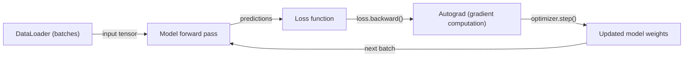
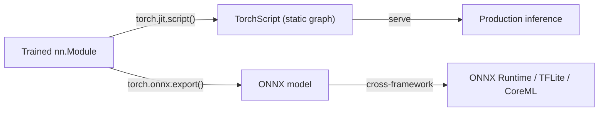

## Definition

PyTorch is a Python-first [deep learning](/docs/fundamentals/deep-learning) framework developed by Meta AI, characterized by dynamic computation graphs and an imperative programming model. Every operation executes immediately (eager mode), and the computational graph for backpropagation is constructed on the fly. This makes it straightforward to write, run, and debug neural network code using standard Python tools — print statements, debuggers, and the Python REPL all work exactly as expected.

PyTorch has become the dominant framework in research and is the foundation of the modern ML ecosystem: [Hugging Face](/docs/tools/huggingface)'s Transformers library defaults to PyTorch, most academic papers release PyTorch implementations, and libraries such as torchvision, torchaudio, torchtext, and PyTorch Geometric extend it to computer vision, audio, text, and graph domains. The framework supports CPU, GPU, Apple Silicon (MPS backend), and multi-GPU training through `torch.distributed`, with higher-level wrappers like HuggingFace Accelerate and PyTorch Lightning reducing distributed boilerplate.

Compared to [TensorFlow](/docs/frameworks/tensorflow), PyTorch is preferred for research and rapid prototyping due to its Python-native debugging experience and faster iteration cycle. TensorFlow maintains an advantage in mobile deployment (TFLite), TPU training, and production pipeline tooling. For deployment, PyTorch provides TorchScript (static graph for production), ONNX export (cross-framework interoperability), and PyTorch Mobile. Most [LLM](/docs/llms) training and fine-tuning work happens in PyTorch through the HuggingFace ecosystem.

## How it works

### Training loop



### Deployment pipeline



### Key abstractions

**`nn.Module`** — base class for all models; define `__init__` (layers) and `forward` (computation). **`autograd`** — automatic differentiation; `loss.backward()` computes gradients for all parameters. **`DataLoader`** — batching, shuffling, and multi-process data loading. **`torch.optim`** — optimizers (Adam, SGD, AdamW). **`torch.distributed`** — data parallel and model parallel distributed training.

## When to use / When NOT to use

| Scenario | Use PyTorch | Do NOT use PyTorch |
|----------|------------|-------------------|
| Research and experimenting with new architectures | Yes — eager mode, Python-native debugging | |
| Fine-tuning HuggingFace models | Yes — default backend for HuggingFace | |
| LLM training and inference workloads | Yes — dominant in LLM ecosystem | |
| Mobile or edge deployment (iOS, Android) | | [TensorFlow Lite](/docs/frameworks/tensorflow) is more mature for this |
| Training on Google TPUs | | [TensorFlow](/docs/frameworks/tensorflow) or JAX have better TPU support |
| Production ML pipelines with managed serving | | TF Serving + TFX provide a more integrated stack |

## Comparisons

| Feature | PyTorch | TensorFlow / Keras |
|---------|---------|-------------------|
| Execution mode | Eager (default) + TorchScript | Eager (default) + tf.function |
| Debugging experience | Python-native (pdb, print) | tf.function can obscure errors |
| Research adoption | Dominant | Decreasing |
| Mobile / edge | PyTorch Mobile (experimental) | TFLite (first-class) |
| HuggingFace ecosystem | Default backend | Supported but secondary |
| TPU support | Via PyTorch/XLA | First-class |
| High-level API | Lightning, Ignite (third-party) | Keras (built-in) |

## Pros and cons

| Pros | Cons |
|------|------|
| Python-native debugging with eager execution | Distributed training requires more manual setup |
| Dominant in research; most papers release PyTorch code | No built-in high-level training API (need Lightning or similar) |
| Foundation of HuggingFace ecosystem | Mobile deployment less mature than TFLite |
| Flexible; easy to implement custom layers and losses | Model serialization (TorchScript) has limitations vs SavedModel |

## Code examples

```python
import torch
import torch.nn as nn
from torch.utils.data import DataLoader, TensorDataset

# Define a simple feedforward network
class MLP(nn.Module):
    def __init__(self, in_features: int, hidden: int, num_classes: int):
        super().__init__()
        self.net = nn.Sequential(
            nn.Linear(in_features, hidden),
            nn.ReLU(),
            nn.Linear(hidden, num_classes),
        )

    def forward(self, x: torch.Tensor) -> torch.Tensor:
        return self.net(x)

model = MLP(in_features=784, hidden=256, num_classes=10)
optimizer = torch.optim.AdamW(model.parameters(), lr=1e-3)
loss_fn = nn.CrossEntropyLoss()

# Explicit training loop
for epoch in range(5):
    for x_batch, y_batch in train_loader:
        optimizer.zero_grad()
        logits = model(x_batch)
        loss = loss_fn(logits, y_batch)
        loss.backward()          # compute gradients
        optimizer.step()         # update weights

# Export for cross-framework deployment
dummy_input = torch.randn(1, 784)
torch.onnx.export(model, dummy_input, "mlp.onnx")
```

## Practical resources

- [PyTorch — Get started](https://pytorch.org/get-started/locally/) — Installation and quick start
- [PyTorch tutorials](https://pytorch.org/tutorials/) — Official tutorials from basics to distributed training
- [PyTorch documentation](https://pytorch.org/docs/stable/) — Full API reference
- [HuggingFace Accelerate](https://huggingface.co/docs/accelerate) — Distributed and mixed-precision training wrapper
- [PyTorch Lightning](https://lightning.ai/docs/pytorch/stable/) — High-level training framework built on PyTorch

## See also

- [TensorFlow](/docs/frameworks/tensorflow)
- [Hugging Face](/docs/tools/huggingface)
- [Deep learning](/docs/fundamentals/deep-learning)
