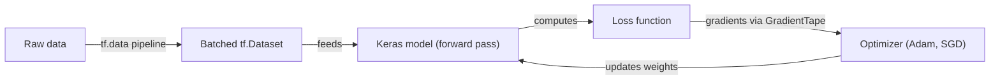
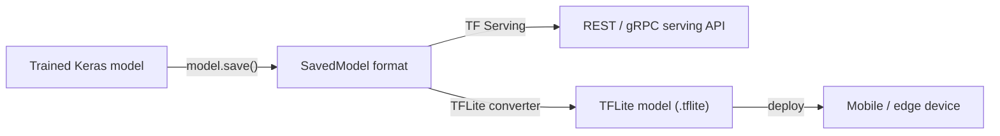

## Definition

TensorFlow is Google's open-source [deep learning](/docs/fundamentals/deep-learning) framework designed with a strong emphasis on production deployment. Originally released in 2015, it has matured into an end-to-end platform covering data pipelines (`tf.data`), model building (Keras), distributed training (`tf.distribute`), and serving (TensorFlow Serving, Vertex AI). The high-level Keras API is the primary interface for most practitioners, providing sequential and functional model construction patterns that reduce boilerplate.

TensorFlow supports a broad range of hardware targets: CPUs, NVIDIA GPUs, Google TPUs, and mobile/edge devices through TensorFlow Lite. This hardware breadth, combined with SavedModel — a standardized model serialization format — makes TensorFlow the framework of choice when the deployment target spans cloud, on-premises serving infrastructure, and on-device inference (iOS, Android, microcontrollers) within the same project.

Compared to [PyTorch](/docs/frameworks/pytorch), TensorFlow has historically been stronger in production pipelines, TPU training, and mobile deployment, while PyTorch has been preferred in research for its imperative debugging experience. Since TensorFlow 2.x introduced eager execution as the default, the day-to-day development experience has converged, but the ecosystem differences remain: TF Serving, TFLite, and TensorFlow Extended (TFX) are production-grade components with no direct PyTorch equivalent.

## How it works

### Training pipeline



### Deployment pipeline



### Key components

**Keras** — high-level API for defining layers, models, and training loops. **`tf.data`** — performant data loading, shuffling, batching, and augmentation. **`tf.distribute`** — multi-GPU and multi-host distributed training strategies. **SavedModel** — portable serialization format for inference and serving. **TensorFlow Lite** — quantized models for mobile and edge devices. **TensorFlow Hub** — pretrained models for [transfer learning](/docs/transfer-learning).

## When to use / When NOT to use

| Scenario | Use TensorFlow | Do NOT use TensorFlow |
|----------|---------------|----------------------|
| Production ML pipelines with TF Serving | Yes — native integration | |
| Mobile and edge deployment via TFLite | Yes — best-in-class edge support | |
| Training on Google TPUs | Yes — TPU support is first-class | |
| Quick research iteration and custom architectures | | [PyTorch](/docs/frameworks/pytorch) has a more natural debugging experience |
| Loading HuggingFace Transformers models | | Most HuggingFace models default to PyTorch; some support TF |
| RL research and environments | | PyTorch is more prevalent in RL research |

## Comparisons

| Feature | TensorFlow / Keras | PyTorch |
|---------|-------------------|---------|
| Primary use case | Production pipelines, mobile, TPU | Research, rapid prototyping |
| High-level API | Keras (built-in) | Lightning, Ignite (third-party) |
| Execution mode | Eager (default) + graph (tf.function) | Eager (default) + TorchScript |
| Mobile / edge | TFLite (first-class) | PyTorch Mobile (experimental) |
| TPU support | First-class | Via XLA / PyTorch/XLA |
| Ecosystem | TFX, TF Serving, TF Hub | HuggingFace, torchvision, ONNX |
| Research adoption | Decreasing | Dominant |

## Pros and cons

| Pros | Cons |
|------|------|
| Mature production ecosystem (TF Serving, TFX, TFLite) | Graph mode and `tf.function` add debugging complexity |
| First-class TPU and mobile deployment support | Steeper learning curve for custom research code |
| SavedModel is a portable, versioned format | HuggingFace ecosystem defaults to PyTorch |
| Keras provides a clean high-level API | Some APIs are still in flux across TF versions |

## Code examples

```python
import tensorflow as tf
from tensorflow import keras

# Build a simple image classifier with Keras functional API
inputs = keras.Input(shape=(28, 28, 1))
x = keras.layers.Conv2D(32, 3, activation="relu")(inputs)
x = keras.layers.GlobalAveragePooling2D()(x)
outputs = keras.layers.Dense(10, activation="softmax")(x)
model = keras.Model(inputs, outputs)

model.compile(
    optimizer="adam",
    loss="sparse_categorical_crossentropy",
    metrics=["accuracy"],
)

# Load and batch data with tf.data
(x_train, y_train), (x_test, y_test) = keras.datasets.mnist.load_data()
x_train = x_train[..., tf.newaxis] / 255.0

dataset = tf.data.Dataset.from_tensor_slices((x_train, y_train))
dataset = dataset.shuffle(10000).batch(64).prefetch(tf.data.AUTOTUNE)

model.fit(dataset, epochs=5)

# Export for serving
model.save("mnist_model")  # SavedModel format
```

## Practical resources

- [TensorFlow — Get started](https://www.tensorflow.org/tutorials) — Official tutorials covering Keras and tf.data
- [Keras documentation](https://keras.io/) — Full Keras API reference and guides
- [TensorFlow Lite — Inference guide](https://www.tensorflow.org/lite/guide) — Mobile and edge deployment
- [TensorFlow Hub](https://tfhub.dev/) — Pretrained models for transfer learning
- [TensorFlow Extended (TFX)](https://www.tensorflow.org/tfx) — Production ML pipelines

## See also

- [PyTorch](/docs/frameworks/pytorch)
- [Deep learning](/docs/fundamentals/deep-learning)
- [Infrastructure](/docs/infrastructure)
