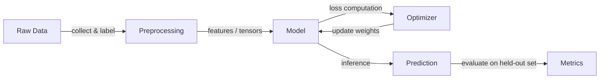

## Definition

AI fundamentals cover the core ideas behind artificial intelligence: what we mean by learning, representation, and generalization. This includes supervised and unsupervised learning, optimization, and the relationship between data, models, and objectives.

These ideas underpin both classical [machine learning](/docs/fundamentals/machine-learning) and [deep learning](/docs/fundamentals/deep-learning). Understanding them helps you choose the right paradigm, interpret results, and reason about limits (e.g. data requirements, bias, robustness).

At the heart of AI is a simple loop: you collect data that encodes some aspect of the world, you define an objective that formalizes what "good" means, and you run an optimizer that adjusts a model until it meets the objective on held-out examples. Everything else — neural architectures, regularization techniques, alignment algorithms — is a refinement of this core loop. Building intuition about each component helps you diagnose failures quickly and make principled design choices when building real systems.

## How it works



### Data collection and preprocessing

**Data** is collected or labeled; it must be representative of the real-world distribution the model will encounter. Preprocessing transforms raw inputs (images, text, tabular rows) into features or tensors the model can consume.

### Model selection and training

A **model** (e.g. a linear function, decision tree, or neural network) is chosen based on data type and task. An objective (loss for supervised/unsupervised, reward for RL) is optimized with an algorithm such as gradient descent. The **optimizer** updates model parameters to minimize loss on training data.

### Evaluation and generalization

The result is a fitted model that must generalize to new inputs. Evaluation uses train/validation/test splits. If the model performs well on training data but poorly on the test set, it is overfitting. Techniques like cross-validation, regularization, and early stopping address this. Mathematical foundations — probability, linear algebra, calculus — tie every step together.

## When to use / When NOT to use

| Scenario | Use AI/ML? | Notes |
|---|---|---|
| Complex pattern recognition from large data | Yes | ML excels when rules are hard to hand-code |
| Well-defined rule-based logic (e.g. tax calculations) | No | Deterministic code is simpler and more auditable |
| Labeled data is available and plentiful | Yes | Supervised learning works best here |
| Data is very scarce (< few hundred examples) | With caution | Few-shot or transfer learning may still apply |
| Real-time decisions requiring strict guarantees | No | ML models are probabilistic; use with fallbacks |
| Exploration or recommendation with user feedback | Yes | RL and collaborative filtering shine here |

## Comparisons

| Concept | Description | Typical Data | Requires Labels |
|---|---|---|---|
| Supervised learning | Learn from labeled examples | Structured, images, text | Yes |
| Unsupervised learning | Find structure without labels | Any | No |
| Reinforcement learning | Learn from reward signals | Sequential/interactive | No (uses rewards) |
| Classical rule systems | Hand-coded logic | Any | No |

## Code examples

```python
# Minimal supervised learning pipeline with scikit-learn
from sklearn.datasets import load_iris
from sklearn.model_selection import train_test_split
from sklearn.preprocessing import StandardScaler
from sklearn.linear_model import LogisticRegression
from sklearn.metrics import accuracy_score

# 1. Load data
X, y = load_iris(return_X_y=True)

# 2. Split into train / test
X_train, X_test, y_train, y_test = train_test_split(
    X, y, test_size=0.2, random_state=42
)

# 3. Preprocess
scaler = StandardScaler()
X_train = scaler.fit_transform(X_train)
X_test = scaler.transform(X_test)

# 4. Train model
model = LogisticRegression(max_iter=200)
model.fit(X_train, y_train)

# 5. Evaluate
preds = model.predict(X_test)
print(f"Accuracy: {accuracy_score(y_test, preds):.2%}")
```

## Practical resources

- [Google ML crash course](https://developers.google.com/machine-learning/crash-course) — Comprehensive introduction to ML concepts with interactive exercises
- [MIT 6.S191 – Introduction to Deep Learning](http://introtodeeplearning.com/) — Lecture slides, videos, and labs covering the full deep learning stack
- [fast.ai – Practical Deep Learning for Coders](https://course.fast.ai/) — Top-down, code-first introduction ideal for practitioners

## See also

- [Machine learning](/docs/fundamentals/machine-learning)
- [Deep learning](/docs/fundamentals/deep-learning)
- [Neural networks](/docs/neural-networks)
