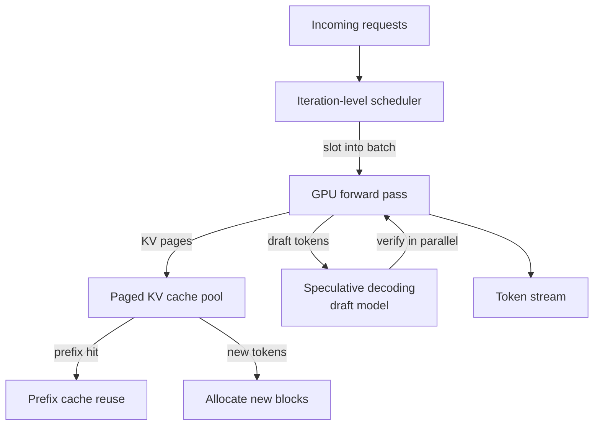

## Definition

**LLM inference optimization** is the engineering discipline of reducing the latency, memory footprint, and cost of running large language models at serving time — without retraining or substantially degrading quality. Unlike training optimization (which focuses on gradient throughput), inference optimization targets the decode loop: each forward pass that produces one new token.

The fundamental constraint is GPU memory. A 70B-parameter model in FP16 requires ~140 GB of VRAM for weights alone, and the **KV cache** — the key/value tensors that accumulate for every token in the context — grows linearly with sequence length and batch size. Managing this memory efficiently is the core challenge.

Modern inference servers address this through four interlocking techniques:
1. **PagedAttention** — OS-inspired virtual memory for the KV cache
2. **Continuous batching** — iteration-level scheduling to maximize GPU utilization
3. **Speculative decoding** — draft models that propose multiple tokens per step
4. **KV-cache reuse** — prefix caching to skip recomputation for shared prompt prefixes

These techniques are implemented in open-source serving engines — most notably **vLLM**, **SGLang**, and **TensorRT-LLM** — which wrap Hugging Face model weights and expose an OpenAI-compatible API.

## How it works

The scheduler runs after every forward pass, evicting finished sequences and inserting waiting ones — enabling maximum GPU occupancy. The KV cache is partitioned into fixed-size blocks (pages) and allocated on demand, eliminating fragmentation. Prefix caching reuses pages for repeated prompt prefixes across requests.

## When to use / When NOT to use

| Scenario | Use | Avoid |
|---|---|---|
| High-concurrency production API (>10 req/s) | Yes — continuous batching + PagedAttention are essential | No — naïve single-request inference will underutilize GPU |
| Long system prompts shared across users | Yes — prefix caching eliminates redundant prefill | No — without prefix caching, every request re-computes the system prompt |
| Low-latency single-user chatbot | Yes — speculative decoding reduces TTFT and inter-token latency | No — speculative decoding adds complexity; simple greedy decode may suffice |
| Small model on commodity hardware | Maybe — quantization + batching help; OTel-style serving is optional | Yes — a simple `transformers` pipeline may be enough |
| Research / fine-tuning experiments | No — inference engines are not designed for training or LoRA | Yes — use training-focused tools (FSDP, DeepSpeed) |

## Key concepts

| Concept | Description |
|---|---|
| KV cache | Key/value tensors stored per layer per token to avoid recomputation |
| PagedAttention | Non-contiguous block allocation for KV cache, eliminating fragmentation |
| Continuous batching | Joining/leaving requests at each iteration, not at batch boundaries |
| Speculative decoding | Small draft model proposes k tokens; target model verifies in one pass |
| Prefix caching | Reuses KV blocks for identical prompt prefixes across requests |
| Chunked prefill | Splits long prompts into chunks to interleave prefill and decode |

## Sources

- [vLLM GitHub](https://github.com/vllm-project/vllm) — primary open-source LLM serving engine; PagedAttention reference implementation
- [PagedAttention — SOSP 2023 paper](https://arxiv.org/abs/2309.06180) — original UC Berkeley paper introducing paged KV cache management
- [vLLM structured decoding blog](https://blog.vllm.ai/2025/01/14/struct-decode-intro.html) — vLLM's approach to grammar-constrained generation
- [RunPod — vLLM PagedAttention guide](https://www.runpod.io/articles/guides/vllm-pagedattention-continuous-batching) — practical deployment guide for PagedAttention and continuous batching
- [Arxiv — vLLM vs HuggingFace TGI performance](https://arxiv.org/html/2511.17593v1) — comparative benchmarks across serving systems

## See also

- [vLLM](/docs/inference-optimization/vllm)
- [Speculative decoding](/docs/inference-optimization/speculative-decoding)
- [KV cache](/docs/inference-optimization/kv-cache)
- [Quantization](/docs/quantization)
- [MLOps](/docs/mlops)
