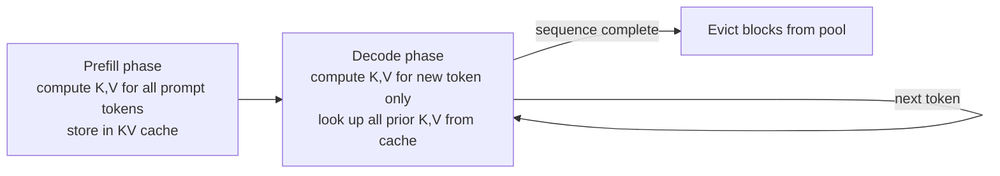

## Definition

The **KV cache** (key-value cache) is the data structure that makes autoregressive LLM inference computationally feasible. During the attention computation in a transformer, each token must attend to all previous tokens' **key** and **value** projections. Without caching, these projections would need to be recomputed from scratch for every new token — scaling inference cost quadratically with context length.

The KV cache stores the key and value tensors for every previously generated token, so that each new decode step only computes projections for the **single new token** and looks up all previous tokens from the cache. This reduces the per-step compute from O(n²) to O(n) in terms of attention, making long-context generation practical.

The trade-off is memory: the KV cache grows linearly with context length, batch size, number of layers, and number of attention heads. For a 70B model serving a 128K-token context, the KV cache can consume tens of gigabytes of VRAM — often more than the model weights themselves. Managing this memory is the central engineering challenge of LLM serving.

## How it works

### Prefill vs. decode

- **Prefill**: All prompt tokens are processed in a single forward pass, producing KV tensors for each token at each layer. These are written to the cache.
- **Decode**: One new token is generated per forward pass. Only the new token's K,V projections are computed; all prior K,V tensors are read from the cache.

Prefill is compute-bound (parallelizable across tokens). Decode is memory-bandwidth-bound (reading large KV tensors from VRAM per step). Optimizing decode is about minimizing memory movement.

## KV cache memory formula

For a single request with sequence length L:

KV memory = 2 × num_layers × num_heads × head_dim × L × dtype_bytes

For Llama-3-70B (80 layers, 64 heads, 128 head dim, FP16):
`2 × 80 × 64 × 128 × L × 2 bytes = 2.62 MB per 1K tokens`

A batch of 100 concurrent requests at 4K tokens each requires ~1 GB of KV cache memory.

## Optimization techniques

| Technique | Description | Benefit |
|---|---|---|
| PagedAttention | Non-contiguous block allocation (see vLLM) | Eliminates fragmentation; enables sharing |
| Prefix caching | Reuse KV blocks for identical prompt prefixes | System prompt computed once, amortized across requests |
| Chunked prefill | Split long prompts into chunks processed alongside decoding | Reduces prefill-decode head-of-line blocking |
| KV quantization | Store KV tensors in INT8 or FP8 instead of FP16 | 2× memory savings with ~1% quality loss |
| Multi-query attention (MQA) | All heads share a single K,V projection | Reduces KV cache size by num_heads× |
| Grouped-query attention (GQA) | Groups of heads share K,V (Llama 3, Mistral) | Intermediate between MHA and MQA |

## When to worry about KV cache

| Scenario | KV cache concern | Action |
|---|---|---|
| Long context (>32K tokens) | High — cache dominates memory | Enable KV quantization, reduce batch size |
| Many concurrent users | High — per-request cache accumulates | Use PagedAttention + eviction policy |
| Short outputs, short prompts | Low — cache is small | Standard serving, no special handling |
| Shared system prompt across all users | High — repeated prefill cost | Enable prefix caching to amortize |
| Beam search (k=4+) | Very high — k copies of the cache | Prefer sampling over beam search in production |

## Sources

- [PagedAttention paper — SOSP 2023](https://arxiv.org/abs/2309.06180) — introduced paged KV cache management to eliminate fragmentation
- [vLLM documentation — KV cache](https://docs.vllm.ai/en/latest/design/kernel/paged_attention.html) — implementation details of PagedAttention and prefix caching
- [Chunked prefill blog — vLLM](https://blog.vllm.ai/2024/09/05/perf-update.html) — vLLM's chunked prefill implementation and benchmarks
- [GQA paper](https://arxiv.org/abs/2305.13245) — grouped-query attention for KV cache compression (Ainslie et al., 2023)
- [KV cache quantization — Hooper et al. 2024](https://arxiv.org/abs/2401.18079) — KVQuant: sub-4-bit KV cache quantization

## See also

- [Inference optimization](/docs/inference-optimization)
- [vLLM](/docs/inference-optimization/vllm)
- [Speculative decoding](/docs/inference-optimization/speculative-decoding)
- [Quantization](/docs/quantization)
