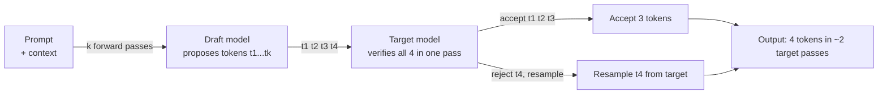

## Definition

**Speculative decoding** is a latency-reduction technique for autoregressive LLM inference that exploits the observation that token verification is cheaper than token generation. A small, fast **draft model** (also called the proposer) generates a sequence of k candidate tokens in k forward passes. The large **target model** (also called the verifier) then verifies all k tokens in a single parallel forward pass — accepting the longest prefix of tokens that match what the target would have generated, and rejecting the rest.

The key insight is that the target model's forward pass cost is roughly constant regardless of sequence length within the context window. So verifying 4 proposed tokens costs approximately the same as verifying 1 token. When the draft model's predictions are correct (acceptance rate α is high), throughput per wall-clock second increases significantly — for a user waiting on a chatbot response, this translates directly to lower time-to-first-token (TTFT) and lower inter-token latency.

Speculative decoding is **lossless by design**: it never changes the output distribution of the target model. Rejected draft tokens are discarded; the target model resamples from its own distribution at the rejection point. This guarantees the statistical properties of the large model's outputs.

## How it works

### Draft model options

| Draft strategy | Description | When to use |
|---|---|---|
| Small fine-tuned model | Separate model 10–50x smaller than target | Best acceptance rate; requires storage and memory overhead |
| n-gram matching | Proposes tokens from recent context using n-gram lookup | Zero memory overhead; effective for repetitive/templated output |
| Medusa heads | Multiple output heads on top of the target model, trained to propose k tokens | No separate model; shares target's computation |
| EAGLE | Speculative model trained on target's hidden states | High acceptance rate; tighter coupling to target architecture |

## When to use / When NOT to use

| Scenario | Use speculative decoding | Skip or defer |
|---|---|---|
| Latency-sensitive single-user interaction (chatbot) | Yes — reduces per-token latency noticeably | No — for batch throughput jobs, benefits are smaller |
| Long output sequences with repetitive structure | Yes — high draft acceptance rate | No — for short outputs (`&lt;20 tokens`), overhead may negate gains |
| Serving a model family with a matching small sibling | Yes — e.g. Llama-3-70B with Llama-3-8B draft | No — mismatched architectures produce low acceptance rates |
| Maximum GPU throughput (batch processing) | Maybe — speculative decoding can hurt batch throughput | Yes — continuous batching alone is more efficient for throughput |
| Resource-constrained deployment | No — requires loading both draft and target models | Yes — if GPU memory is already saturated |

## Acceptance rate and performance

Typical acceptance rates (α) for speculative decoding range from 0.6 to 0.85 depending on the task and draft model quality. With α = 0.75 and k = 4 draft tokens, expected speedup is approximately 2–3x for latency-bound single-user workloads. For batch workloads where the GPU is already saturated, the speedup approaches 1x — speculative decoding helps latency, not throughput.

vLLM supports speculative decoding via `--speculative-model`, `--num-speculative-tokens`, and `--speculative-draft-tensor-parallel-size`. SGLang has native Eagle support. Both engines report acceptance rate metrics for tuning.

## Sources

- [Speculative decoding paper — Chen et al. 2023](https://arxiv.org/abs/2302.01318) — original speculative decoding paper from Google DeepMind
- [Fast inference from transformers — Leviathan et al. 2023](https://arxiv.org/abs/2211.17192) — parallel speculative sampling paper (concurrent with Chen et al.)
- [EAGLE paper](https://arxiv.org/abs/2401.15077) — speculative model using target hidden states for high acceptance rate
- [vLLM speculative decoding docs](https://docs.vllm.ai/en/latest/features/spec_decode.html) — configuration guide for n-gram, draft model, and EAGLE in vLLM
- [vLLM GitHub](https://github.com/vllm-project/vllm) — source and benchmarks

## See also

- [Inference optimization](/docs/inference-optimization)
- [vLLM](/docs/inference-optimization/vllm)
- [KV cache](/docs/inference-optimization/kv-cache)
