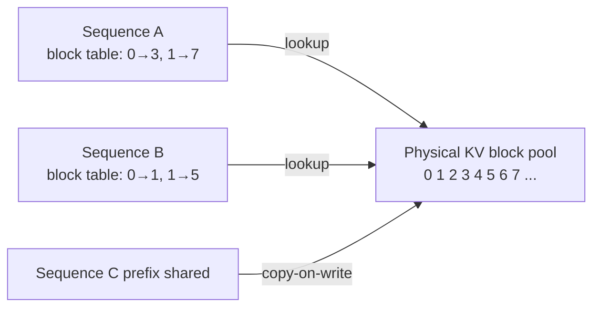

## Definition

**vLLM** is an open-source LLM inference and serving engine developed at UC Berkeley's Sky Computing Lab (Woosuk Kwon et al.) and released in 2023. It introduced two foundational innovations — **PagedAttention** for memory-efficient KV cache management and **continuous batching** for maximum GPU utilization — that together enable throughput up to 24x higher than naïve single-request serving under concurrent load.

vLLM wraps Hugging Face model weights and exposes an OpenAI-compatible REST API, making it a drop-in replacement for the OpenAI API in local or self-hosted deployments. It supports every major open-weight model family (Llama, Mistral, Qwen, Gemma, Falcon) and hardware backends (NVIDIA CUDA, AMD ROCm, Google TPU, Intel Gaudi).

## How it works

### PagedAttention

Traditional attention implementations require a contiguous memory region for each sequence's KV cache, leading to fragmentation: a GPU may have free memory in total but no contiguous block large enough for a new request. PagedAttention borrows the OS paging concept — KV cache is divided into fixed-size **blocks** (default: 16 tokens per block), blocks are stored in a global pool, and each sequence receives a **block table** mapping logical blocks to physical pages. This eliminates both internal and external fragmentation.

Blocks can also be **shared** across sequences with identical prefixes (e.g., the same system prompt), reducing memory and enabling prefix caching.

### Continuous batching

Static batching holds the GPU until the slowest sequence in a batch finishes generating. Continuous batching operates at the **iteration level**: after each forward pass, the scheduler checks which sequences have finished, releases their blocks immediately, and inserts waiting requests into the freed slots. This keeps the GPU saturated regardless of varying output lengths.

### Prefix caching

Identical prompt prefixes — system prompts, tool definitions, few-shot examples — are automatically detected and their KV blocks reused across requests. This effectively makes the system prompt "free" after the first request that uses it, dramatically reducing both latency (no prefill cost) and memory pressure for shared-prefix workloads.

## When to use / When NOT to use

| Scenario | Use vLLM | Use alternatives |
|---|---|---|
| High-concurrency API serving (>10 req/s) | Yes — continuous batching + PagedAttention are essential | No — Transformers `generate()` is single-request only |
| Self-hosted OpenAI-compatible endpoint | Yes — drop-in compatible API | No — if you want a managed service (Bedrock, Vertex AI) |
| Serving large models (70B+) on multiple GPUs | Yes — tensor parallelism built in | No — for edge/mobile, use llama.cpp or ONNX |
| LoRA fine-tuned model serving | Yes — vLLM supports LoRA adapters with hot-swap | Maybe — Lorax is more specialized for multi-LoRA |
| Development on a single GPU with small model | Maybe — overkill; `transformers` pipeline is simpler | Yes — for a prototype, vLLM setup adds overhead |

## Key configuration options

| Option | Description |
|---|---|
| `--model` | HuggingFace model ID or local path |
| `--tensor-parallel-size` | Number of GPUs for tensor parallelism |
| `--max-model-len` | Maximum context length (token budget) |
| `--gpu-memory-utilization` | Fraction of GPU memory allocated to KV pool (default 0.9) |
| `--enable-prefix-caching` | Enable automatic prefix (radix) caching |
| `--speculative-model` | Draft model for speculative decoding |
| `--block-size` | KV cache block size in tokens (default 16) |

## Sources

- [vLLM GitHub](https://github.com/vllm-project/vllm) — source code, documentation, and issue tracker
- [PagedAttention paper — SOSP 2023](https://arxiv.org/abs/2309.06180) — Kwon et al.; foundational paper introducing paged KV cache management
- [vLLM official documentation](https://docs.vllm.ai/) — deployment guides, supported models, and API reference
- [vLLM vs HuggingFace TGI benchmarks](https://arxiv.org/html/2511.17593v1) — comparative performance analysis under various concurrency levels
- [RunPod — vLLM PagedAttention guide](https://www.runpod.io/articles/guides/vllm-pagedattention-continuous-batching) — practical deployment walkthrough

## See also

- [Inference optimization](/docs/inference-optimization)
- [Speculative decoding](/docs/inference-optimization/speculative-decoding)
- [KV cache](/docs/inference-optimization/kv-cache)
- [Structured generation](/docs/structured-generation)
- [Quantization](/docs/quantization)
