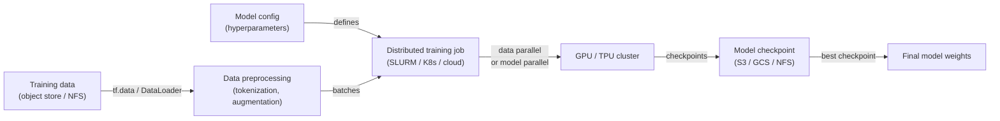
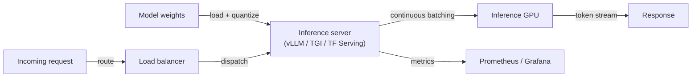

## Definition

AI infrastructure encompasses the hardware, networking, and software systems required to train and deploy large machine learning models at scale. On the hardware side, this means GPUs (NVIDIA H100/A100, consumer RTX series), TPUs (Google's custom AI accelerators), and emerging inference-specific chips (AWS Inferentia, Groq LPU). On the software side, it includes distributed training frameworks, job schedulers, model serving stacks, and observability tooling.

The scale of infrastructure needed is driven primarily by [LLMs](/docs/llms) and large vision models. Training a frontier model may require thousands of GPUs running for weeks, demanding careful attention to inter-node networking (NVLink, InfiniBand), storage I/O (parallel file systems like Lustre, cloud object storage with high-bandwidth connectors), and fault tolerance (automatic checkpointing, preemption handling). Serving these trained models efficiently requires different hardware optimizations: [quantization](/docs/quantization), speculative decoding, and continuous batching reduce per-token costs and latency.

[Frameworks](/docs/frameworks/pytorch) such as PyTorch, JAX, and TensorFlow provide the programming model for expressing neural network computations; infrastructure provides the substrate. Cloud providers (AWS, GCP, Azure) offer managed AI infrastructure (SageMaker, Vertex AI, Azure ML) that handles cluster provisioning, job scheduling, and experiment tracking, while on-premises deployments use orchestrators like SLURM or Kubernetes with GPU device plugins.

## How it works

### Training pipeline



### Serving pipeline



### Key concepts

**Data parallelism** — replicate model across all devices; split data across devices; synchronize gradients. **Model parallelism** — split model layers across devices; necessary when model doesn't fit on a single GPU. **Pipeline parallelism** — split model into stages across devices; overlap computation and communication. **Continuous batching** — dynamically group concurrent inference requests to maximize GPU utilization. **KV cache** — cache attention key/value tensors between tokens to avoid recomputation.

## When to use / When NOT to use

| Scenario | Invest in dedicated infrastructure | Use cloud / managed services |
|----------|-----------------------------------|------------------------------|
| Training proprietary frontier models | Yes — cost and control at scale | |
| Regulated environments (data sovereignty) | Yes — on-prem guarantees data residency | |
| Occasional fine-tuning or inference | | Cloud spot instances or managed APIs are cheaper |
| Serving public-facing models at variable load | | Autoscaling cloud serving is easier to manage |
| Research with frequent GPU needs | | Cloud reserved instances or academic clusters suffice |

## Pros and cons

| Pros | Cons |
|------|------|
| Full control over hardware, data, and security | High capital and operational cost for on-prem clusters |
| Predictable cost at high utilization | Requires expertise in distributed systems and MLOps |
| Lowest latency when co-located with services | Over-provisioning risk if workloads fluctuate |
| No egress costs or API rate limits | GPU supply constraints and long procurement lead times |

## Code examples

```python
# PyTorch DistributedDataParallel (DDP) training — minimal example
import torch
import torch.distributed as dist
import torch.multiprocessing as mp
from torch.nn.parallel import DistributedDataParallel as DDP
from torch.utils.data.distributed import DistributedSampler

def train(rank: int, world_size: int):
    dist.init_process_group("nccl", rank=rank, world_size=world_size)
    torch.cuda.set_device(rank)

    model = MyModel().to(rank)
    model = DDP(model, device_ids=[rank])          # wrap for distributed sync

    sampler = DistributedSampler(dataset, num_replicas=world_size, rank=rank)
    loader = DataLoader(dataset, batch_size=64, sampler=sampler)

    optimizer = torch.optim.AdamW(model.parameters(), lr=1e-4)
    for epoch in range(10):
        sampler.set_epoch(epoch)                   # ensure different shuffles
        for x, y in loader:
            x, y = x.to(rank), y.to(rank)
            loss = loss_fn(model(x), y)
            loss.backward()
            optimizer.step()
            optimizer.zero_grad()

    dist.destroy_process_group()

if __name__ == "__main__":
    mp.spawn(train, args=(torch.cuda.device_count(),), nprocs=torch.cuda.device_count())
```

## Practical resources

- [PyTorch — Distributed training overview](https://pytorch.org/tutorials/beginner/distributed_overview.html) — DDP, FSDP, and RPC
- [Google Cloud — TPU quickstart](https://cloud.google.com/tpu/docs/quick-starts) — Running training on TPU pods
- [vLLM documentation](https://docs.vllm.ai/) — High-throughput LLM inference server
- [NVIDIA — Megatron-LM](https://github.com/NVIDIA/Megatron-LM) — Large-scale model parallelism for LLM training
- [Kubernetes — GPU scheduling](https://kubernetes.io/docs/tasks/manage-gpus/scheduling-gpus/) — Running GPU workloads on K8s

## See also

- [Local inference](/docs/local-inference)
- [Edge reasoning](/docs/edge-reasoning)
- [Model compression](/docs/model-compression)
- [Quantization](/docs/quantization)
- [MLOps](/docs/mlops)
- [Frameworks](/docs/frameworks/pytorch)
