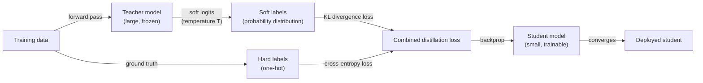
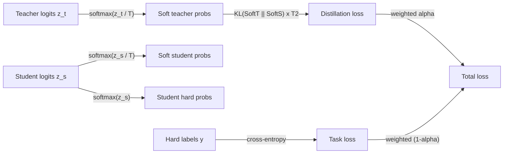

## Definition

Knowledge distillation is a [model compression](/docs/model-compression) technique in which a smaller **student** model is trained to reproduce the behavior of a larger, more capable **teacher** model. Rather than training the student on hard labels alone (the ground-truth class or token), distillation exposes the student to the teacher's **soft outputs** — probability distributions over all classes or tokens — which contain richer information about the model's internal representations and the relative similarities between concepts. This additional signal allows the student to reach accuracy levels that would require significantly more data or capacity if trained from scratch.

The concept was formalized by Hinton et al. in 2015 and has since been applied broadly: BERT (110M parameters) was distilled into DistilBERT (66M, retaining ~97% of BERT's performance), GPT-style models have been distilled into smaller chat-capable variants, and ensemble models have been distilled into single networks. Beyond classification, distillation applies to sequence generation (matching output distributions token by token), intermediate feature matching (aligning hidden states between teacher and student), and attention transfer (matching attention maps in transformer models).

Knowledge distillation is complementary to [quantization](/docs/quantization) and [pruning](/docs/pruning) in the compression pipeline. A typical production workflow distills a large model into a smaller one, then quantizes the student for deployment. Unlike pruning (which modifies an existing model) and quantization (which changes numeric representation), distillation creates a fundamentally different, purpose-trained model whose architecture can be freely designed.

## How it works

### Training pipeline



### Loss function decomposition



### Distillation variants

| Variant | What is matched | Use case |
|---------|----------------|---------|
| Response-based (Hinton) | Output logits (soft labels) | Classification, generation |
| Feature-based | Intermediate hidden states | Structural compression |
| Attention transfer | Attention weight maps | Transformer head compression |
| Data-free distillation | Synthetic data generated by teacher | No access to original training data |
| Online distillation | Mutual learning between peers | No strong teacher required |

## When to use / When NOT to use

| Scenario | Use knowledge distillation | Do NOT use knowledge distillation |
|----------|--------------------------|------------------------------------|
| Need a small model with near-teacher accuracy | Yes — distillation is most accurate compression method | |
| Deploying a student fine-tuned for a specific task | Yes — task-specific distillation is very effective | |
| Compressing ensemble models into a single network | Yes — canonical use case | |
| Need fast compression with no retraining | | Use PTQ [quantization](/docs/quantization) instead |
| No access to training data | | Data-free distillation is complex; quantization is simpler |
| Pruning an existing model without changing architecture | | [Pruning](/docs/pruning) is more appropriate |

## Pros and cons

| Pros | Cons |
|------|------|
| Student architecture is unconstrained — can be freely designed | Requires significant training compute (full training run) |
| Often achieves better accuracy than pruning at same compression ratio | Requires access to the teacher at training time |
| Soft labels provide richer signal than hard labels alone | Teacher-student capacity gap can limit transfer effectiveness |
| Complementary to quantization and pruning | Hyperparameter tuning (temperature, loss weight) adds complexity |

## Code examples

```python
# Knowledge distillation training loop in PyTorch
import torch
import torch.nn.functional as F

def distillation_loss(
    student_logits: torch.Tensor,
    teacher_logits: torch.Tensor,
    hard_labels: torch.Tensor,
    temperature: float = 4.0,
    alpha: float = 0.7,
) -> torch.Tensor:
    """Combine KL-divergence distillation loss with cross-entropy task loss."""
    # Soft targets from teacher (scaled by temperature)
    soft_teacher = F.softmax(teacher_logits / temperature, dim=-1)
    soft_student = F.log_softmax(student_logits / temperature, dim=-1)

    # Distillation loss: KL divergence between soft distributions
    # Multiply by T^2 to maintain gradient magnitude relative to task loss
    loss_kl = F.kl_div(soft_student, soft_teacher, reduction="batchmean") * (temperature ** 2)

    # Task loss: standard cross-entropy with hard labels
    loss_ce = F.cross_entropy(student_logits, hard_labels)

    return alpha * loss_kl + (1 - alpha) * loss_ce


# Training setup: teacher is frozen, student is updated
teacher.train(False)   # set teacher to inference mode (no gradient updates)
student.train(True)

for x_batch, y_batch in train_loader:
    with torch.no_grad():
        teacher_logits = teacher(x_batch)   # get soft labels from frozen teacher

    student_logits = student(x_batch)       # student forward pass

    loss = distillation_loss(
        student_logits, teacher_logits, y_batch,
        temperature=4.0,
        alpha=0.7,
    )

    optimizer.zero_grad()
    loss.backward()
    optimizer.step()
```

## Practical resources

- [Distilling the Knowledge in a Neural Network (Hinton et al., 2015)](https://arxiv.org/abs/1503.02531) — Original paper introducing soft targets and temperature
- [DistilBERT paper](https://arxiv.org/abs/1910.01108) — Distilling BERT to 40% fewer parameters with 97% of performance
- [Hugging Face — Distillation guide](https://huggingface.co/docs/transformers/tasks/distillation) — Practical walkthrough with Transformers
- [TinyBERT paper](https://arxiv.org/abs/1909.10351) — Attention and feature-based distillation for BERT

## See also

- [Model compression](/docs/model-compression)
- [Transfer learning](/docs/transfer-learning)
