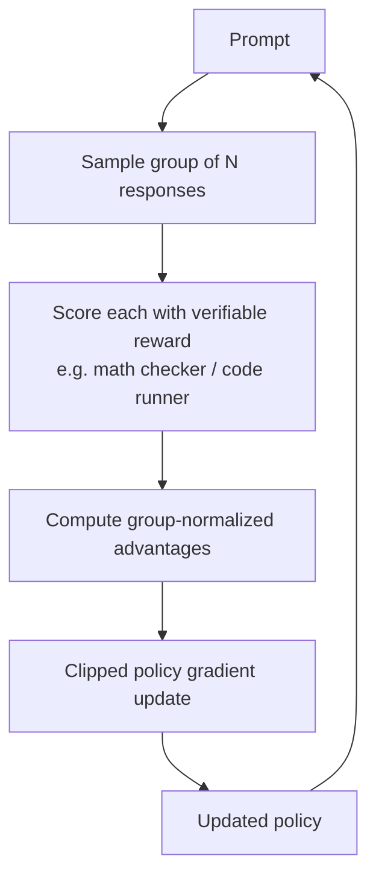
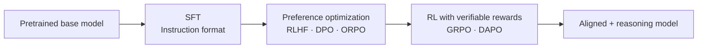

## Definition

**Post-training** is everything that happens to a language model after the initial pretraining step. Pretraining teaches the model statistics of language; post-training shapes *how it behaves* — making it helpful, harmless, honest, and (for reasoning models) capable of systematic problem-solving.

The modern post-training stack layers multiple techniques:

1. **Supervised Fine-Tuning (SFT)** — teach the format of good responses.
2. **Preference optimization** — align outputs with human or AI preferences (RLHF, DPO, ORPO).
3. **Reinforcement Learning with Verifiable Rewards (RLVR)** — train on tasks with checkable answers (GRPO, DAPO).

Each layer targets a different failure mode of the raw pretrained model: the model knows *facts* but needs to learn *conversation format*, then *preference alignment*, then *systematic reasoning*.

## How it works

### Supervised Fine-Tuning (SFT)

SFT is the first post-training stage. A dataset of (instruction, ideal response) pairs — often written or curated by humans — is used to fine-tune the model with standard cross-entropy loss. SFT teaches the model the basic **interaction format**: how to follow instructions, produce structured outputs, and respond conversationally.

SFT alone produces capable chat models, but they tend to be sycophantic (agreeing rather than being truthful) and lack preference sensitivity. SFT is a prerequisite for all downstream alignment techniques because RLHF and DPO both require a reasonable base policy to optimize from.

### RLHF (Reinforcement Learning from Human Feedback)

RLHF adds a human preference signal on top of SFT. The pipeline has three stages:

1. **Reward model training** — human annotators rank pairs of model outputs; a separate neural network (the reward model) is trained to predict which response humans prefer.
2. **RL optimization** — the main model is fine-tuned with PPO (Proximal Policy Optimization), maximizing the reward model's score while a KL-divergence penalty prevents it from drifting too far from the SFT baseline.
3. **Iteration** — new prompts, new outputs, new annotations, repeat.

RLHF is computationally expensive (three models in memory: policy, reward, reference), brittle to reward hacking, and requires large human annotation budgets. Despite these costs, it produced the first generation of safe, helpful chat models (InstructGPT, early Claude, early Gemini).

### DPO (Direct Preference Optimization)

DPO (Rafailov et al., 2023) eliminates the separate reward model. It reformulates the RLHF objective so the policy model itself implicitly encodes the reward, training directly on **preference pairs** (chosen response, rejected response) using a binary cross-entropy loss.

**Key tradeoffs vs RLHF:**

| | RLHF | DPO |
|---|---|---|
| Reward model | Separate network required | Implicit in policy |
| Online sampling | Yes — policy generates during training | No — trains on static dataset |
| Stability | PPO can be unstable | More stable, simpler to implement |
| Data efficiency | Lower (online) | Higher (offline pairs) |
| Flexibility | Can use any reward signal | Requires paired preference data |

DPO became the dominant preference optimization method in 2023–2024 due to its simplicity. Variants include **SimPO** (reference-free DPO) and **KTO** (unpaired preference data).

### ORPO (Odds-Ratio Preference Optimization)

ORPO (Hong et al., 2024) collapses the two-stage SFT→DPO pipeline into a **single training step**. It adds an odds-ratio penalty term to the standard SFT loss, simultaneously teaching instruction following and penalizing rejected responses — no reference model, no reward model, no separate SFT stage.

ORPO is especially useful when compute or data are constrained, and has been adopted by smaller open-source models where the full RLHF stack is too costly.

### GRPO (Group Relative Policy Optimization)

GRPO is an **online RL** method introduced with DeepSeek-R1. It generates responses *during training* and uses group-based advantage estimation instead of a separate critic network.

For each prompt, GRPO samples a **group** of responses (typically 8–64) and computes the advantage of each response by normalizing its reward against the group mean and standard deviation:

```
advantage_i = (reward_i − mean(group)) / std(group)
```

This eliminates the critic (value function) entirely — the group statistics serve as the baseline. GRPO then applies a clipped policy gradient update (similar to PPO's clip) on these advantages.

**Why GRPO mattered:** DeepSeek-R1 used pure GRPO with verifiable rewards (math answers, code test results) and achieved emergent **chain-of-thought reasoning** and **self-reflection** without any supervised reasoning traces. This demonstrated that RL with verifiable rewards alone can produce reasoning capabilities that match or exceed supervised approaches.



### DAPO (Dynamic Sampling Policy Optimization)

DAPO (2025) addresses instabilities observed when scaling GRPO to larger models and longer reasoning chains. It adds four improvements over GRPO:

| Improvement | What it does |
|---|---|
| **Clip-shifting** | Asymmetric clipping ratio — encourages exploration on low-probability tokens |
| **Dynamic sampling** | Skips prompts where the model is already perfect or completely failing; focuses training on the useful "struggle zone" |
| **Token-level loss** | Policy gradient computed per token rather than per sequence, avoiding length bias |
| **Overflow reward shaping** | Penalizes overly long responses to prevent reward hacking via verbosity |

DAPO enables stable training at scales where GRPO diverges, and has been adopted in subsequent open-source reasoning model training runs.

### The full post-training pipeline



Not every model uses all stages. Chat models often stop after SFT + DPO. Reasoning models (DeepSeek-R1, Qwen-thinking, o1-style) add GRPO/DAPO. The choice depends on the target capability and compute budget.

## When to use / When NOT to use

| Scenario | Recommended technique | Why |
|---|---|---|
| Adapting a base model to follow instructions | SFT | Cheapest, most interpretable first step |
| Reducing sycophancy, improving helpfulness/harmlessness | DPO or RLHF | Direct preference signal; DPO is cheaper |
| Single-stage SFT + alignment with minimal data | ORPO | Merges both objectives; no reference model needed |
| Teaching systematic reasoning on math/code | GRPO or DAPO | Verifiable rewards eliminate need for human labels |
| Large-scale reasoning training that must be stable | DAPO over GRPO | Dynamic sampling and token-level loss prevent divergence |
| You have ample human annotation budget and need nuanced value alignment | RLHF | Human preferences capture subtlety that verifiable rewards cannot |

## Tradeoffs summary

| Technique | Reward signal | Online? | Compute cost | Best for |
|---|---|---|---|---|
| SFT | Supervised labels | No | Low | Instruction following |
| RLHF (PPO) | Human preference pairs + reward model | Yes | Very high | Nuanced alignment |
| DPO | Human preference pairs | No | Low–medium | Chat alignment, simpler pipeline |
| ORPO | Preference pairs (no reference model) | No | Low | Single-stage alignment |
| GRPO | Verifiable rewards | Yes | Medium | Math, code, reasoning |
| DAPO | Verifiable rewards | Yes | Medium–high | Large-scale reasoning stability |

## Sources

- [Post-Training in 2026: GRPO, DAPO, RLVR and Beyond — llm-stats.com](https://llm-stats.com/blog/research/post-training-techniques-2026)
- [Complete Guide to Post-Training LLMs: SFT, RLHF, DPO, GRPO — Sundeep Teki](https://www.sundeepteki.org/advice/the-complete-guide-to-post-training-llms-how-sft-rlhf-dpo-and-grpo-shape-llms)
- [GRPO deep-dive — Cameron Wolfe (Substack)](https://cameronrwolfe.substack.com/p/grpo)
- [Guide to LLM Post-Training Algorithms — HuggingFace](https://huggingface.co/blog/karina-zadorozhny/guide-to-llm-post-training-algorithms)
- [The Production Alignment Stack: RLHF, DPO, or Verifier-Driven RL? — Medium](https://medium.com/@adnanmasood/the-production-alignment-stack-rlhf-dpo-or-verifier-driven-rl-032fae9040aa)
- [Post-training methods for language models — Red Hat Developer](https://developers.redhat.com/articles/2025/11/04/post-training-methods-language-models)

## See also

- [Fine-tuning](/docs/llms/fine-tuning)
- [Reinforcement learning](/docs/rl)
- [AI safety](/docs/ai-safety)
- [Large Language Models](/docs/llms)
