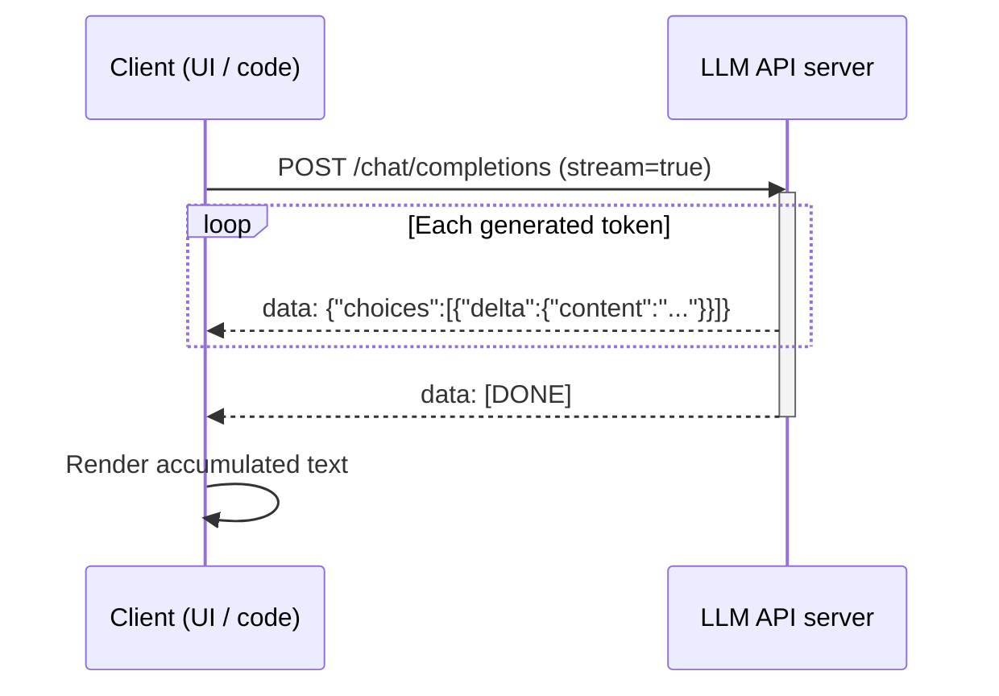

## Definition

Streaming means returning [LLM](/docs/llms) output **token by token** (or chunk by chunk) as it is generated, instead of waiting for the full response. Users see text appear incrementally, which lowers **perceived latency** and improves chat and assistant [use cases](/docs/llms).

It is supported by most LLM APIs (OpenAI, Anthropic, Gemini, open-source servers like vLLM) via Server-Sent Events (SSE) or similar protocols. The same [prompt engineering](/docs/prompt-engineering) and [RAG](/docs/rag) or [agents](/docs/agents) patterns apply; only the response delivery is incremental.

The user experience difference between streaming and non-streaming is large in practice: a response that takes 10 seconds to complete feels nearly instant when the first token arrives within 200 ms. This "time to first token" (TTFT) metric is as important as throughput for interactive applications. Streaming also enables **early cancellation** — if the model starts generating an off-target response, the user or application can stop the stream immediately, saving compute and time. For long-form outputs like code generation or document drafting, streaming provides visible progress that builds user trust.

## How it works



### Server-side generation

The **client** sends a request with the prompt (and optional [RAG](/docs/rag) context or tool results) with `stream=True`. The **server** runs the model autoregressively and, instead of buffering the full output, **pushes** each new token (or a small chunk of tokens) to the client as an SSE event as soon as it is generated.

### Client-side rendering

The client **receives** and **renders** tokens as they arrive (e.g. appending to a chat UI). Each SSE event contains a JSON delta with the new content fragment. The connection stays open until the model emits an end-of-sequence token or the server sends `[DONE]`.

### Cancellation and error handling

The client can close the connection at any time to cancel generation. Production implementations should handle partial responses gracefully (e.g. incomplete JSON tool calls) and implement reconnection logic for dropped connections.

## When to use / When NOT to use

| Scenario | Use streaming? | Notes |
|---|---|---|
| Chat and assistant UIs | Yes | Default for all interactive text output |
| Long-form content generation | Yes | Shows progress, enables early cancellation |
| Batch processing / offline jobs | No | Non-streaming is simpler and equally fast |
| Parsing structured JSON output | With caution | Parse only when `[DONE]` is received |
| Tool call results that depend on full output | No | Wait for complete response before acting |
| Webhook / async pipelines | No | Fire-and-forget is simpler |

## Comparisons

| Feature | Streaming | Non-streaming |
|---|---|---|
| Time to first token | Very low | High (waits for full response) |
| Perceived latency | Low | High |
| Early cancellation | Yes | No |
| Implementation complexity | Moderate | Low |
| Best for | Interactive UI, long responses | Batch jobs, short responses |

## Pros and cons

| Pros | Cons |
|---|---|
| Dramatically lower perceived latency | More complex client implementation |
| Enables early cancellation | Partial output complicates structured parsing |
| Better user experience for chat UIs | Requires persistent connection |
| Allows progressive rendering of long outputs | Error recovery is more complex |

## Code examples

```python
# Streaming chat completion with OpenAI SDK
from openai import OpenAI
import sys

client = OpenAI()  # OPENAI_API_KEY from environment

def stream_response(prompt: str, system: str = "You are a helpful assistant.") -> str:
    """Stream tokens to stdout and return the full accumulated text."""
    full_text = []

    stream = client.chat.completions.create(
        model="gpt-4o-mini",
        messages=[
            {"role": "system",  "content": system},
            {"role": "user",    "content": prompt},
        ],
        stream=True,
        temperature=0.7,
        max_tokens=512,
    )

    for chunk in stream:
        delta = chunk.choices[0].delta
        if delta.content:
            print(delta.content, end="", flush=True)
            full_text.append(delta.content)

    print()  # newline after stream ends
    return "".join(full_text)


# Example usage
if __name__ == "__main__":
    prompt = "Explain token streaming in LLMs in three short paragraphs."
    result = stream_response(prompt)
    print(f"\nTotal characters: {len(result)}")
```

## Practical resources

- [OpenAI – Streaming](https://platform.openai.com/docs/api-reference/streaming) — Official OpenAI streaming API reference
- [Anthropic – Streaming](https://docs.anthropic.com/en/api/streaming) — Claude streaming documentation
- [vLLM – Streaming](https://docs.vllm.ai/en/latest/serving/openai_compatible_server.html#streaming) — Open-source serving with streaming support

## See also

- [LLMs](/docs/llms)
- [Prompt engineering](/docs/prompt-engineering)
- [Local inference](/docs/local-inference)
