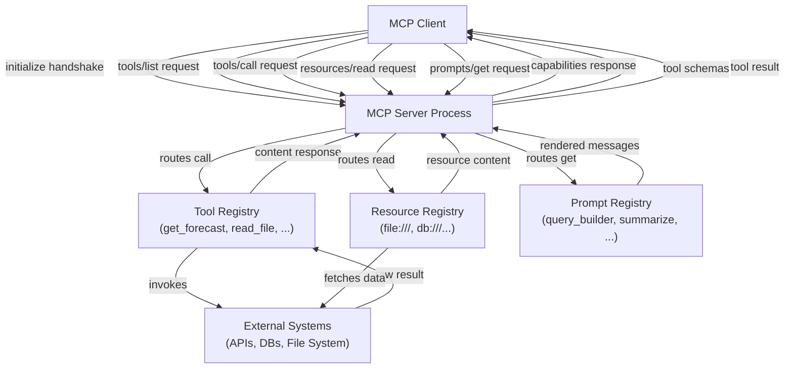

## Definition

An **MCP server** is a process that exposes capabilities to MCP-compatible AI applications through the Model Context Protocol. It acts as the bridge between an AI model and some external system — a file system, a REST API, a database, a code runner — by wrapping that system's functionality in a well-defined, discoverable interface. The server owns the implementation details; the client only needs to know the protocol. Any MCP-compliant client can connect to any MCP server and immediately discover and use its capabilities without custom integration work.

An MCP server can expose three categories of capability. **Tools** are callable functions that accept structured input and return output — the AI invokes them to take actions or retrieve dynamic information. **Resources** are read-only, URI-addressed data sources that the AI can read for context — files, database records, API snapshots. **Prompts** are reusable, parameterized prompt templates stored on the server that clients can surface to users or inject into conversations. A single server can offer any combination of these; many servers expose only tools.

The **server lifecycle** follows a predictable pattern: the server starts and binds to a transport (stdio for local servers, Streamable HTTP for remote servers), waits for a client to connect, completes the `initialize` handshake to negotiate protocol versions and capabilities, then enters its main loop responding to requests. When the client disconnects or sends a shutdown signal, the server performs cleanup and exits. Because the protocol is stateful within a session, the server can maintain per-connection state — for example, caching expensive API responses for the duration of a session.

## How it works

### Server setup and initialization

Setting up an MCP server starts with creating an `McpServer` instance (from the high-level SDK) or an `Server` instance (from the low-level SDK) with a name and version. The name and version are sent to the client during the `initialize` handshake and help with debugging and logging. After creating the server, you register capabilities — tools, resources, prompts — before connecting to a transport. The SDK's high-level `McpServer` class provides ergonomic `server.tool()`, `server.resource()`, and `server.prompt()` methods that handle request routing and schema validation internally. The connection step (`server.connect(transport)`) starts the event loop and blocks until the session ends.

### Defining tools

Tools are the most commonly used MCP capability. Each tool has three required elements: a **name** (a short, lowercase identifier used in `tools/call` requests), a **description** (a natural-language explanation that the AI uses to decide when and how to call the tool), and an **input schema** (a Zod schema in the TypeScript SDK, converted to JSON Schema for the protocol). When a client calls a tool, the SDK validates the incoming arguments against the schema before invoking your handler function, so you receive type-safe, validated input. The handler returns a `content` array of content blocks — text, images, or embedded resources — that the client passes back to the AI model. Tools can also set `isError: true` in their response to signal a recoverable error, which allows the AI to retry or fall back gracefully.

### Defining resources

Resources expose file-like data that the AI can read for context. A resource is identified by a URI (e.g., `file:///path/to/data.json` or `postgres://mydb/users/123`) and has a MIME type that tells the client how to handle the content. Resources are discovered via `resources/list` and read via `resources/read`. The SDK supports both **static resources** (registered with a fixed URI and content) and **dynamic resources** (registered with a URI template pattern, resolved at read time). Resource templates use RFC 6570 URI template syntax — for example, `file:///{path}` matches any file path. When the client reads a resource URI that matches a template, your handler receives the extracted template variables and returns the content. Resources should be used for data that the AI needs to read but not modify; for write operations, use a tool.

### Defining prompts

Prompts are reusable interaction templates. A prompt has a name, a description, and an optional list of arguments (name, description, required flag). When a client requests a prompt via `prompts/get`, your handler receives the argument values and returns a list of messages — typically a mix of `user` and `assistant` role messages — that the client injects into the conversation. Prompts enable server authors to encode domain knowledge about how to interact with the server's capabilities. For example, a database server might expose a `query_builder` prompt that accepts a natural-language description of a query and returns a structured prompt that guides the AI to produce safe, parameterized SQL.

### Transport configuration

The transport layer determines how the server communicates with clients. **stdio transport** (`StdioServerTransport`) reads from `process.stdin` and writes to `process.stdout`. It is the default for local tool servers — the host application spawns the server as a child process and communicates over the process streams. No network configuration is needed, and the server's stderr is available for logging without interfering with the protocol. **Streamable HTTP transport** (`StreamableHTTPServerTransport`) is the current standard for remote servers (introduced in the MCP spec 2025-03-26). It handles both client-to-server messages and server-to-client streaming over a single endpoint using a unified HTTP approach — replacing the previous HTTP+SSE transport which is now deprecated. Streamable HTTP is more compatible with HTTP proxies, load balancers, and corporate firewalls, and avoids the security pitfalls of long-lived SSE connections.

> **Deprecation note:** The `SSEServerTransport` (HTTP+SSE, from spec version 2024-11-05) is **deprecated** as of the March 2025 MCP specification update. New servers should use `StreamableHTTPServerTransport`. Existing SSE servers may continue operating during the transition period, but major platforms (Atlassian, Keboola, Cloudflare) have published end-of-life dates in mid-2026.



## When to use / When NOT to use

| Scenario | Build an MCP server | Consider alternatives |
|---|---|---|
| Exposing an existing API or service to multiple AI applications | Best fit — one server, any client can use it | Direct function calling if only one provider and app matters |
| Wrapping a file system, database, or internal data source for AI context | Best fit — resources and tools map naturally | Custom RAG pipeline if semantic retrieval is the primary need |
| Providing domain-specific prompt templates to AI users | Prompts capability is purpose-built | System prompt injection if templates are simple and static |
| Building tooling for a single, internal AI application with one provider | MCP adds useful structure but may be overkill | In-process tool functions are simpler |
| Exposing tools that require real-time streaming results | Supported via Streamable HTTP transport | WebSockets or custom streaming if protocol overhead matters |
| Tools that need to maintain per-user long-lived state across sessions | Requires careful server design — sessions are 1:1 | Stateful backend service with a thin MCP wrapper |

## Code examples

### Complete MCP server with tools, resources, and a prompt

```typescript
import { McpServer, ResourceTemplate } from "@modelcontextprotocol/sdk/server/mcp.js";
import { StdioServerTransport } from "@modelcontextprotocol/sdk/server/stdio.js";
import { z } from "zod";
import * as fs from "fs/promises";
import * as path from "path";

const server = new McpServer({
  name: "file-and-weather-server",
  version: "1.0.0",
});

// -----------------------------------------------------------------------
// Tool 1: Get weather forecast (mock — replace with a real weather API)
// -----------------------------------------------------------------------
server.tool(
  "get_weather",
  "Fetches the current weather forecast for a given city. Returns temperature, conditions, and humidity.",
  {
    city: z.string().describe("The city name, e.g. 'Tokyo' or 'Berlin'"),
    units: z
      .enum(["celsius", "fahrenheit"])
      .default("celsius")
      .describe("Temperature units"),
  },
  async ({ city, units }) => {
    // In production, call a real weather API here (e.g. Open-Meteo, WeatherAPI)
    const mockData = {
      city,
      temperature: units === "celsius" ? 18 : 64,
      units,
      condition: "Partly cloudy",
      humidity_percent: 72,
      forecast: "Light rain expected in the evening",
    };

    return {
      content: [
        {
          type: "text",
          text: JSON.stringify(mockData, null, 2),
        },
      ],
    };
  }
);

// -----------------------------------------------------------------------
// Tool 2: List directory contents
// -----------------------------------------------------------------------
server.tool(
  "list_directory",
  "Lists the files and subdirectories in a given directory path. Use this to explore file system structure.",
  {
    dir_path: z
      .string()
      .describe("Absolute path to the directory to list"),
  },
  async ({ dir_path }) => {
    try {
      const entries = await fs.readdir(dir_path, { withFileTypes: true });
      const listing = entries.map((e) => ({
        name: e.name,
        type: e.isDirectory() ? "directory" : "file",
      }));

      return {
        content: [
          {
            type: "text",
            text: JSON.stringify(listing, null, 2),
          },
        ],
      };
    } catch (err) {
      return {
        isError: true,
        content: [
          {
            type: "text",
            text: `Error listing directory: ${(err as Error).message}`,
          },
        ],
      };
    }
  }
);

// -----------------------------------------------------------------------
// Resource: Read any text file by path (URI template)
// -----------------------------------------------------------------------
server.resource(
  "text-file",
  new ResourceTemplate("file:///{file_path}", { list: undefined }),
  async (uri, { file_path }) => {
    const resolvedPath = path.resolve(String(file_path));

    try {
      const content = await fs.readFile(resolvedPath, "utf-8");
      return {
        contents: [
          {
            uri: uri.href,
            mimeType: "text/plain",
            text: content,
          },
        ],
      };
    } catch (err) {
      throw new Error(`Cannot read file at ${resolvedPath}: ${(err as Error).message}`);
    }
  }
);

// -----------------------------------------------------------------------
// Prompt: Guided file analysis template
// -----------------------------------------------------------------------
server.prompt(
  "analyze_file",
  "Generates a structured prompt that guides the AI to analyze a text file for issues, patterns, or summaries.",
  {
    file_path: z.string().describe("Path to the file to analyze"),
    focus: z
      .string()
      .optional()
      .describe("Optional: specific aspect to focus on, e.g. 'security issues' or 'performance'"),
  },
  async ({ file_path, focus }) => {
    const focusInstruction = focus
      ? `Focus specifically on: ${focus}.`
      : "Provide a general analysis.";

    return {
      messages: [
        {
          role: "user",
          content: {
            type: "text",
            text: `Please analyze the file at \`${file_path}\`.

${focusInstruction}

Use the \`read_file\` resource (URI: file:///${file_path}) to read its contents, then provide:
1. A brief summary of what the file contains
2. Key observations or findings
3. Any recommendations or concerns

Be concise and structured.`,
          },
        },
      ],
    };
  }
);

// -----------------------------------------------------------------------
// Start the server
// -----------------------------------------------------------------------
async function main() {
  const transport = new StdioServerTransport();
  await server.connect(transport);
  // Log to stderr so it doesn't interfere with the stdio protocol
  console.error("file-and-weather-server is running on stdio");
}

main().catch((err) => {
  console.error("Server failed to start:", err);
  process.exit(1);
});
```

### Streamable HTTP transport (standard remote transport)

The Streamable HTTP transport is the current standard for remote MCP servers. It exposes a single HTTP endpoint that handles both request/response and server-initiated streaming.

```typescript
import { McpServer } from "@modelcontextprotocol/sdk/server/mcp.js";
import { StreamableHTTPServerTransport } from "@modelcontextprotocol/sdk/server/streamableHttp.js";
import express from "express";

const app = express();
app.use(express.json());

const server = new McpServer({ name: "remote-server", version: "1.0.0" });

// Register your tools, resources, and prompts here (same API as stdio)
// server.tool(...), server.resource(...), server.prompt(...)

// Single endpoint handles all MCP communication (requests + streaming)
app.all("/mcp", async (req, res) => {
  const transport = new StreamableHTTPServerTransport({ sessionIdGenerator: undefined });
  await server.connect(transport);
  await transport.handleRequest(req, res, req.body);
});

app.listen(3000, () => {
  console.log("MCP server listening on http://localhost:3000/mcp");
});
```

> **Legacy SSE transport (deprecated):** If you need to support older clients that only implement the 2024-11-05 spec, `SSEServerTransport` from `@modelcontextprotocol/sdk/server/sse.js` can be kept alongside the Streamable HTTP endpoint during migration. New implementations should not use SSE as the primary transport.

## Practical resources

- [MCP TypeScript SDK — server API reference](https://github.com/modelcontextprotocol/typescript-sdk/tree/main/src/server) — Source and inline documentation for `McpServer`, transports, and all server-side types.
- [Official MCP server examples](https://github.com/modelcontextprotocol/servers) — Reference implementations including file system, GitHub, PostgreSQL, Slack, and more — invaluable as starting points.
- [MCP transport documentation](https://modelcontextprotocol.io/specification/2025-03-26/basic/transports) — Protocol specification covering stdio and Streamable HTTP transports (the current standard); includes deprecation notes for the legacy HTTP+SSE transport.
- [Zod documentation](https://zod.dev) — The schema library used by the TypeScript SDK for input validation; understanding Zod types maps directly to tool parameter schemas.

## See also

- [Model Context Protocol overview](/docs/mcp)
- [Building MCP clients](/docs/mcp/building-clients)
- [Agent tools and actions](/docs/agents/tools-actions)
