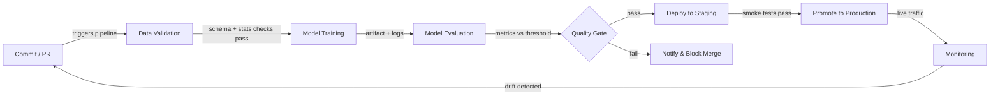

## Definition

Continuous Integration and Continuous Delivery (CI/CD) is a software engineering practice that automates building, testing, and deploying code on every change. When applied to machine learning, the scope expands beyond code: data quality, model performance, and artifact versioning all become first-class citizens of the pipeline. A broken ML CI/CD pipeline can ship a model that silently degrades in production without a single line of application code changing.

Traditional CI/CD validates logic and API contracts. ML CI/CD must additionally validate statistical properties of data (schema, distributions, missing-value rates), model quality thresholds (accuracy, latency, fairness), and reproducibility — the ability to re-train the exact same model from the exact same inputs. Tools like [DVC](/docs/mlops/cicd/dvc) for data versioning and CML (Continuous Machine Learning) for reporting metrics inside pull requests make this practical.

The end goal is a fully automated path from a code or data change to a safely deployed model, with human gates only where they genuinely add value — such as reviewing a model card before a production promotion.

## How it works



### Data Validation

Before training begins, the pipeline checks that incoming data matches the expected schema and statistical profile. Great Expectations or TensorFlow Data Validation (TFDV) can assert that column types are correct, value ranges are sensible, and there are no unexpected spikes in missing values. Failing this gate early prevents wasted compute on corrupt batches. Any schema drift is surfaced as a failed check in the pull request, which blocks the merge until the issue is understood and either fixed or explicitly accepted. This step is the ML equivalent of type-checking code before running tests.

### Model Training

Training is executed as a reproducible, parameterized job — ideally containerized so the exact environment (CUDA version, library pinning) is captured. A good CI/CD system passes hyperparameters through configuration files tracked in version control, not hard-coded into scripts. Tools like [DVC](/docs/mlops/cicd/dvc) track which dataset version and which config produced which model artifact, so any trained model can be traced back to its inputs. Training runs are recorded in an experiment tracker (MLflow, W&B) so the comparison to the previous champion model is automatic.

### Model Evaluation

After training, automated evaluation scripts compute the target metrics on a held-out test set and compare them against a defined threshold or against the current production model. CML (from Iterative.ai) can post a Markdown report with metrics tables and plots directly on the GitHub or GitLab pull request, so reviewers see performance regressions without leaving their code review workflow. Evaluation should also cover slice-based fairness metrics for regulated domains. The quality gate passes only if the new model meets or exceeds the thresholds.

### Deployment and Monitoring

On passing the quality gate, the model artifact is registered in a [model registry](/docs/mlops/cicd/model-registry) and deployed to a staging environment where smoke tests run against live (or representative) traffic. Promotion to production can be manual (a click in the registry UI) or fully automated. Once in production, a [monitoring](/docs/mlops/monitoring) layer tracks data drift, prediction drift, and business KPIs, and can trigger a re-training run — completing the feedback loop back to the Commit step.

## When to use / When NOT to use

| Use when | Avoid when |
|---|---|
| Multiple data scientists commit to shared model code | Working solo on a one-off notebook experiment |
| Models are retrained regularly on fresh data | The model is static and trained once, never updated |
| Production failures are costly (fraud, health, safety) | Prototype stage where speed of iteration outweighs correctness |
| Team needs reproducibility and audit trails | Infrastructure / DevOps maturity is very low |
| Regulatory compliance requires documented model versioning | Dataset is tiny and fits in a single notebook end-to-end |

## Comparisons

| Criterion | Traditional CI/CD | ML CI/CD |
|---|---|---|
| Primary artifact | Binary / Docker image | Model artifact + data version |
| Test types | Unit, integration, E2E | Unit + data quality + model quality + fairness |
| Trigger | Code push | Code push OR new data OR scheduled retraining |
| Rollback | Redeploy previous image | Redeploy previous model version from registry |
| Observability | Application logs, traces | Data drift, prediction drift, business metrics |

## Pros and cons

| Pros | Cons |
|---|---|
| Catches regressions before they reach production | Higher setup cost than traditional CI/CD |
| Full audit trail of data + code + model versions | Data validation requires domain expertise to define correctly |
| Enables safe, frequent model updates | Training jobs can be slow, making CI feedback loops longer |
| Reduces manual handoffs between data science and ops | Requires alignment between data, ML, and platform teams |
| Metrics in PRs improve code review quality | Misconfigured thresholds can block valid improvements |

## Code examples

```yaml
# .github/workflows/ml-pipeline.yml
# GitHub Actions workflow for a full ML CI/CD pipeline with CML reporting

name: ML Pipeline

on:
  push:
    branches: [main, "feat/**"]
  pull_request:
    branches: [main]

jobs:
  ml-pipeline:
    runs-on: ubuntu-latest

    steps:
      # 1. Check out the repository with full git history (needed for DVC)
      - name: Checkout code
        uses: actions/checkout@v4
        with:
          fetch-depth: 0

      # 2. Set up Python and install dependencies
      - name: Set up Python 3.11
        uses: actions/setup-python@v5
        with:
          python-version: "3.11"

      - name: Install dependencies
        run: pip install -r requirements.txt

      # 3. Pull data and model artifacts from DVC remote
      - name: Pull DVC artifacts
        env:
          AWS_ACCESS_KEY_ID: ${{ secrets.AWS_ACCESS_KEY_ID }}
          AWS_SECRET_ACCESS_KEY: ${{ secrets.AWS_SECRET_ACCESS_KEY }}
        run: dvc pull

      # 4. Validate data quality before training
      - name: Validate data
        run: python src/validate_data.py --data data/train.csv

      # 5. Train the model and save metrics to metrics.json
      - name: Train model
        run: python src/train.py --config configs/train.yaml

      # 6. Evaluate model and write report for CML
      - name: Evaluate model
        run: python src/evaluate.py --output reports/metrics.md

      # 7. Post CML report as a comment on the pull request
      - name: Post CML report
        uses: iterative/setup-cml@v2
        with:
          version: latest

      - name: Publish CML report
        env:
          REPO_TOKEN: ${{ secrets.GITHUB_TOKEN }}
        run: |
          # Append the confusion matrix image to the report
          echo "## Model evaluation report" >> reports/metrics.md
          cml comment create reports/metrics.md

      # 8. Push updated DVC artifacts (only on main)
      - name: Push DVC artifacts
        if: github.ref == 'refs/heads/main'
        env:
          AWS_ACCESS_KEY_ID: ${{ secrets.AWS_ACCESS_KEY_ID }}
          AWS_SECRET_ACCESS_KEY: ${{ secrets.AWS_SECRET_ACCESS_KEY }}
        run: dvc push
```

```python
# src/validate_data.py
# Simple data validation gate using pandas — replace with Great Expectations for production

import argparse
import sys
import pandas as pd

EXPECTED_COLUMNS = {"feature_a", "feature_b", "label"}
MAX_MISSING_RATE = 0.05  # 5% threshold


def validate(path: str) -> None:
    df = pd.read_csv(path)

    # Check that all required columns are present
    missing_cols = EXPECTED_COLUMNS - set(df.columns)
    if missing_cols:
        print(f"FAIL: Missing columns: {missing_cols}")
        sys.exit(1)

    # Check missing-value rates
    for col in EXPECTED_COLUMNS:
        rate = df[col].isna().mean()
        if rate > MAX_MISSING_RATE:
            print(f"FAIL: Column '{col}' has {rate:.1%} missing values (threshold: {MAX_MISSING_RATE:.0%})")
            sys.exit(1)

    print("Data validation passed.")


if __name__ == "__main__":
    parser = argparse.ArgumentParser()
    parser.add_argument("--data", required=True)
    args = parser.parse_args()
    validate(args.data)
```

## Practical resources

- [CML (Continuous Machine Learning) by Iterative](https://cml.dev/) — Official docs for posting ML metrics and plots directly in GitHub/GitLab PRs.
- [GitHub Actions for ML — Iterative guide](https://iterative.ai/blog/github-actions-ml) — Walkthrough of setting up an end-to-end ML pipeline with GitHub Actions and DVC.
- [Google MLOps: Continuous delivery and automation pipelines in ML](https://cloud.google.com/architecture/mlops-continuous-delivery-and-automation-pipelines-in-machine-learning) — Google's reference architecture describing three levels of ML automation maturity.
- [Great Expectations documentation](https://docs.greatexpectations.io/) — Framework for data validation and documentation in ML pipelines.

## See also

- [Data Version Control (DVC)](/docs/mlops/cicd/dvc)
- [Model registry](/docs/mlops/cicd/model-registry)
- [MLOps overview](/docs/mlops)
