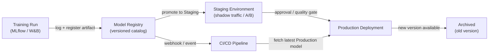

## Definition

A model registry is a centralized catalog that stores, versions, and governs trained ML model artifacts throughout their lifecycle — from initial experimentation through staging, production deployment, and eventual retirement. Think of it as the equivalent of a software artifact repository (like Nexus or Artifactory) but purpose-built for machine learning, with additional metadata about training data, evaluation metrics, and approval status attached to every version.

Without a registry, teams commonly share models through ad-hoc channels: Slack messages with S3 links, shared directories, or hard-coded paths in deployment scripts. This makes it impossible to answer basic governance questions such as "which model is currently in production?", "who approved this model for deployment?", or "what dataset was used to train the version that caused the incident last week?". A registry makes these questions trivially answerable.

Model registries integrate with both the training side (experiment trackers log a run, and the best run's artifact is registered) and the deployment side (CI/CD or serving infrastructure pulls the artifact at the `Production` stage). They typically enforce a promotion workflow — `None → Staging → Production → Archived` — that can require human sign-off, automated quality gates, or both before a model graduates to the next stage.

## How it works



### Model registration

After a training run completes and metrics are logged to an experiment tracker, the best artifact is registered in the registry with `mlflow.register_model()` or the equivalent SDK call. Each registration creates a new **version** of a named model (e.g., `fraud-detector`). Versions are immutable — you cannot overwrite a registered version, only create a new one. Metadata such as the run ID, dataset hash, training parameters, and evaluation metrics are attached to the version and are queryable through the registry API or UI.

### Staging workflow

Newly registered versions start in the `None` (or `Candidate`) stage. A data scientist or automated gate promotes a version to `Staging` for deeper validation — integration testing, shadow deployment, canary traffic splitting, or A/B comparison against the current production model. Staging is a safe environment where regressions are contained; any failure here prevents the model from reaching production without blocking the serving system.

### Production promotion and governance

Promotion to `Production` may require a human approval step, especially in regulated industries. Many teams implement a pull-request-style review: the registry emits a webhook, a reviewer examines the model card (which documents training data, fairness metrics, and known limitations), and the promotion is recorded in an audit log with the approver's identity and timestamp. The serving infrastructure subscribes to the `Production` stage and automatically loads the new model version when promotion occurs, enabling zero-downtime model updates.

### Archiving and rollback

When a new version reaches `Production`, the old version is transitioned to `Archived`. Archiving does not delete the artifact — it remains fully retrievable for rollback or forensic analysis. If the new production version degrades (detected by [monitoring](/docs/mlops/monitoring)), the operations team can re-promote the archived version to `Production` in seconds, rolling back without a code deployment.

## When to use / When NOT to use

| Use when | Avoid when |
|---|---|
| Multiple models or model versions are deployed simultaneously | You have a single model trained once with no plans to update it |
| Regulatory or audit requirements demand model provenance | The team is in early R&D phase with no production deployment yet |
| Different teams own training vs. deployment | A single person trains and deploys in a single script |
| You need rollback capability for production models | Overhead of governance process is not justified by the risk level |
| A/B testing or shadow deployment requires managing multiple live versions | Experiment tracking alone already satisfies your governance needs |

## Comparisons

| Criterion | MLflow Model Registry | W&B Registry | AWS SageMaker Model Registry |
|---|---|---|---|
| Hosting | Self-hosted or Databricks managed | SaaS (W&B cloud) | Fully managed AWS service |
| Integration | MLflow tracking server | W&B experiment tracking | SageMaker training + endpoints |
| Stage workflow | None → Staging → Production → Archived | Alias-based (custom stages) | Pending → Approved → Rejected |
| Approval process | Manual via UI/API | Manual via UI/API | Integration with AWS IAM / CodePipeline |
| Cost | Open source (self-hosted free) | Free tier + paid plans | Pay-per-use AWS pricing |

## Pros and cons

| Pros | Cons |
|---|---|
| Single source of truth for all production models | Adds process overhead — teams must remember to register artifacts |
| Enables rollback in seconds without a code deployment | Self-hosted registries require infrastructure maintenance |
| Full audit trail with approver identity and timestamps | Integration work required to connect training pipelines to the registry |
| Decouples model promotion from code deployment cycles | Governance processes can slow down fast-moving teams if over-engineered |
| Enables safe A/B testing by serving multiple registered versions | Artifact storage costs grow over time as versions accumulate |

## Code examples

```python
# model_registry_example.py
# Demonstrates registering, transitioning, and loading models with MLflow Model Registry

import mlflow
import mlflow.sklearn
from mlflow.tracking import MlflowClient
from sklearn.datasets import make_classification
from sklearn.ensemble import RandomForestClassifier
from sklearn.model_selection import train_test_split
from sklearn.metrics import accuracy_score

# --- 1. Train and log a model to MLflow tracking server ---

mlflow.set_tracking_uri("http://localhost:5000")  # or your MLflow server URI
mlflow.set_experiment("fraud-detection")

X, y = make_classification(n_samples=5000, n_features=20, random_state=42)
X_train, X_test, y_train, y_test = train_test_split(X, y, test_size=0.2, random_state=42)

with mlflow.start_run(run_name="rf-baseline") as run:
    model = RandomForestClassifier(n_estimators=100, random_state=42)
    model.fit(X_train, y_train)

    accuracy = accuracy_score(y_test, model.predict(X_test))

    # Log parameters and metrics — these attach to the registered version
    mlflow.log_param("n_estimators", 100)
    mlflow.log_metric("accuracy", accuracy)

    # Log the model artifact with a schema signature for validation at serving time
    signature = mlflow.models.infer_signature(X_train, model.predict(X_train))
    mlflow.sklearn.log_model(
        sk_model=model,
        artifact_path="model",
        signature=signature,
        registered_model_name="fraud-detector",  # registers on log if name provided
    )

    run_id = run.info.run_id
    print(f"Run ID: {run_id} | Accuracy: {accuracy:.4f}")

# --- 2. Transition the newly registered version to Staging ---

client = MlflowClient()

# Fetch the latest version of the model (just registered above)
latest_versions = client.get_latest_versions("fraud-detector", stages=["None"])
new_version = latest_versions[0].version

# Promote to Staging for integration testing
client.transition_model_version_stage(
    name="fraud-detector",
    version=new_version,
    stage="Staging",
    archive_existing_versions=False,  # keep other Staging versions for comparison
)
print(f"Version {new_version} promoted to Staging")

# --- 3. After validation, promote Staging model to Production ---

# Archive the current Production version and promote Staging to Production
client.transition_model_version_stage(
    name="fraud-detector",
    version=new_version,
    stage="Production",
    archive_existing_versions=True,  # automatically archive the old Production version
)
print(f"Version {new_version} is now Production")

# Add a description to document why this version was promoted
client.update_model_version(
    name="fraud-detector",
    version=new_version,
    description="Promoted after passing shadow traffic test with 0.1% error rate improvement.",
)

# --- 4. Load the Production model in a serving or batch scoring script ---

production_model = mlflow.sklearn.load_model("models:/fraud-detector/Production")
predictions = production_model.predict(X_test)
print(f"Loaded Production model accuracy: {accuracy_score(y_test, predictions):.4f}")
```

## Practical resources

- [MLflow Model Registry documentation](https://mlflow.org/docs/latest/model-registry.html) — Official guide with Python API reference and UI walkthrough.
- [Weights & Biases Registry](https://docs.wandb.ai/guides/model_registry) — W&B's model registry with linked artifacts and lineage graphs.
- [AWS SageMaker Model Registry](https://docs.aws.amazon.com/sagemaker/latest/dg/model-registry.html) — Managed registry integrated with SageMaker Pipelines and CodePipeline.
- [Google Vertex AI Model Registry](https://cloud.google.com/vertex-ai/docs/model-registry/introduction) — GCP's managed solution for model versioning and deployment.

## See also

- [MLflow](/docs/mlops/mlflow)
- [Weights & Biases (W&B)](/docs/mlops/wandb)
- [Model serving](/docs/mlops/deployment/model-serving)
