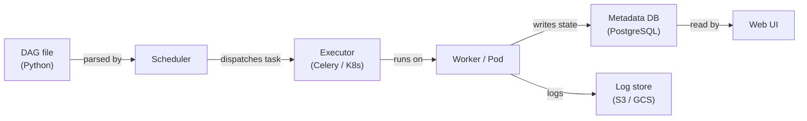

## Definition

Apache Airflow is an open-source platform for programmatically authoring, scheduling, and monitoring workflows. Workflows are expressed as **Directed Acyclic Graphs (DAGs)** written in Python, which gives engineers the full expressiveness of a programming language to define complex dependencies, branching logic, dynamic task generation, and retry policies. Airflow was originally created at Airbnb in 2014 and later donated to the Apache Software Foundation; it has become the de facto standard for batch workflow orchestration in data engineering and MLOps.

In the ML context, Airflow orchestrates the entire model lifecycle: data ingestion, preprocessing, feature engineering, model training, evaluation, artifact registration, and deployment. It does not execute the compute itself — instead, it delegates to specialized systems (Spark, dbt, SageMaker, Kubernetes) via its rich operator ecosystem. This separation of orchestration from execution is a key architectural strength: you can swap the underlying compute layer without changing the DAG logic.

Airflow's scheduler continuously parses DAG files, evaluates the state of each task instance, and dispatches ready tasks to an executor (LocalExecutor, CeleryExecutor, or KubernetesExecutor). The web UI provides real-time visibility into DAG runs, task logs, and lineage. Airflow is designed for batch workloads with known schedules — it is not suitable for sub-minute streaming or event-driven pipelines.

## How it works

### DAGs and task dependencies

A DAG is a Python file that instantiates an `airflow.DAG` object and defines tasks using operators. Dependencies between tasks are declared with the `>>` bitshift operator or `set_downstream`/`set_upstream` calls. The scheduler reads these files from the DAGs folder, computes the dependency graph, and triggers task instances when all upstream dependencies are in the `success` state. DAG runs can be scheduled on a cron expression or triggered externally via the REST API or the `TriggerDagRunOperator`.

### Operators, sensors, and hooks

**Operators** are the atomic units of work in Airflow. The `PythonOperator` executes a Python callable; `BashOperator` runs a shell command; `SparkSubmitOperator` submits a Spark job; `BigQueryOperator` runs a SQL query. **Sensors** are a special class of operator that block until a condition is met — a file lands in S3, a partition appears in a Hive table, or an external DAG completes. **Hooks** provide reusable connections to external systems (databases, cloud APIs, message queues) and are used internally by operators but can also be called directly. This layered abstraction means most integrations already exist in the `apache-airflow-providers-*` packages.

### XComs and inter-task communication

**XComs** (cross-communications) allow tasks to push and pull small values — strings, numbers, JSON blobs — between task instances within the same DAG run. A task pushes an XCom by returning a value from its Python callable or by calling `context['ti'].xcom_push(key, value)`. Downstream tasks pull it with `context['ti'].xcom_pull(task_ids='upstream_task', key='value')`. XComs are stored in the Airflow metadata database, so they are not suitable for large payloads (use object storage for that). They are ideal for passing model evaluation metrics, artifact paths, or decision flags between pipeline steps.

### Scheduler architecture

The Airflow scheduler is a Python process that parses DAG files on a configurable interval, computes which task instances are ready to run, and submits them to the executor. With `CeleryExecutor`, tasks are dispatched to a pool of worker processes via a message broker (Redis or RabbitMQ). With `KubernetesExecutor`, each task instance gets its own isolated Kubernetes pod — eliminating shared-worker resource contention and enabling per-task resource specifications. The metadata database (PostgreSQL or MySQL in production) stores DAG run state, task instance history, XComs, variables, and connections.



## When to use / When NOT to use

| Use when | Avoid when |
|----------|------------|
| You need batch workflow orchestration with complex dependencies | Your workload requires sub-minute latency or is event-driven |
| Your team is comfortable writing workflows in Python | You want a low-code or UI-first workflow builder |
| You need rich integration with cloud services (AWS, GCP, Azure) | Your DAGs are extremely simple and a cron job would suffice |
| You require detailed audit trails, retries, and alerting | You need a managed, zero-ops orchestration service out of the box |
| You want KubernetesExecutor for isolated, reproducible task environments | Your organization cannot maintain the Airflow scheduler and workers |

## Comparisons

| Criterion | Apache Airflow | Prefect |
|-----------|---------------|---------|
| Ease of use | Moderate — requires understanding DAG model, scheduler setup, and executors | High — Pythonic flows with minimal boilerplate; local execution just works |
| Scalability | High — KubernetesExecutor scales tasks independently | High — Prefect Cloud or self-hosted server with work pools |
| UI quality | Good — DAG graph, Gantt, task logs; somewhat dated design | Excellent — modern UI with flow run observability and artifact tracking |
| Kubernetes support | First-class via KubernetesExecutor (one pod per task) | Via Kubernetes work pools; easier to configure than Airflow |
| Learning curve | Steep — DAG semantics, XComs, providers, executor configuration | Gentle — feels like writing regular Python; less to learn upfront |

## Pros and cons

| Pros | Cons |
|------|------|
| Mature ecosystem with hundreds of provider integrations | Significant operational overhead (scheduler, workers, metadata DB) |
| Full Python expressiveness for dynamic DAG generation | DAG parsing errors can silently break the scheduler |
| Strong community and enterprise support (MWAA, Cloud Composer, Astronomer) | Not suitable for streaming or sub-minute scheduling |
| KubernetesExecutor enables per-task resource isolation | XComs are limited in size — not suitable for passing large artifacts |
| Rich UI with graph view, Gantt chart, and task-level logs | Config sprawl across DAG files, environment variables, and Airflow UI |

## Code examples

```python
"""
Airflow DAG for a complete ML pipeline:
  1. Extract training data from a source database
  2. Preprocess and validate the data
  3. Train a model and register it in a model registry

Requires: apache-airflow >= 2.7, apache-airflow-providers-postgres,
          scikit-learn, pandas, mlflow
"""

from __future__ import annotations

from datetime import datetime, timedelta

from airflow import DAG
from airflow.operators.python import PythonOperator

# --- Default arguments applied to every task ---
default_args = {
    "owner": "ml-team",
    "retries": 2,
    "retry_delay": timedelta(minutes=5),
    "email_on_failure": True,
    "email": ["ml-alerts@example.com"],
}

# ---------------------------------------------------------------------------
# Task callables
# ---------------------------------------------------------------------------

def extract_data(**context) -> None:
    """
    Pull the latest training window from the feature store and
    save it to a shared location. Push the output path via XCom.
    """
    import pandas as pd

    # In production, replace with a real DB/feature-store connection
    df = pd.DataFrame(
        {
            "feature_a": [1.0, 2.0, 3.0, 4.0, 5.0],
            "feature_b": [0.1, 0.4, 0.9, 1.6, 2.5],
            "label": [0, 0, 1, 1, 1],
        }
    )

    output_path = "/tmp/airflow/training_data.parquet"
    import pathlib
    pathlib.Path(output_path).parent.mkdir(parents=True, exist_ok=True)
    df.to_parquet(output_path, index=False)

    # Push artifact path to XCom so downstream tasks can consume it
    context["ti"].xcom_push(key="data_path", value=output_path)
    print(f"[extract] saved {len(df)} rows to {output_path}")


def preprocess_data(**context) -> None:
    """
    Load extracted data, validate schema, apply feature scaling,
    and persist the preprocessed dataset.
    """
    import pandas as pd
    from sklearn.preprocessing import StandardScaler

    # Pull the path produced by the extract task
    data_path = context["ti"].xcom_pull(task_ids="extract_data", key="data_path")
    df = pd.read_parquet(data_path)

    # Validate required columns
    required = {"feature_a", "feature_b", "label"}
    missing = required - set(df.columns)
    if missing:
        raise ValueError(f"Missing columns: {missing}")

    # Scale features
    scaler = StandardScaler()
    df[["feature_a", "feature_b"]] = scaler.fit_transform(
        df[["feature_a", "feature_b"]]
    )

    output_path = "/tmp/airflow/preprocessed_data.parquet"
    df.to_parquet(output_path, index=False)
    context["ti"].xcom_push(key="preprocessed_path", value=output_path)
    print(f"[preprocess] scaled and saved {len(df)} rows to {output_path}")


def train_model(**context) -> None:
    """
    Train a logistic regression model, evaluate on a hold-out split,
    and log the run to MLflow.
    """
    import pandas as pd
    import mlflow
    import mlflow.sklearn
    from sklearn.linear_model import LogisticRegression
    from sklearn.model_selection import train_test_split
    from sklearn.metrics import accuracy_score

    preprocessed_path = context["ti"].xcom_pull(
        task_ids="preprocess_data", key="preprocessed_path"
    )
    df = pd.read_parquet(preprocessed_path)

    X = df[["feature_a", "feature_b"]].values
    y = df["label"].values
    X_train, X_test, y_train, y_test = train_test_split(
        X, y, test_size=0.2, random_state=42
    )

    with mlflow.start_run(run_name="airflow-logistic-regression"):
        model = LogisticRegression()
        model.fit(X_train, y_train)

        accuracy = accuracy_score(y_test, model.predict(X_test))
        mlflow.log_metric("accuracy", accuracy)
        mlflow.sklearn.log_model(model, artifact_path="model")

        print(f"[train] accuracy={accuracy:.4f}")
        mlflow.register_model(
            f"runs:/{mlflow.active_run().info.run_id}/model",
            name="airflow-demo-model",
        )


# ---------------------------------------------------------------------------
# DAG definition
# ---------------------------------------------------------------------------

with DAG(
    dag_id="ml_training_pipeline",
    description="Extract → Preprocess → Train pipeline for nightly model refresh",
    default_args=default_args,
    start_date=datetime(2024, 1, 1),
    schedule="0 2 * * *",  # Run at 02:00 UTC daily
    catchup=False,
    tags=["ml", "training"],
) as dag:

    extract = PythonOperator(
        task_id="extract_data",
        python_callable=extract_data,
    )

    preprocess = PythonOperator(
        task_id="preprocess_data",
        python_callable=preprocess_data,
    )

    train = PythonOperator(
        task_id="train_model",
        python_callable=train_model,
    )

    # Define linear dependency: extract → preprocess → train
    extract >> preprocess >> train
```

## Practical resources

- [Apache Airflow documentation](https://airflow.apache.org/docs/) — Official reference for DAGs, operators, executors, and configuration
- [Astronomer — Airflow guides](https://www.astronomer.io/docs/learn/) — Practical tutorials on DAG authoring, testing, and deployment
- [Airflow provider packages index](https://airflow.apache.org/docs/#providers-packages-docs-apache-airflow-providers) — Browse all official integrations (AWS, GCP, Spark, dbt, etc.)
- [Managed Airflow — Amazon MWAA](https://docs.aws.amazon.com/mwaa/latest/userguide/what-is-mwaa.html) — AWS managed Airflow service reference

## See also

- [Data pipelines](/docs/mlops/data-engineering)
- [Apache Spark](/docs/mlops/data-engineering/spark)
- [MLOps CI/CD](/docs/mlops/cicd)
