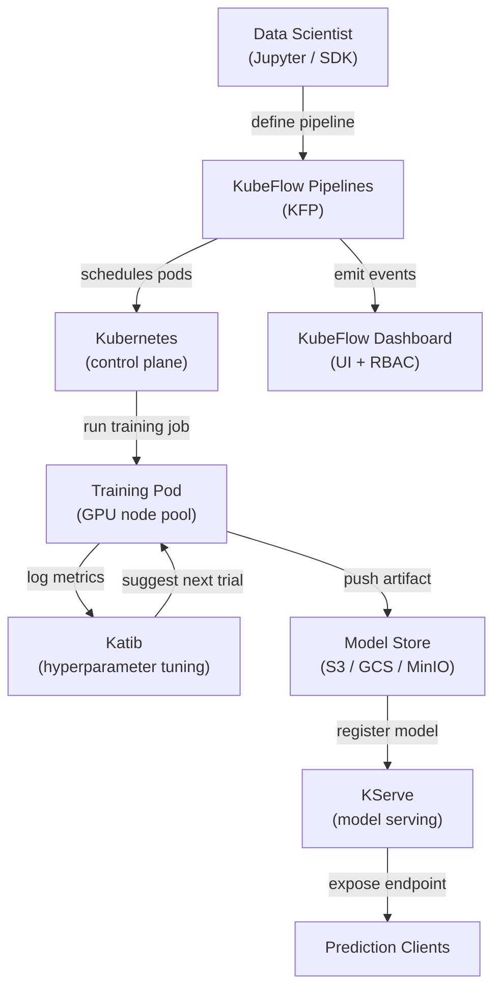

## Definition

KubeFlow is an open-source ML toolkit designed to make deploying ML workflows on Kubernetes simple, portable, and scalable. It was originally created by Google and is now a Cloud Native Computing Foundation (CNCF) project with broad industry adoption. KubeFlow does not try to be a single monolithic platform; instead, it is a curated collection of Kubernetes-native components that each solve a distinct ML infrastructure problem.

The core components are: **KubeFlow Pipelines (KFP)** for defining and running DAG-based ML workflows as Kubernetes jobs; **Katib** for automated hyperparameter tuning and neural architecture search using Bayesian optimization, random search, or reinforcement learning; **KFServing (now KServe)** for scalable model serving with serverless scaling, canary deployments, and support for multiple serving runtimes; and **Jupyter Notebook Servers** managed by the KubeFlow dashboard for interactive development in a multi-tenant environment. The entire platform is installed via a single set of Kubernetes manifests and managed through a web UI.

KubeFlow's strength is that it runs on any Kubernetes cluster — on-premises, GKE, EKS, AKS, or a local kind cluster — making it suitable for organizations that require data to stay within their own infrastructure. Its main cost is operational complexity: the learning curve is steep, and operating KubeFlow in production requires solid Kubernetes expertise.

## How it works



### KubeFlow Pipelines (KFP)

KFP allows data scientists to define ML pipelines as Python code using the KFP SDK. Each pipeline step is a containerized component: a Python function decorated with `@dsl.component` is compiled into a container specification that KFP executes as a Kubernetes pod. The pipeline DAG is compiled to an Intermediate Representation (IR YAML) file that KFP's backend controller schedules on the cluster. This approach means every step is fully reproducible: the container image is pinned, inputs and outputs are artifacts tracked in KFP's metadata store (ML Metadata / MLMD), and the entire execution graph is visible in the UI with logs, inputs, outputs, and status per step.

### Katib — Hyperparameter Tuning

Katib is KubeFlow's AutoML component. It defines an `Experiment` Kubernetes custom resource that specifies the search space (parameter ranges and types), the objective metric (minimize loss, maximize accuracy), and the search algorithm (Bayesian optimization via Gaussian Process, CMA-ES, random search, or grid search). Katib runs parallel trials — each trial is a full training job — and uses the results to suggest better configurations for subsequent trials. The integration with KFP means a full pipeline (data → feature engineering → train → evaluate) can be treated as a single Katib trial, enabling end-to-end AutoML across complex pipelines.

### KServe (formerly KFServing)

KServe extends Kubernetes with `InferenceService` custom resources that declaratively define model serving deployments. Specify the framework (sklearn, xgboost, pytorch, tensorflow, custom) and the model URI (S3 path, PVC) and KServe handles: pulling the model, selecting the right serving runtime, configuring the sidecar proxy, exposing the endpoint via Istio, and scaling replicas to zero when idle (serverless mode). Canary deployments split traffic between two model versions by percentage, enabling safe rollouts. The transformer and explainer components allow plugging in preprocessing logic and SHAP-based explainability alongside the predictor.

### Multi-tenancy and RBAC

The KubeFlow dashboard implements multi-tenancy via Kubernetes namespaces: each user or team gets an isolated namespace with its own resource quotas, notebook servers, and pipeline runs. Role-Based Access Control (RBAC) restricts which users can view, run, or manage pipelines and models. This makes KubeFlow suitable for large organizations where multiple teams share a single GPU cluster and need isolation without separate clusters.

## When to use / When NOT to use

| Use when | Avoid when |
|---|---|
| Running ML workloads on an existing Kubernetes cluster | Your team has no Kubernetes expertise and no dedicated platform engineer |
| Need full pipeline orchestration, AutoML, and serving in one platform | A managed service (SageMaker, Vertex AI) fits your cloud provider strategy |
| Data residency requirements prevent using managed cloud ML services | You only need model serving, not full pipeline orchestration |
| Organization operates a shared GPU cluster with multi-tenancy needs | Your ML workflows are simple enough for a single training script |
| Advanced serving features (serverless scaling, canary, transformers) are required | Fast time-to-production is more important than infrastructure control |

## Comparisons

| Criterion | KubeFlow | ML on Kubernetes (vanilla) |
|---|---|---|
| Complexity | High — many CRDs, controllers, and Istio dependencies | Medium — only standard Kubernetes objects |
| Features | Pipelines, AutoML (Katib), serving (KServe), notebook management | Whatever you build and configure manually |
| Learning curve | Steep — requires Kubernetes + KubeFlow domain knowledge | Medium — standard K8s knowledge sufficient |
| Flexibility | Moderate — extensible but bound to KubeFlow abstractions | High — full control over every Kubernetes resource |
| Managed options | Kubeflow on GKE (Vertex AI Pipelines), AWS Managed KubeFlow | Any managed Kubernetes (EKS, GKE, AKS) |
| Setup time | Days to weeks for a production-grade installation | Hours to days depending on workload complexity |

## Pros and cons

| Pros | Cons |
|---|---|
| Unified ML platform — pipelines, tuning, serving in one system | Very high operational complexity and large number of moving parts |
| Cloud-agnostic — runs on any Kubernetes cluster | Steep learning curve; requires Kubernetes expertise to operate |
| Serverless model serving with automatic scale-to-zero | Resource-heavy installation (Istio, Argo Workflows, MLMD, Knative) |
| Strong multi-tenancy with namespace isolation and RBAC | Upgrades between KubeFlow versions can be involved |
| Active CNCF community and broad ecosystem integrations | Debugging failures often requires understanding multiple layers (K8s → Argo → Python SDK) |

## Code examples

```python
# kubeflow_pipeline.py
# KubeFlow Pipelines v2 SDK — defines a two-step ML pipeline:
#   1. Data preprocessing component
#   2. Training component
# Requires: pip install kfp==2.*

from kfp import dsl
from kfp.client import Client


# --- Component 1: Preprocess raw CSV data ---

@dsl.component(
    base_image="python:3.11-slim",
    packages_to_install=["pandas==2.2.0", "scikit-learn==1.4.0"],
)
def preprocess(
    raw_data_path: str,
    output_features: dsl.Output[dsl.Dataset],
) -> None:
    """
    Reads raw CSV, applies feature engineering, and writes features as Parquet.
    KFP tracks output_features as a Dataset artifact with URI and metadata.
    """
    import pandas as pd
    from sklearn.preprocessing import StandardScaler

    df = pd.read_csv(raw_data_path)

    # Simple feature engineering: scale numeric columns
    scaler = StandardScaler()
    numeric_cols = df.select_dtypes("number").columns.tolist()
    df[numeric_cols] = scaler.fit_transform(df[numeric_cols])

    # KFP provides output_features.path — write artifact there
    df.to_parquet(output_features.path, index=False)
    print(f"Wrote {len(df)} rows to {output_features.path}")


# --- Component 2: Train a model on the preprocessed features ---

@dsl.component(
    base_image="python:3.11-slim",
    packages_to_install=["pandas==2.2.0", "scikit-learn==1.4.0", "joblib==1.3.0"],
)
def train(
    features: dsl.Input[dsl.Dataset],
    n_estimators: int,
    model_output: dsl.Output[dsl.Model],
    metrics_output: dsl.Output[dsl.Metrics],
) -> None:
    """
    Trains a RandomForestClassifier and writes the model artifact + metrics.
    """
    import json
    import joblib
    import pandas as pd
    from sklearn.ensemble import RandomForestClassifier
    from sklearn.model_selection import train_test_split
    from sklearn.metrics import accuracy_score

    df = pd.read_parquet(features.path)
    X = df.drop(columns=["label"]).values
    y = df["label"].values
    X_train, X_test, y_train, y_test = train_test_split(X, y, test_size=0.2, random_state=42)

    clf = RandomForestClassifier(n_estimators=n_estimators, random_state=42)
    clf.fit(X_train, y_train)

    accuracy = float(accuracy_score(y_test, clf.predict(X_test)))

    # Write model artifact (KFP tracks the URI and lineage)
    joblib.dump(clf, model_output.path)

    # Log metrics — visible in the KubeFlow Pipelines UI
    metrics_output.log_metric("accuracy", accuracy)
    metrics_output.log_metric("n_estimators", n_estimators)
    print(f"Accuracy: {accuracy:.4f}")


# --- Pipeline definition ---

@dsl.pipeline(
    name="fraud-detection-pipeline",
    description="Two-stage pipeline: preprocess CSV data, then train RandomForest.",
)
def fraud_pipeline(
    raw_data_path: str = "gs://my-bucket/data/train.csv",
    n_estimators: int = 100,
) -> None:
    # Step 1: preprocess — runs in its own pod
    preprocess_task = preprocess(raw_data_path=raw_data_path)

    # Step 2: train — depends on the Dataset artifact from step 1
    train_task = train(
        features=preprocess_task.outputs["output_features"],
        n_estimators=n_estimators,
    )
    # Assign this task to a node pool with GPU (optional resource request)
    train_task.set_accelerator_type("NVIDIA_TESLA_T4").set_accelerator_limit(1)


# --- Submit the pipeline to a running KubeFlow Pipelines instance ---

if __name__ == "__main__":
    # Connect to KFP backend (port-forward: kubectl port-forward -n kubeflow svc/ml-pipeline 8888:8888)
    client = Client(host="http://localhost:8888")

    run = client.create_run_from_pipeline_func(
        pipeline_func=fraud_pipeline,
        arguments={
            "raw_data_path": "gs://my-bucket/data/train.csv",
            "n_estimators": 200,
        },
        run_name="fraud-pipeline-run-v1",
        experiment_name="fraud-detection",
    )
    print(f"Pipeline run created: {run.run_id}")
    print(f"View at: http://localhost:8888/#/runs/details/{run.run_id}")
```

## Practical resources

- [KubeFlow official documentation](https://www.kubeflow.org/docs/) — Architecture overview, component guides, and installation instructions.
- [KubeFlow Pipelines SDK reference](https://kubeflow-pipelines.readthedocs.io/) — Full API reference for the KFP v2 Python SDK.
- [KServe documentation](https://kserve.github.io/website/) — Serving runtime, InferenceService spec, and canary rollout guide.
- [Katib hyperparameter tuning guide](https://www.kubeflow.org/docs/components/katib/overview/) — Experiment spec, search algorithms, and integration with training operators.

## See also

- [ML on Kubernetes](/docs/mlops/deployment/ml-kubernetes)
- [Model serving](/docs/mlops/deployment/model-serving)
- [Monitoring](/docs/mlops/monitoring)
