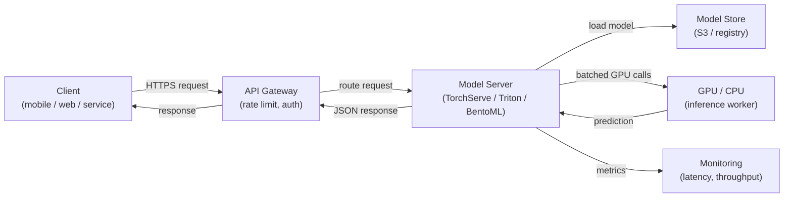

## Definition

Model serving is the process of making a trained ML model available for inference — accepting input data, running a prediction, and returning results to callers. It is the bridge between the offline world of training and experimentation and the online world of production applications. A well-designed serving layer is as important as model quality: a 98% accurate model deployed with a 10-second latency is often useless in a product context.

Model serving encompasses three distinct paradigms that differ fundamentally in their latency, throughput, and infrastructure requirements. **Batch inference** processes large volumes of data on a schedule, writing predictions to a database or file; it is the highest-throughput option but cannot respond to individual requests in real time. **Real-time (online) inference** exposes an API endpoint that returns predictions in milliseconds; it prioritizes low latency over throughput. **Streaming inference** processes events from a queue or stream as they arrive, sitting between batch and real-time in both latency and complexity.

Scaling a model serving system involves challenges that are specific to ML: models are typically large files loaded into memory (or GPU VRAM), startup time matters for autoscaling, GPU utilization must be maximized to be cost-effective, and prediction latency has a tail distribution that can be unpredictable under load. Frameworks like NVIDIA Triton Inference Server, TorchServe, and BentoML exist specifically to address these challenges.

## How it works



### Batch inference

In batch inference, a scheduled job (cron, Airflow DAG, or a cloud scheduler) reads a dataset from storage, runs predictions on the entire set, and writes the results back. The model is loaded once per job run, so the per-prediction amortized cost of loading is negligible. This pattern suits use cases like generating nightly recommendations, scoring all customers for churn risk, or annotating a data warehouse with predicted sentiment. The main scaling lever is parallelism across data partitions — each partition can be processed by a separate worker. A common pitfall is training-serving skew: the batch scoring script uses different preprocessing logic than the training pipeline.

### Real-time API inference

Real-time serving exposes the model behind an HTTP (or gRPC) endpoint that responds synchronously to individual requests. The key engineering challenge is latency: model loading is slow (seconds to minutes for large models), so instances must be kept warm or pre-scaled. Frameworks like TorchServe and BentoML handle model loading, request deserialization, batching of concurrent requests (dynamic batching), and health checks. Horizontal scaling via Kubernetes or managed services (AWS SageMaker Endpoints, GCP Vertex AI Endpoints) adds replicas when throughput exceeds a threshold. GPU memory determines how many model replicas fit on a single node, which directly drives cost.

### Streaming inference

Streaming inference connects the model server to an event stream (Kafka, Kinesis, Pub/Sub). Events arrive continuously and predictions are emitted to an output topic. This pattern fits fraud detection on transaction streams, real-time anomaly detection on sensor data, or any use case where a new event must be scored within hundreds of milliseconds but the volume is too high for synchronous HTTP. The model server acts as a consumer-producer: it reads from the input topic, runs inference, and writes to the output topic. Backpressure management is critical — the consumer must not fall behind the producer during traffic spikes.

### Scaling considerations

GPU scheduling is the dominant cost factor for large models. Key levers include: **dynamic batching** (accumulating multiple requests into a single GPU call), **model quantization** (reducing precision from FP32 to INT8 to fit more models per GPU), **model caching** (keeping the model in VRAM across requests), and **autoscaling** (adding or removing replicas based on queue depth or latency SLOs). Triton Inference Server supports all of these with a declarative configuration file per model, making it the go-to choice for heterogeneous model fleets in production.

## When to use / When NOT to use

| Use when | Avoid when |
|---|---|
| A downstream application needs predictions at request time | All consumers can tolerate predictions computed hours in advance |
| Predictions must reflect the latest model version immediately | The dataset is small enough to be scored in a nightly batch cheaply |
| Event-driven scoring is needed (streaming) | The model is used only for offline analysis with no downstream system |
| Model inference cost is high and GPU utilization must be maximized | Prototype stage where a simple script called directly is sufficient |

## Comparisons

| Criterion | TorchServe | TF Serving | NVIDIA Triton | BentoML | FastAPI (custom) |
|---|---|---|---|---|---|
| Framework support | PyTorch-native | TensorFlow / Keras | Multi-framework (ONNX, TF, PyTorch, TensorRT) | Framework-agnostic | Framework-agnostic |
| Dynamic batching | Yes | Yes | Yes (highly configurable) | Yes | Manual implementation |
| gRPC support | Yes | Yes | Yes | Yes | Via grpcio |
| GPU optimization | Good | Good | Best-in-class | Good | Manual |
| Ease of setup | Medium | Medium | High (complex config) | Low (Python-native) | Very low |
| Production readiness | High | High | Very high | High | Depends on implementation |

## Pros and cons

| Pros | Cons |
|---|---|
| Decouples model updates from application code releases | Adds infrastructure complexity over running inference inline |
| Enables independent scaling of inference capacity | Cold-start latency can be significant for large models |
| Purpose-built frameworks handle batching, health checks, versioning | GPU instances are expensive; cost management requires care |
| Supports A/B testing and canary deployments natively | Streaming inference requires Kafka/Kinesis expertise alongside ML |
| Monitoring hooks for latency, throughput, and prediction drift | Model-serving skew (different preprocessing) is a persistent risk |

## Code examples

```python
# fastapi_serving.py
# Production-ready FastAPI model serving endpoint with dynamic model loading,
# input validation via Pydantic, and health check endpoint.

from __future__ import annotations

import os
from contextlib import asynccontextmanager
from typing import List

import joblib
import numpy as np
import uvicorn
from fastapi import FastAPI, HTTPException
from pydantic import BaseModel, Field

# --- Input/output schemas ---

class PredictionRequest(BaseModel):
    """Input features for a single inference request."""
    features: List[float] = Field(
        ...,
        min_length=20,
        max_length=20,
        description="Exactly 20 numerical features (must match training schema).",
        example=[0.1, -0.5, 1.2] + [0.0] * 17,
    )


class PredictionResponse(BaseModel):
    label: int
    probability: float
    model_version: str


# --- Model lifecycle management ---

MODEL: dict = {}  # holds the loaded model and metadata


@asynccontextmanager
async def lifespan(app: FastAPI):
    """Load model at startup; release resources on shutdown."""
    model_path = os.environ.get("MODEL_PATH", "models/model.joblib")
    model_version = os.environ.get("MODEL_VERSION", "unknown")

    if not os.path.exists(model_path):
        raise RuntimeError(f"Model file not found at {model_path}")

    MODEL["clf"] = joblib.load(model_path)
    MODEL["version"] = model_version
    print(f"Model v{model_version} loaded from {model_path}")
    yield
    MODEL.clear()
    print("Model unloaded.")


# --- API definition ---

app = FastAPI(
    title="ML Model Serving API",
    description="Real-time inference endpoint for the fraud detection model.",
    version="1.0.0",
    lifespan=lifespan,
)


@app.get("/health")
def health() -> dict:
    """Liveness probe — returns 200 when the model is loaded."""
    if "clf" not in MODEL:
        raise HTTPException(status_code=503, detail="Model not loaded")
    return {"status": "ok", "model_version": MODEL["version"]}


@app.post("/predict", response_model=PredictionResponse)
def predict(request: PredictionRequest) -> PredictionResponse:
    """
    Run inference on a single input vector.
    Returns the predicted label and the positive-class probability.
    """
    clf = MODEL.get("clf")
    if clf is None:
        raise HTTPException(status_code=503, detail="Model not ready")

    X = np.array(request.features).reshape(1, -1)
    label = int(clf.predict(X)[0])
    probability = float(clf.predict_proba(X)[0][label])

    return PredictionResponse(
        label=label,
        probability=probability,
        model_version=MODEL["version"],
    )


if __name__ == "__main__":
    # For local testing: MODEL_PATH=models/model.joblib MODEL_VERSION=v1 python fastapi_serving.py
    uvicorn.run(app, host="0.0.0.0", port=8080, log_level="info")
```

```python
# client_example.py
# Simple client that calls the FastAPI serving endpoint

import httpx

BASE_URL = "http://localhost:8080"

# Health check
response = httpx.get(f"{BASE_URL}/health")
print(response.json())  # {"status": "ok", "model_version": "v1"}

# Prediction
payload = {"features": [0.1, -0.5, 1.2] + [0.0] * 17}
response = httpx.post(f"{BASE_URL}/predict", json=payload)
print(response.json())
# {"label": 1, "probability": 0.87, "model_version": "v1"}
```

## Practical resources

- [BentoML documentation](https://docs.bentoml.com/) — Framework-agnostic model serving with built-in batching, containerization, and deployment integrations.
- [NVIDIA Triton Inference Server](https://docs.nvidia.com/deeplearning/triton-inference-server/user-guide/docs/index.html) — High-performance serving for multi-framework model fleets with GPU optimization.
- [TorchServe documentation](https://pytorch.org/serve/) — Official PyTorch model serving solution with handler customization.
- [FastAPI documentation](https://fastapi.tiangolo.com/) — Modern, high-performance Python web framework used widely for custom ML serving APIs.

## See also

- [KubeFlow](/docs/mlops/deployment/kubeflow)
- [ML on Kubernetes](/docs/mlops/deployment/ml-kubernetes)
- [Monitoring](/docs/mlops/monitoring)
