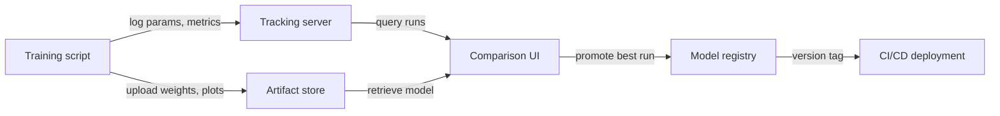

## Definition

Experiment tracking is the practice of systematically recording every detail of an ML training run so that results can be reproduced, compared, and audited. Without it, teams lose track of which hyperparameters produced which results, waste compute rediscovering configurations, and cannot demonstrate compliance when models influence high-stakes decisions.

A complete experiment record captures four categories of information. **Parameters** are the inputs to training: learning rate, batch size, model architecture choices, feature sets. **Metrics** are the outputs: loss curves, accuracy, F1, AUC, latency. **Artifacts** are the produced files: trained model weights, preprocessed datasets, evaluation plots, confusion matrices. **Metadata** is the context: code version (git commit), environment (library versions, hardware), dataset version, wall-clock time, and the name of the person who ran it.

Model versioning is the natural extension: once you track experiments, you can promote the best run's artifact to a model registry, tag it with a semantic version, and tie every serving deployment back to a specific experiment. This closes the loop between experimentation and production, making rollbacks straightforward and audits possible.

## How it works

### Instrumentation

The training script is instrumented with a few lines of SDK code that open a "run" context and log data to a central server during training. Most frameworks (PyTorch Lightning, Hugging Face Trainer, Keras) have native integrations that auto-log common metrics with zero additional code.

### Centralized storage

Logged data is persisted to a backend store — a local file system, a managed cloud database, or a SaaS platform. Parameters and metrics are stored as structured records; artifacts are pushed to object storage (S3, GCS, Azure Blob). The backend is queried by the UI and the SDK.

### Comparison and analysis

The tracking UI lets you filter, sort, and compare runs across all four dimensions. You can plot metric curves for many runs on the same chart, group by parameter values, and export results to a dataframe for custom analysis. This makes it easy to identify the Pareto-optimal runs (best accuracy for given latency budget, for example).

### Model promotion

The best run's artifact is registered in a model registry with a version number and transition state (Staging → Production → Archived). Downstream CI/CD systems query the registry to know which model version to deploy, creating a clean handoff between experimentation and serving.



## When to use / When NOT to use

| Use when | Avoid when |
|----------|------------|
| You run more than a handful of experiments and need to compare results | You are running a single, one-shot training and will never revisit it |
| Reproducibility is required (regulated industry, research publication) | The experiment is trivial (e.g., a two-parameter grid search with obvious outcomes) |
| Multiple team members share experiment results | The team works alone and keeps notes in a personal spreadsheet that is sufficient |
| You want to promote model versions to production systematically | The model is never deployed and results do not need to be audited |

## Comparisons

| Criterion | MLflow | Weights & Biases (W&B) |
|-----------|--------|------------------------|
| Ease of setup | Self-hostable with `mlflow ui`; pip install only | SaaS account required; CLI install; free tier available |
| UI quality | Functional but spartan; good for tabular comparison | Polished, interactive; excellent for media and curve overlays |
| Collaboration | Shared server required; no built-in access control in OSS | Team workspaces, role-based access, and sharing built in |
| Pricing | Free and open-source; managed offering via Databricks | Free tier for individuals; paid for large teams |
| Integrations | Deep integration with Databricks, Spark, sklearn, PyTorch | Broad integrations; strong in research and academia |

## Code examples

```python
# generic_tracking.py
# Framework-agnostic experiment tracking pattern.
# Works with any ML library; swap out the model training code as needed.
# pip install mlflow scikit-learn pandas

import mlflow
from sklearn.linear_model import LogisticRegression
from sklearn.datasets import make_classification
from sklearn.model_selection import train_test_split
from sklearn.metrics import accuracy_score, roc_auc_score
import numpy as np

# --- Configuration ---
EXPERIMENT_NAME = "binary-classification-demo"
PARAMS = {
    "C": 0.1,           # Regularization strength
    "max_iter": 1000,
    "solver": "lbfgs",
    "random_state": 42,
}

# --- Data preparation ---
X, y = make_classification(
    n_samples=2000, n_features=20, n_informative=10, random_state=42
)
X_train, X_test, y_train, y_test = train_test_split(
    X, y, test_size=0.2, random_state=42
)

# --- Tracking boilerplate (works with MLflow, swap with wandb.init() for W&B) ---
mlflow.set_experiment(EXPERIMENT_NAME)

with mlflow.start_run(run_name=f"logreg-C{PARAMS['C']}") as run:
    # 1. Log all hyperparameters at the start
    mlflow.log_params(PARAMS)

    # 2. Train the model
    model = LogisticRegression(**PARAMS)
    model.fit(X_train, y_train)

    # 3. Evaluate and log metrics
    y_pred = model.predict(X_test)
    y_prob = model.predict_proba(X_test)[:, 1]

    metrics = {
        "accuracy": accuracy_score(y_test, y_pred),
        "roc_auc": roc_auc_score(y_test, y_prob),
        "n_train": len(X_train),
        "n_test": len(X_test),
    }
    mlflow.log_metrics(metrics)

    # 4. Log the model artifact
    mlflow.sklearn.log_model(model, artifact_path="model")

    # 5. Log any extra files (e.g., feature importance, plots)
    import json, tempfile, os
    with tempfile.TemporaryDirectory() as tmp:
        meta_path = os.path.join(tmp, "run_metadata.json")
        with open(meta_path, "w") as f:
            json.dump({"git_commit": "abc1234", "dataset_version": "v1.3"}, f)
        mlflow.log_artifact(meta_path)

    print(f"Run ID : {run.info.run_id}")
    print(f"Accuracy: {metrics['accuracy']:.4f} | ROC-AUC: {metrics['roc_auc']:.4f}")
```

## Practical resources

- [MLflow Tracking Documentation](https://mlflow.org/docs/latest/tracking.html) — Official guide covering the tracking API, backends, artifact stores, and autologging.
- [Weights & Biases – Experiment Tracking Quickstart](https://docs.wandb.ai/quickstart) — Step-by-step guide to logging your first W&B run in under five minutes.
- [Neptune.ai – Experiment Tracking Guide](https://neptune.ai/blog/ml-experiment-tracking) — Vendor-neutral overview of what to track, why, and how to compare tools.
- [Made With ML – Experiment Tracking](https://madewithml.com/courses/mlops/experiment-tracking/) — Practical notebook-based walkthrough integrating MLflow into a real training loop.

## See also

- [MLflow](/docs/mlops/mlflow)
- [Weights & Biases](/docs/mlops/wandb)
- [MLOps](/docs/mlops)
