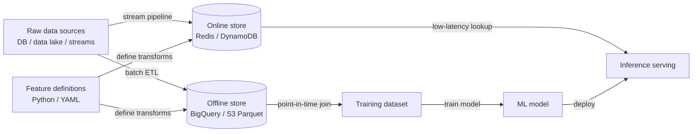

## Definition

A feature store is a data system specifically designed to manage the lifecycle of ML features — from raw data transformation, through storage, to low-latency serving — in a way that is consistent between model training and production inference. Without a feature store, teams commonly encounter **training-serving skew**: the feature computation logic executed offline during training differs subtly from the logic used at serving time, causing production models to underperform relative to offline evaluation.

Feature stores address this by storing feature definitions as code and running the same transformation logic in both contexts. They maintain two complementary storage layers: an **offline store** (a data warehouse or data lake, e.g. BigQuery, Redshift, Parquet files on S3) that holds large historical datasets used for training and batch scoring, and an **online store** (a low-latency key-value database, e.g. Redis, DynamoDB, Cassandra) that serves precomputed feature values to models at inference time with sub-millisecond latency.

The problem of training-serving skew and the need for feature reuse become acute at scale. A large organization may have dozens of teams each computing similar features (customer spend in the last 7 days, session length, device type) independently, with subtle differences in business logic. A feature store provides a governed catalog where features are defined once, validated, and reused across teams and models, dramatically reducing duplicated engineering effort and the risk of inconsistent feature logic.

## How it works

### Feature definition and transformation pipelines

Features are defined as code — Python classes or YAML manifests — that specify the data source, transformation logic, and the entity key (the identifier used to look up features, e.g., `user_id`, `product_id`). Batch transformation pipelines run on a schedule to materialize features into the offline store. Stream transformation pipelines (e.g., using Flink or Spark Structured Streaming) keep the online store fresh for time-sensitive features such as real-time fraud signals.

### Offline store: training data retrieval

When training a model, you generate a dataset by providing a list of entity keys and a set of timestamps (a "point-in-time join"). The feature store retrieves the feature values that were correct as of each timestamp, avoiding future data leakage. This point-in-time correctness is one of the hardest things to implement correctly without a feature store and one of the most valuable guarantees it provides.

### Online store: low-latency serving

Before a model serves a prediction, it needs feature values for the entity being scored (e.g., the user making a request). The feature store client queries the online store by entity key and returns a feature vector in milliseconds. Because the same feature definitions underpin both the offline and online stores, the values are guaranteed to be computed identically.

### Feature registry and governance

A feature catalog documents each feature: its definition, owner, data type, freshness guarantee, and which models consume it. This governance layer enables discoverability — a new team can browse existing features before writing their own — and impact analysis — understanding which models are affected if a feature's upstream data source changes.

### Materialization jobs

Materialization is the process of running transformation pipelines and writing results to the stores. Offline materialization runs as a scheduled batch job. Online materialization copies a subset of offline data into the online store for fast retrieval, or is driven by streaming pipelines when real-time freshness is required. Feast, Tecton, and Hopsworks all provide CLI commands or orchestration integrations to trigger and monitor materialization.



## When to use / When NOT to use

| Use when | Avoid when |
|----------|------------|
| Multiple teams or models share the same feature logic and consistency is critical | You have a single model with a small, stable feature set that never changes |
| Training-serving skew has caused production incidents or accuracy gaps | Your inference latency requirements are relaxed and batch scoring is sufficient |
| You need point-in-time correct training datasets to avoid data leakage | The engineering overhead of operating a feature store exceeds the project's scale |
| Features must be served at sub-millisecond latency for real-time predictions | You are in early exploration and your features are not yet stable enough to formalize |
| Regulatory requirements demand a governed, auditable feature catalog | Your data science team is small and lacks ML engineering support to manage infrastructure |

## Comparisons

| Criterion | Feast | Tecton | Hopsworks |
|-----------|-------|--------|-----------|
| Open-source | Yes (Apache 2.0) | No (SaaS / managed) | Yes core; enterprise paid |
| Managed offering | No (self-hosted only) | Yes (fully managed) | Yes (cloud or on-prem) |
| Streaming features | Limited (via Kafka source) | Native, production-grade | Native with Flink integration |
| Feature monitoring | Basic | Advanced (built-in drift) | Advanced |
| Best for | Teams wanting OSS control | Enterprises needing managed real-time features | Teams wanting full-stack open-source |

## Pros and cons

| Pros | Cons |
|------|------|
| Eliminates training-serving skew by sharing transformation logic | Significant engineering investment to set up and operate |
| Enables feature reuse across teams, reducing duplicated effort | Adds an operational dependency to the serving path (online store availability) |
| Point-in-time joins prevent data leakage in training data | Feature definitions can become a bottleneck if governance is too rigid |
| Centralizes feature governance and documentation | Learning curve for data scientists unfamiliar with the abstraction |
| Supports both batch and real-time feature serving | Overkill for teams with a small number of models and stable features |

## Code examples

```python
# feast_feature_store_example.py
# Demonstrates defining, materializing, and retrieving features with Feast.
# Prerequisites:
#   pip install feast pandas scikit-learn
#   feast init my_feature_repo && cd my_feature_repo
#   (Adjust the data source path below to match your environment.)

# ── feature_repo/features.py ──────────────────────────────────────────────────
# This file defines the feature views and entities in your Feast registry.

from datetime import timedelta
import pandas as pd
from feast import (
    Entity,
    FeatureStore,
    FeatureView,
    Field,
    FileSource,
)
from feast.types import Float32, Int64

# 1. Define the entity — the primary key used to look up features
driver = Entity(
    name="driver",
    description="A taxi driver identified by driver_id",
)

# 2. Define the data source (parquet file for local demo; swap for BigQuery etc.)
driver_stats_source = FileSource(
    path="data/driver_stats.parquet",   # generated below
    timestamp_field="event_timestamp",
    created_timestamp_column="created",
)

# 3. Define a FeatureView — the transformation and storage spec
driver_stats_fv = FeatureView(
    name="driver_hourly_stats",
    entities=[driver],
    ttl=timedelta(days=7),              # how long features stay valid
    schema=[
        Field(name="conv_rate", dtype=Float32),
        Field(name="acc_rate", dtype=Float32),
        Field(name="avg_daily_trips", dtype=Int64),
    ],
    online=True,                        # materialize to online store
    source=driver_stats_source,
)


# ── generate_sample_data.py ───────────────────────────────────────────────────
# Run this once to create sample data before materializing.
def generate_driver_stats(path: str = "data/driver_stats.parquet") -> None:
    import os
    os.makedirs("data", exist_ok=True)

    rng = pd.date_range(end=pd.Timestamp.now(tz="UTC"), periods=48, freq="h")
    df = pd.DataFrame({
        "driver_id": [1001, 1002, 1003] * 16,
        "event_timestamp": list(rng[:48]),
        "created": pd.Timestamp.now(tz="UTC"),
        "conv_rate": [0.8, 0.6, 0.9] * 16,
        "acc_rate": [0.95, 0.88, 0.92] * 16,
        "avg_daily_trips": [150, 200, 175] * 16,
    })
    df.to_parquet(path, index=False)
    print(f"Sample data written to {path}")


# ── training_data_retrieval.py ────────────────────────────────────────────────
# Retrieve a point-in-time correct training dataset.
def get_training_data(repo_path: str = ".") -> pd.DataFrame:
    store = FeatureStore(repo_path=repo_path)

    # Entity DataFrame: the entities and timestamps we want features for
    entity_df = pd.DataFrame({
        "driver_id": [1001, 1002, 1003],
        "event_timestamp": [
            pd.Timestamp("2024-01-15 10:00:00", tz="UTC"),
            pd.Timestamp("2024-01-15 11:00:00", tz="UTC"),
            pd.Timestamp("2024-01-15 12:00:00", tz="UTC"),
        ],
        "label": [1, 0, 1],   # target variable for supervised training
    })

    # Point-in-time join: retrieves feature values as-of each row's timestamp
    training_df = store.get_historical_features(
        entity_df=entity_df,
        features=[
            "driver_hourly_stats:conv_rate",
            "driver_hourly_stats:acc_rate",
            "driver_hourly_stats:avg_daily_trips",
        ],
    ).to_df()

    print("Training dataset:")
    print(training_df.to_string())
    return training_df


# ── online_serving.py ─────────────────────────────────────────────────────────
# Retrieve features for real-time inference after materialization.
def get_online_features(driver_ids: list, repo_path: str = ".") -> dict:
    store = FeatureStore(repo_path=repo_path)

    # Materialize features to the online store first:
    # store.materialize_incremental(end_date=pd.Timestamp.now(tz="UTC"))

    feature_vector = store.get_online_features(
        features=[
            "driver_hourly_stats:conv_rate",
            "driver_hourly_stats:acc_rate",
            "driver_hourly_stats:avg_daily_trips",
        ],
        entity_rows=[{"driver_id": did} for did in driver_ids],
    ).to_dict()

    print("Online feature vector:")
    for key, values in feature_vector.items():
        print(f"  {key}: {values}")
    return feature_vector


# ── main ──────────────────────────────────────────────────────────────────────
if __name__ == "__main__":
    generate_driver_stats()
    # After running `feast apply` to register the feature views:
    # training_df = get_training_data()
    # online_fv   = get_online_features([1001, 1002])
    print("Feature definitions ready. Run `feast apply` to register them.")
```

## Practical resources

- [Feast Documentation](https://docs.feast.dev/) — Official docs for the most widely used open-source feature store, including quickstart, feature view API, and deployment guides.
- [Tecton – Feature Store Concepts](https://docs.tecton.ai/docs/introduction/feature-store-concepts) — Vendor-neutral conceptual overview of online/offline stores, point-in-time joins, and feature pipelines from the team that built Uber's Michelangelo.
- [Hopsworks Documentation](https://docs.hopsworks.ai/) — Full-stack feature store with native Flink streaming, feature monitoring, and a model registry.
- [Feature Store for ML – O'Reilly](https://www.featurestore.org/) — Community resource aggregating research, blog posts, and talks on feature store design patterns.
- [Chip Huyen – Feature Engineering for ML Systems](https://huyenchip.com/2022/01/02/real-time-machine-learning-challenges-and-solutions.html) — Deep dive into the engineering challenges of real-time feature computation and how feature stores solve them.

## See also

- [MLOps](/docs/mlops)
- [MLflow](/docs/mlops/mlflow)
- [Experiment tracking](/docs/mlops/experiment-tracking)
