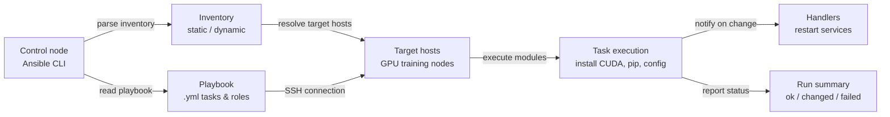

## Definition

Ansible is an open-source automation tool created by Red Hat that handles configuration management, application deployment, and task automation across a fleet of servers using simple, human-readable YAML files called **playbooks**. Its defining architectural choice is being **agentless**: Ansible connects to managed nodes over SSH (Linux) or WinRM (Windows) and executes tasks directly, with no daemon or agent software required on the target machines. This makes it significantly easier to adopt than agent-based tools — you can start managing existing servers without any pre-installed software beyond Python and an SSH server.

Ansible operates on a **push model**: an operator runs a playbook from a control node, Ansible connects to the target inventory of hosts, and executes tasks in order. Tasks call **modules** — idempotent units of work that know how to install packages, manage files, start services, run commands, and interact with cloud APIs. Community and official modules cover virtually every Linux package manager, service, cloud provider, network device, and application. Roles bundle related tasks, files, templates, and variables into reusable, shareable units that can be published to Ansible Galaxy or maintained in internal Git repositories.

In ML and data engineering contexts, Ansible fills the gap that [Terraform](/docs/mlops/iac/terraform) leaves. Terraform provisions infrastructure (creates the GPU instance, the VPC, the S3 bucket); Ansible configures what runs on that infrastructure (installs the correct CUDA version, configures the Python environment, sets up distributed training dependencies, and ensures GPU monitoring tools are running). The two tools are complementary rather than competing: a typical MLOps workflow uses Terraform to provision cloud resources and Ansible to bootstrap those resources into a ready-to-train state.

## How it works

### Inventory

The inventory defines which hosts Ansible manages. A static inventory is an INI or YAML file listing hostnames or IP addresses grouped by role (e.g., `[gpu_training_nodes]`, `[model_serving]`). Dynamic inventories query cloud APIs (AWS EC2, GCP Compute, Azure VMs) at runtime to build the host list from live infrastructure — essential for auto-scaling environments. Host and group variables define per-host or per-group configuration values that are referenced in playbooks.

### Playbooks and tasks

A playbook is a YAML file containing one or more **plays**. Each play targets a group of hosts and a list of **tasks**. Each task calls a module with arguments and optionally defines conditions (`when`), loops (`loop`), and handlers triggered on change. Tasks are executed sequentially within a play; plays can run in parallel across hosts. The result of each task is one of: `ok` (no change needed), `changed` (change was made), `failed`, or `skipped`. Ansible prints a summary of these results after every playbook run.

### Roles

Roles provide a standardized directory structure for organizing related automation: `tasks/`, `handlers/`, `templates/`, `files/`, `vars/`, `defaults/`, and `meta/`. A role can be applied to multiple plays in multiple playbooks, and roles can depend on other roles. Ansible Galaxy hosts thousands of community roles (e.g., `geerlingguy.docker`, `nvidia.nvidia_driver`) that can be installed with `ansible-galaxy install` and used directly in playbooks.

### Variables and templating

Ansible uses the Jinja2 templating engine throughout playbooks and template files. Variables can be defined at multiple levels (role defaults, group vars, host vars, playbook vars, extra vars passed with `-e`) with a clear precedence order. Templates (`.j2` files) generate configuration files dynamically — for example, generating a distributed training configuration file with the correct master node IP, number of GPUs, and batch size for each environment.

### Idempotency and handlers

Ansible modules are designed to be idempotent: running a playbook multiple times produces the same end state without causing unintended side effects. If a package is already installed at the correct version, the task reports `ok` and does nothing. **Handlers** are special tasks that run at the end of a play only if notified by a task that resulted in `changed` — used to restart services (like a CUDA-accelerated training daemon) only when their configuration actually changes.



## When to use / When NOT to use

| Use when | Avoid when |
|----------|------------|
| Configuring software on existing servers: installing CUDA, Python, pip packages, system services | Provisioning new cloud infrastructure from scratch (use Terraform for that) |
| Bootstrapping GPU training nodes after Terraform creates them | You need fine-grained state tracking across hundreds of resources (Ansible has no state file) |
| Setting up consistent ML environments across development, staging, and production machines | You need complex dependency graphs between cloud resources with automatic ordering |
| Running ad-hoc commands across a fleet of servers (e.g., update a config file everywhere) | Target machines cannot be reached via SSH or WinRM from the control node |
| Deploying application updates or rolling out configuration changes across many nodes | You are provisioning cloud-native resources (VPCs, IAM roles, S3 buckets) — use Terraform |
| Teams that need low-barrier IaC tooling with a shallow YAML learning curve | You need very fast parallel execution; Ansible's SSH overhead limits scalability at thousands of nodes |

## Comparisons

| Criterion | Ansible | Terraform |
|-----------|---------|-----------|
| Paradigm | Procedural with idempotent modules — tasks run in order | Declarative — describe desired state, Terraform computes the diff |
| State management | Stateless — no built-in tracking of what was previously applied | Explicit state file maps configuration to real resource IDs |
| Primary use case | Configuration management and software deployment on existing hosts | Cloud infrastructure provisioning (instances, networks, storage) |
| Cloud provider support | Cloud modules exist but are less comprehensive than Terraform providers | 1,000+ providers with deep, versioned API coverage |
| Idempotency | Task-level — each module must be written idempotently | Native — plan/apply always converges to declared state |
| Learning curve | Low — YAML tasks are readable; no new language required | Moderate — HCL syntax + state/plan mental model to learn |
| Agent required | No — agentless, connects via SSH | No — Terraform runs on the control machine, calls cloud APIs |
| When to use together | Ansible configures software on infrastructure Terraform has provisioned | Terraform provisions resources; Ansible handles OS and app config |

## Pros and cons

| Aspect | Pros | Cons |
|--------|------|------|
| Agentless architecture | No software to install on target nodes; works with existing SSH | SSH overhead limits performance at very large scale (10,000+ nodes) |
| YAML playbooks | Human-readable, self-documenting automation | Complex logic (loops, conditionals) becomes verbose in YAML |
| Idempotent modules | Safe to re-run; drift correction without side effects | Idempotency depends on module quality; shell/command modules are not inherently idempotent |
| Ansible Galaxy | Large ecosystem of community roles for common software | Community role quality varies; pinning role versions is critical for reproducibility |
| No state file | Simple, no state management overhead | No built-in drift detection between runs; manual or third-party tooling required |
| Jinja2 templating | Powerful dynamic configuration generation | Template debugging is harder than native code; errors surface at runtime |

## Code examples

```yaml
# ml_environment_setup.yml
# Ansible playbook to configure a GPU training node for ML workloads.
# Installs CUDA toolkit, cuDNN, Python 3.11, pip packages, and sets up
# a systemd service for the Prometheus node exporter.
#
# Usage:
#   ansible-playbook -i inventory.ini ml_environment_setup.yml
#
# inventory.ini example:
#   [gpu_training_nodes]
#   10.0.1.10 ansible_user=ubuntu ansible_ssh_private_key_file=~/.ssh/ml-key.pem
#   10.0.1.11 ansible_user=ubuntu ansible_ssh_private_key_file=~/.ssh/ml-key.pem

---
- name: Configure GPU training nodes for ML workloads
  hosts: gpu_training_nodes
  become: true  # Run tasks as root via sudo
  vars:
    cuda_version: "12.1"
    python_version: "3.11"
    pip_packages:
      - torch==2.3.0
      - torchvision==0.18.0
      - torchaudio==2.3.0
      - numpy==1.26.4
      - pandas==2.2.2
      - scikit-learn==1.4.2
      - mlflow==2.13.0
      - evidently==0.4.30
      - prometheus-client==0.20.0
    node_exporter_version: "1.8.1"
    ml_user: "mlops"
    ml_workdir: "/opt/ml"

  handlers:
    - name: restart node_exporter
      ansible.builtin.systemd:
        name: node_exporter
        state: restarted
        daemon_reload: true

  tasks:
    # --- System prerequisites ---

    - name: Update apt package cache
      ansible.builtin.apt:
        update_cache: true
        cache_valid_time: 3600  # Skip update if cache is less than 1 hour old

    - name: Install system dependencies
      ansible.builtin.apt:
        name:
          - build-essential
          - git
          - wget
          - curl
          - htop
          - nvtop          # GPU monitoring in terminal
          - python{{ python_version }}
          - python{{ python_version }}-dev
          - python{{ python_version }}-venv
          - python3-pip
        state: present

    # --- CUDA installation ---

    - name: Check if CUDA {{ cuda_version }} is already installed
      ansible.builtin.command: nvcc --version
      register: nvcc_check
      changed_when: false
      failed_when: false

    - name: Add CUDA repository keyring
      ansible.builtin.shell: |
        wget -qO /tmp/cuda-keyring.deb \
          https://developer.download.nvidia.com/compute/cuda/repos/ubuntu2204/x86_64/cuda-keyring_1.1-1_all.deb
        dpkg -i /tmp/cuda-keyring.deb
      when: cuda_version not in (nvcc_check.stdout | default(''))
      args:
        creates: /usr/share/keyrings/cuda-archive-keyring.gpg

    - name: Install CUDA toolkit {{ cuda_version }}
      ansible.builtin.apt:
        name: cuda-toolkit-{{ cuda_version | replace('.', '-') }}
        state: present
        update_cache: true
      when: cuda_version not in (nvcc_check.stdout | default(''))

    - name: Set CUDA environment variables in /etc/environment
      ansible.builtin.lineinfile:
        path: /etc/environment
        line: "{{ item }}"
        state: present
      loop:
        - 'CUDA_HOME=/usr/local/cuda'
        - 'PATH=/usr/local/cuda/bin:$PATH'
        - 'LD_LIBRARY_PATH=/usr/local/cuda/lib64:$LD_LIBRARY_PATH'

    # --- ML user and workspace ---

    - name: Create dedicated ML user
      ansible.builtin.user:
        name: "{{ ml_user }}"
        shell: /bin/bash
        home: "/home/{{ ml_user }}"
        create_home: true
        state: present

    - name: Create ML working directory
      ansible.builtin.file:
        path: "{{ ml_workdir }}"
        state: directory
        owner: "{{ ml_user }}"
        group: "{{ ml_user }}"
        mode: "0755"

    # --- Python virtual environment and packages ---

    - name: Create Python virtual environment
      ansible.builtin.command:
        cmd: python{{ python_version }} -m venv {{ ml_workdir }}/venv
        creates: "{{ ml_workdir }}/venv/bin/python"
      become_user: "{{ ml_user }}"

    - name: Upgrade pip in virtual environment
      ansible.builtin.pip:
        name: pip
        state: latest
        virtualenv: "{{ ml_workdir }}/venv"
      become_user: "{{ ml_user }}"

    - name: Install ML Python packages
      ansible.builtin.pip:
        name: "{{ pip_packages }}"
        virtualenv: "{{ ml_workdir }}/venv"
        state: present
      become_user: "{{ ml_user }}"

    - name: Write requirements.txt for reproducibility
      ansible.builtin.copy:
        dest: "{{ ml_workdir }}/requirements.txt"
        content: "{{ pip_packages | join('\n') }}\n"
        owner: "{{ ml_user }}"
        group: "{{ ml_user }}"
        mode: "0644"

    # --- Prometheus Node Exporter for infrastructure monitoring ---

    - name: Check if node_exporter is already installed
      ansible.builtin.stat:
        path: /usr/local/bin/node_exporter
      register: node_exporter_stat

    - name: Download Prometheus node_exporter {{ node_exporter_version }}
      ansible.builtin.get_url:
        url: "https://github.com/prometheus/node_exporter/releases/download/v{{ node_exporter_version }}/node_exporter-{{ node_exporter_version }}.linux-amd64.tar.gz"
        dest: /tmp/node_exporter.tar.gz
        mode: "0644"
      when: not node_exporter_stat.stat.exists

    - name: Extract and install node_exporter
      ansible.builtin.unarchive:
        src: /tmp/node_exporter.tar.gz
        dest: /tmp
        remote_src: true
      when: not node_exporter_stat.stat.exists

    - name: Copy node_exporter binary to /usr/local/bin
      ansible.builtin.copy:
        src: "/tmp/node_exporter-{{ node_exporter_version }}.linux-amd64/node_exporter"
        dest: /usr/local/bin/node_exporter
        mode: "0755"
        remote_src: true
      when: not node_exporter_stat.stat.exists
      notify: restart node_exporter

    - name: Create node_exporter systemd service
      ansible.builtin.copy:
        dest: /etc/systemd/system/node_exporter.service
        content: |
          [Unit]
          Description=Prometheus Node Exporter
          After=network.target

          [Service]
          User=nobody
          ExecStart=/usr/local/bin/node_exporter \
            --collector.systemd \
            --collector.processes
          Restart=on-failure

          [Install]
          WantedBy=multi-user.target
        mode: "0644"
      notify: restart node_exporter

    - name: Enable and start node_exporter
      ansible.builtin.systemd:
        name: node_exporter
        enabled: true
        state: started
        daemon_reload: true

    # --- Verification ---

    - name: Verify GPU is visible to CUDA
      ansible.builtin.command: nvidia-smi
      register: nvidia_smi_output
      changed_when: false
      failed_when: nvidia_smi_output.rc != 0

    - name: Print GPU info
      ansible.builtin.debug:
        var: nvidia_smi_output.stdout_lines

    - name: Verify PyTorch can see the GPU
      ansible.builtin.command:
        cmd: "{{ ml_workdir }}/venv/bin/python -c \"import torch; print('CUDA available:', torch.cuda.is_available()); print('GPU count:', torch.cuda.device_count())\""
      register: torch_check
      changed_when: false
      become_user: "{{ ml_user }}"

    - name: Print PyTorch GPU availability
      ansible.builtin.debug:
        var: torch_check.stdout_lines
```

## Practical resources

- [Ansible documentation](https://docs.ansible.com/ansible/latest/index.html) — Official documentation covering playbooks, modules, roles, inventory, and best practices.
- [Ansible Galaxy](https://galaxy.ansible.com/) — Community hub for reusable Ansible roles and collections, including NVIDIA GPU drivers, Docker, and Kubernetes roles.
- [Jeff Geerling — Ansible for DevOps](https://www.ansiblefordevops.com/) — Comprehensive book and accompanying GitHub repository covering Ansible from basics to production patterns.
- [NVIDIA Ansible collection](https://github.com/nvidia/ansible-collection-nvidia-gpu) — Official NVIDIA Ansible collection for managing GPU drivers, CUDA, and NCCL installations.
- [Ansible best practices guide](https://docs.ansible.com/ansible/latest/tips_tricks/ansible_tips_tricks.html) — Official tips and tricks covering directory structure, variable management, and performance optimization.

## See also

- [Terraform](/docs/mlops/iac/terraform)
- [ML Kubernetes](/docs/mlops/deployment/ml-kubernetes)
- [MLOps](/docs/mlops)
