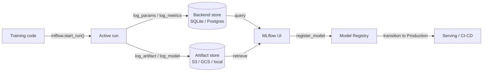

## Definition

MLflow is an open-source platform designed to manage the end-to-end machine learning lifecycle. Originally released by Databricks in 2018, it has become one of the most widely adopted MLOps tools due to its simplicity, framework-agnosticism, and the fact that it can be run entirely on-premise without any cloud dependency. A single `pip install mlflow` and a two-line code change is enough to start tracking experiments.

MLflow organizes functionality into four tightly integrated components. **Tracking** records parameters, metrics, and artifacts for every training run. **Projects** package ML code into reproducible, runnable units defined by a `MLproject` file. **Models** provide a standard format for packaging models that can be served by any supported deployment target. **Model Registry** provides a centralized model store with lifecycle management (Staging, Production, Archived states) and version history. Together these components cover the journey from raw experiment to production deployment.

MLflow can be run locally (SQLite backend, local filesystem artifacts), on a self-managed server (PostgreSQL + S3), or as a fully managed service via Databricks Managed MLflow. The open-source core is Apache 2.0 licensed, making it suitable for regulated industries where data cannot leave on-premise infrastructure.

## How it works

### Tracking server

When you call `mlflow.start_run()`, the client opens a run on the tracking server and begins buffering logs. Parameters (`log_param`, `log_params`) and metrics (`log_metric`, `log_metrics`) are written to the backend store (SQLite or PostgreSQL). Artifacts are uploaded to the artifact store (local filesystem, S3, GCS, Azure Blob, HDFS). The server exposes a REST API consumed by the client SDK and the web UI.

### MLflow Projects

A project is a directory (or git repo) with an `MLproject` YAML file that declares the entry points, parameters, and conda/pip environment. Running `mlflow run . -P lr=0.01` resolves the environment, sets parameters, and launches the entry point — producing a tracked run automatically. This makes experiments reproducible by anyone with access to the repo.

### MLflow Models

A model saved with `mlflow.<flavor>.log_model()` is stored in the MLmodel format: a directory containing the serialized model, a `MLmodel` YAML descriptor, and a `conda.yaml` / `requirements.txt`. The `pyfunc` flavor provides a uniform `model.predict(data)` interface regardless of the underlying framework, enabling the same model to be loaded by different serving backends.

### Model Registry

The registry stores named model versions with transition states. Automated CI/CD systems query the registry for the latest `Production` version to deploy. Human approvers or automated validation jobs transition versions between states. Every version links back to its source run, preserving full provenance.



## When to use / When NOT to use

| Use when | Avoid when |
|----------|------------|
| You need a fully self-hosted, open-source MLOps platform | Your team needs rich collaborative features (shared reports, Slack notifications) out of the box |
| Data cannot leave your infrastructure (regulated industries) | You prefer a SaaS product with zero infrastructure to manage |
| You already use Databricks and want native integration | Your workflow is notebook-only with no production deployment planned |
| Framework agnosticism is important (sklearn, XGBoost, PyTorch, TF, etc.) | You need advanced sweep/hyperparameter optimization built in |
| Cost control is critical; open-source licensing is required | Your team lacks the engineering bandwidth to manage a server and artifact store |

## Comparisons

| Criterion | MLflow | Weights & Biases (W&B) |
|-----------|--------|------------------------|
| Ease of setup | Self-hostable with one command; no account needed | SaaS; free account required; no infrastructure to manage |
| UI quality | Clean but basic; focused on tabular metrics and run comparison | Highly polished; excellent media logging, custom charts, reports |
| Collaboration | Shared server required; no built-in RBAC in OSS | Built-in team workspaces, sharing links, and role-based access |
| Pricing | Free and open-source; Databricks Managed MLflow costs extra | Free for individuals; paid plans for teams |
| Hyperparameter optimization | Integrates with Optuna, Ray Tune externally | Sweeps built in with Bayesian/grid/random search |

## Code examples

```python
# mlflow_full_example.py
# Full MLflow tracking example: logs params, metrics, a custom artifact,
# and registers the model in the Model Registry.
# pip install mlflow scikit-learn matplotlib

import mlflow
import mlflow.sklearn
import matplotlib.pyplot as plt
import numpy as np
from sklearn.ensemble import GradientBoostingClassifier
from sklearn.datasets import load_breast_cancer
from sklearn.model_selection import train_test_split, cross_val_score
from sklearn.metrics import (
    accuracy_score, roc_auc_score, classification_report
)
import os, tempfile, json

# ── 1. Data ──────────────────────────────────────────────────────────────────
X, y = load_breast_cancer(return_X_y=True)
X_train, X_test, y_train, y_test = train_test_split(
    X, y, test_size=0.2, stratify=y, random_state=0
)

# ── 2. Hyperparameters ────────────────────────────────────────────────────────
params = {
    "n_estimators": 200,
    "learning_rate": 0.05,
    "max_depth": 4,
    "subsample": 0.8,
    "random_state": 0,
}

# ── 3. MLflow run ─────────────────────────────────────────────────────────────
mlflow.set_experiment("breast-cancer-gbt")

with mlflow.start_run(run_name="gbt-tuned") as run:

    # Log hyperparameters
    mlflow.log_params(params)

    # Train
    clf = GradientBoostingClassifier(**params)
    clf.fit(X_train, y_train)

    # Evaluate
    y_pred = clf.predict(X_test)
    y_prob = clf.predict_proba(X_test)[:, 1]
    cv_scores = cross_val_score(clf, X_train, y_train, cv=5, scoring="roc_auc")

    metrics = {
        "accuracy": accuracy_score(y_test, y_pred),
        "roc_auc": roc_auc_score(y_test, y_prob),
        "cv_roc_auc_mean": cv_scores.mean(),
        "cv_roc_auc_std": cv_scores.std(),
    }
    mlflow.log_metrics(metrics)

    # Log a feature importance plot as an artifact
    with tempfile.TemporaryDirectory() as tmp:
        fig, ax = plt.subplots(figsize=(8, 5))
        feat_imp = clf.feature_importances_
        top_idx = np.argsort(feat_imp)[-10:]
        ax.barh(range(10), feat_imp[top_idx])
        ax.set_title("Top 10 feature importances")
        fig.tight_layout()
        plot_path = os.path.join(tmp, "feature_importance.png")
        fig.savefig(plot_path)
        plt.close(fig)
        mlflow.log_artifact(plot_path, artifact_path="plots")

        # Log classification report as JSON
        report = classification_report(y_test, y_pred, output_dict=True)
        report_path = os.path.join(tmp, "classification_report.json")
        with open(report_path, "w") as f:
            json.dump(report, f, indent=2)
        mlflow.log_artifact(report_path, artifact_path="evaluation")

    # Log and register the model
    mlflow.sklearn.log_model(
        clf,
        artifact_path="model",
        registered_model_name="breast-cancer-gbt",  # creates registry entry
    )

    print(f"Run ID  : {run.info.run_id}")
    for k, v in metrics.items():
        print(f"  {k}: {v:.4f}")

# ── 4. Load a registered model (simulates downstream serving) ─────────────────
# model_uri = "models:/breast-cancer-gbt/1"
# loaded = mlflow.sklearn.load_model(model_uri)
# print(loaded.predict(X_test[:3]))
```

## Practical resources

- [MLflow Official Documentation](https://mlflow.org/docs/latest/index.html) — Complete reference covering all four components, REST API, and deployment targets.
- [MLflow GitHub Repository](https://github.com/mlflow/mlflow) — Source code, issue tracker, and examples; useful for understanding internals and contributing.
- [Databricks – MLflow Tutorials](https://docs.databricks.com/en/mlflow/index.html) — Production-grade MLflow usage on Databricks with Unity Catalog integration.
- [Towards Data Science – MLflow in Production](https://towardsdatascience.com/deploy-mlflow-with-docker-compose-8059f16b6039) — Community walkthrough of deploying a self-hosted MLflow server with Docker Compose, PostgreSQL, and MinIO.

## See also

- [Experiment tracking](/docs/mlops/experiment-tracking)
- [Weights & Biases](/docs/mlops/wandb)
- [MLOps](/docs/mlops)
