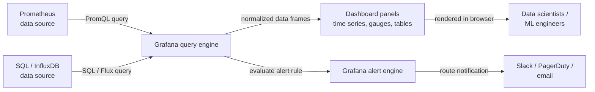

## Definition

Grafana is an open-source analytics and interactive visualization platform that connects to a wide range of data sources — [Prometheus](/docs/mlops/monitoring/prometheus), InfluxDB, Elasticsearch, Loki, PostgreSQL, cloud-native monitoring APIs, and dozens more — and renders the data as interactive, shareable dashboards. It provides no storage of its own; it is purely a query-and-visualization layer that sits in front of existing data infrastructure. This design makes Grafana complementary to every time-series or log storage system rather than a replacement for any of them.

In ML and MLOps contexts, Grafana serves as the unified observability interface. Data scientists and ML engineers use it to track model performance metrics (accuracy, F1, AUC) as they change over time, visualize prediction latency and throughput alongside infrastructure resource usage, and monitor data quality signals such as feature drift scores. Because Grafana supports multiple data sources simultaneously, a single dashboard can combine Prometheus metrics, application logs from Loki, and business KPIs from a SQL database — giving a complete, contextualized view of a model's behavior in production.

Grafana is available as a self-hosted open-source distribution, as Grafana Cloud (a managed SaaS offering), and as Grafana Enterprise with additional enterprise features. The open-source distribution is fully functional and is the most common choice for teams that already operate Kubernetes or have infrastructure-as-code workflows, since Grafana dashboards, data source configurations, and alert rules can all be managed as JSON or through Terraform providers.

## How it works

### Data source configuration

Grafana connects to data sources via plugins. A data source plugin translates Grafana's internal query model into the native query language of the backend (PromQL for Prometheus, SQL for relational databases, Lucene for Elasticsearch, etc.) and returns data in a normalized format. Data sources are configured in the Grafana UI or via provisioning files (YAML), which allows managing configurations as code in a Git repository. Authentication, TLS, and timeout settings are all configurable per data source.

### Dashboard and panel composition

A Grafana dashboard is a JSON document containing an ordered list of panels. Each panel defines a query against a data source, a visualization type (time series, gauge, bar chart, table, heatmap, stat, etc.), and display options (axes, thresholds, legends, overrides). Panels can be linked to other dashboards, support variables (template variables allow a single dashboard to switch between environments, model versions, or services via a dropdown), and can reference annotations — events overlaid on time-series graphs to mark deployments, retraining runs, or incident starts.

### Variables and templating

Template variables transform a static dashboard into a dynamic one. A variable queries the data source for a list of values (e.g., all distinct `model_version` label values from Prometheus) and inserts the selected value into every panel query on the dashboard. This makes it possible to build a single ML model dashboard that works for all models and versions rather than maintaining one dashboard per model.

### Alerting

Grafana Alerting (introduced in Grafana 8+) provides unified, multi-datasource alert rules that evaluate panel queries on a schedule and route firing alerts to contact points (Slack, PagerDuty, email, webhooks). Alert rules are grouped into notification policies that determine routing, grouping, and silencing behavior. Grafana Alerting can coexist with Prometheus Alertmanager or fully replace it, depending on team preference.

### Provisioning and infrastructure as code

Grafana supports declarative provisioning of data sources, dashboards, and alert rules via YAML and JSON files loaded at startup. Combined with the Grafana Terraform provider, the entire Grafana configuration can be version-controlled and deployed through CI/CD pipelines — a critical capability for teams that manage multiple environments or want reproducible monitoring infrastructure.



## When to use / When NOT to use

| Use when | Avoid when |
|----------|------------|
| You need interactive, shareable dashboards over Prometheus or other time-series data | You need a full-featured ML experiment tracking UI (use MLflow or W&B instead) |
| You want to correlate infrastructure metrics with model performance in one view | Your team has no existing time-series data source to connect Grafana to |
| You have multiple data sources (Prometheus, SQL, Loki) to unify in one dashboard | A simple text or tabular summary is sufficient and a dashboard adds no value |
| You want to manage dashboards as code via JSON or Terraform | Your organization is already standardized on a proprietary observability platform |
| You need alerting that spans multiple data sources | You need to store or analyze raw prediction logs (Grafana queries, it does not store) |

## Comparisons

Grafana and Prometheus are complementary — Prometheus collects and stores metrics; Grafana visualizes them. The table below compares them to help clarify their distinct roles.

| Criterion | Grafana | Prometheus |
|-----------|---------|-----------|
| Primary role | Visualization and dashboarding | Metrics collection, storage, and alerting |
| Data storage | None — queries external backends | Local TSDB (pull-based scraping) |
| Query language | Depends on data source (PromQL, SQL, etc.) | PromQL |
| Alerting | Unified multi-datasource alerting (Grafana 8+) | PromQL-based rules + Alertmanager |
| Data sources | 50+ plugins (Prometheus, SQL, Loki, cloud, etc.) | Self only (TSDB) |
| When to use together | Always — Grafana is the UI for Prometheus data | Always — Prometheus is the backend for Grafana dashboards |

## Pros and cons

| Aspect | Pros | Cons |
|--------|------|------|
| Multi-datasource | Unifies metrics, logs, and SQL in one dashboard | Configuration complexity grows with the number of data sources |
| Dashboard-as-code | JSON export and Terraform provider enable GitOps workflows | JSON dashboards are verbose and hard to diff manually |
| Template variables | One dashboard covers all models, environments, and versions | Variable queries add latency on dashboard load |
| Visualization library | Rich, customizable panel types | Some advanced chart types require plugins or Grafana Enterprise |
| Alerting | Unified, multi-datasource alert rules | Learning curve for notification policies and routing trees |
| Self-hosted option | Full control, no data leaves your infrastructure | Requires operational effort: upgrades, backups, plugin management |

## Code examples

```json
// grafana_ml_dashboard.json
// Grafana dashboard definition for monitoring an ML model serving endpoint.
// Import this JSON via Grafana UI: Dashboards → Import → Upload JSON file.
// Prerequisites: Prometheus data source named "Prometheus" with ml_* metrics.
{
  "title": "ML Model Monitoring",
  "description": "Dashboard for monitoring ML model latency, throughput, confidence distribution, and data drift.",
  "uid": "ml-model-monitoring-v1",
  "schemaVersion": 36,
  "version": 1,
  "refresh": "30s",
  "time": { "from": "now-3h", "to": "now" },
  "templating": {
    "list": [
      {
        "name": "model_name",
        "label": "Model",
        "type": "query",
        "datasource": { "type": "prometheus", "uid": "Prometheus" },
        "query": "label_values(ml_predictions_total, model_name)",
        "includeAll": false,
        "multi": false,
        "current": {}
      },
      {
        "name": "model_version",
        "label": "Version",
        "type": "query",
        "datasource": { "type": "prometheus", "uid": "Prometheus" },
        "query": "label_values(ml_predictions_total{model_name=\"$model_name\"}, model_version)",
        "includeAll": true,
        "multi": true,
        "current": {}
      }
    ]
  },
  "panels": [
    {
      "id": 1,
      "title": "Prediction Throughput (req/s)",
      "type": "timeseries",
      "gridPos": { "x": 0, "y": 0, "w": 12, "h": 8 },
      "datasource": { "type": "prometheus", "uid": "Prometheus" },
      "targets": [
        {
          "expr": "sum(rate(ml_predictions_total{model_name=\"$model_name\", status=\"success\"}[2m])) by (model_version)",
          "legendFormat": "{{model_version}} — success",
          "refId": "A"
        },
        {
          "expr": "sum(rate(ml_predictions_total{model_name=\"$model_name\", status=\"error\"}[2m])) by (model_version)",
          "legendFormat": "{{model_version}} — error",
          "refId": "B"
        }
      ],
      "fieldConfig": {
        "defaults": {
          "unit": "reqps",
          "custom": { "lineWidth": 2, "fillOpacity": 10 }
        }
      }
    },
    {
      "id": 2,
      "title": "P50 / P95 / P99 Prediction Latency",
      "type": "timeseries",
      "gridPos": { "x": 12, "y": 0, "w": 12, "h": 8 },
      "datasource": { "type": "prometheus", "uid": "Prometheus" },
      "targets": [
        {
          "expr": "histogram_quantile(0.50, sum(rate(ml_prediction_latency_seconds_bucket{model_name=\"$model_name\"}[2m])) by (le, model_version))",
          "legendFormat": "p50 {{model_version}}",
          "refId": "A"
        },
        {
          "expr": "histogram_quantile(0.95, sum(rate(ml_prediction_latency_seconds_bucket{model_name=\"$model_name\"}[2m])) by (le, model_version))",
          "legendFormat": "p95 {{model_version}}",
          "refId": "B"
        },
        {
          "expr": "histogram_quantile(0.99, sum(rate(ml_prediction_latency_seconds_bucket{model_name=\"$model_name\"}[2m])) by (le, model_version))",
          "legendFormat": "p99 {{model_version}}",
          "refId": "C"
        }
      ],
      "fieldConfig": {
        "defaults": {
          "unit": "s",
          "thresholds": {
            "mode": "absolute",
            "steps": [
              { "color": "green", "value": null },
              { "color": "yellow", "value": 0.1 },
              { "color": "red", "value": 0.5 }
            ]
          }
        }
      }
    },
    {
      "id": 3,
      "title": "Data Drift Score",
      "type": "gauge",
      "gridPos": { "x": 0, "y": 8, "w": 8, "h": 6 },
      "datasource": { "type": "prometheus", "uid": "Prometheus" },
      "targets": [
        {
          "expr": "ml_data_drift_score{model_name=\"$model_name\"}",
          "legendFormat": "{{feature_set}}",
          "refId": "A"
        }
      ],
      "fieldConfig": {
        "defaults": {
          "unit": "none",
          "min": 0,
          "max": 1,
          "thresholds": {
            "mode": "absolute",
            "steps": [
              { "color": "green", "value": null },
              { "color": "yellow", "value": 0.1 },
              { "color": "red", "value": 0.25 }
            ]
          }
        }
      }
    },
    {
      "id": 4,
      "title": "Prediction Confidence Distribution (heatmap)",
      "type": "heatmap",
      "gridPos": { "x": 8, "y": 8, "w": 16, "h": 6 },
      "datasource": { "type": "prometheus", "uid": "Prometheus" },
      "targets": [
        {
          "expr": "sum(rate(ml_prediction_confidence_bucket{model_name=\"$model_name\"}[5m])) by (le)",
          "legendFormat": "{{le}}",
          "refId": "A",
          "format": "heatmap"
        }
      ]
    }
  ]
}
```

## Practical resources

- [Grafana documentation](https://grafana.com/docs/grafana/latest/) — Official documentation covering installation, data sources, dashboards, alerting, and provisioning.
- [Grafana dashboard best practices](https://grafana.com/docs/grafana/latest/dashboards/build-dashboards/best-practices/) — Official guide on structuring effective dashboards, using template variables, and organizing panels.
- [Grafana Terraform provider](https://registry.terraform.io/providers/grafana/grafana/latest/docs) — Manage Grafana data sources, dashboards, and alert rules as infrastructure-as-code.
- [Awesome Grafana](https://github.com/monitoringartist/grafana-aws-cloudwatch-dashboards) — Community-curated collection of pre-built Grafana dashboards for common infrastructure stacks.
- [Grafana Labs blog — ML observability](https://grafana.com/blog/2021/08/09/how-to-monitor-machine-learning-models-with-grafana/) — Practical walkthrough of setting up ML model monitoring dashboards with Grafana and Prometheus.

## See also

- [Prometheus](/docs/mlops/monitoring/prometheus)
- [ML monitoring](/docs/mlops/monitoring)
- [MLOps](/docs/mlops)
