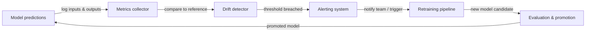

## Definition

ML monitoring is the practice of continuously observing machine learning models and the data they operate on after deployment. Unlike traditional software, which either works or throws an error, a model can silently degrade: it still produces outputs, but those outputs grow increasingly wrong as the world changes. ML monitoring provides the early-warning systems that detect this degradation before it causes business harm.

Three phenomena drive most model degradation in production. **Concept drift** occurs when the statistical relationship between input features and the target variable changes — for example, a fraud detection model trained before a new attack vector appears will systematically miss the new pattern. **Data drift** (also called covariate shift) occurs when the distribution of input features changes without a corresponding change in the target relationship — seasonal patterns, demographic shifts, and upstream data-pipeline changes all cause data drift. **Model decay** is the cumulative performance loss that results from one or both of these drifts; left unchecked it manifests as rising error rates, declining revenue, and degraded user experiences.

Effective ML monitoring spans three layers: **data quality monitoring** (schema, null rates, value ranges), **distribution monitoring** (statistical tests for drift in features and predictions), and **model performance monitoring** (business and ML metrics computed against ground truth when labels are available). The combination of all three layers provides defense in depth — catching problems early, at their source, and in their downstream effect.

## How it works

### Data and prediction collection

Every prediction request passes through an instrumented serving layer that logs inputs, outputs, timestamps, and metadata to a centralized store (object storage, a data warehouse, or a streaming platform like Kafka). Reference datasets — typically the training or validation dataset — are stored alongside production logs to serve as the statistical baseline for drift calculations. Label pipelines ingest delayed ground truth (labels often arrive hours or weeks after prediction) and join them back to the logged predictions.

### Drift detection

Drift detectors compare the current production distribution against the reference baseline using statistical tests. For continuous features, the Population Stability Index (PSI), Kolmogorov-Smirnov test, or Wasserstein distance measure distributional change. For categorical features, chi-squared tests or Jensen-Shannon divergence are common. Predictions themselves are treated as a feature: a shift in prediction distribution (e.g., a classifier suddenly outputting "positive" 80% of the time when the baseline was 30%) is a powerful early signal before ground truth labels arrive.

### Performance metric computation

When ground truth labels are available, performance metrics are computed over rolling windows or time-based cohorts. Accuracy, precision, recall, F1, RMSE, and AUC-ROC are common ML metrics. Business metrics — revenue attributed to model-driven decisions, call deflection rate, recommendation click-through — are often more actionable. Latency, throughput, and error rates are infrastructure metrics that indicate serving health and should be monitored alongside model quality.

### Alerting and escalation

Thresholds and anomaly-detection rules fire alerts when a metric crosses a boundary. Static thresholds are simple but brittle; statistical process control (e.g., control charts) and ML-based anomaly detection adapt to seasonality. Alerts route to PagerDuty, Slack, or email depending on severity. Well-designed alert hierarchies distinguish between informational events (log only), warnings (notify the ML team), and critical events (page on-call, trigger automated rollback or retraining).

### Retraining feedback loop

Monitoring is the input to the retraining loop. When drift is detected or performance degrades past a threshold, an automated pipeline (or human decision) triggers a retraining job on fresh data. After retraining, the new model candidate passes evaluation gates before promotion, closing the loop.



## When to use / When NOT to use

| Use when | Avoid when |
|----------|------------|
| A model is deployed to production and serves real users | The model is a one-off analysis that will never be used again |
| Model decisions have measurable business impact | The prediction volume is so low that statistical tests lack power |
| Ground truth labels are eventually available | You have no feedback mechanism to collect labels or business outcomes |
| Regulatory requirements mandate auditable model performance | The cost of monitoring tooling exceeds the expected value of the deployed model |
| The data-generating process is known to change over time | The model is retrained continuously anyway and drift is implicitly handled |
| Multiple models are in production simultaneously | A human reviews every prediction individually, making automated monitoring redundant |

## Comparisons

| Tool | Primary focus | Drift detection | Performance tracking | Hosting |
|------|--------------|-----------------|---------------------|---------|
| Evidently AI | Data and model quality reports | Yes (30+ tests) | Yes | Self-hosted / Cloud |
| WhyLabs | LLM and ML observability | Yes (statistical) | Yes | SaaS |
| Arize AI | ML observability platform | Yes | Yes | SaaS |
| Custom dashboards | Fully tailored | Manual implementation | Manual implementation | Self-hosted |
| MLflow | Experiment tracking + basic monitoring | Limited | Yes (offline) | Self-hosted / Cloud |

## Pros and cons

| Aspect | Pros | Cons |
|--------|------|------|
| Concept drift detection | Catches model decay before business impact | Requires ground truth labels, which arrive with delay |
| Data drift detection | Works without labels — detects problems early | Can produce false positives on benign distributional shifts |
| Automated alerting | Reduces time-to-detect from weeks to minutes | Poorly tuned thresholds cause alert fatigue |
| Tooling ecosystem | Rich open-source and SaaS options | Adds infrastructure complexity and maintenance burden |
| Retraining triggers | Closes the loop automatically | Risk of training instability if retraining fires too frequently |

## Code examples

```python
# drift_detection.py
# Demonstrates concept and data drift detection using Evidently AI.
# Run: pip install evidently scikit-learn pandas numpy

import numpy as np
import pandas as pd
from sklearn.datasets import make_classification
from sklearn.ensemble import RandomForestClassifier
from sklearn.model_selection import train_test_split

from evidently.report import Report
from evidently.metric_preset import DataDriftPreset, ClassificationPreset
from evidently import ColumnMapping

# --- 1. Simulate reference (training) data ---
X, y = make_classification(
    n_samples=1000,
    n_features=10,
    n_informative=5,
    random_state=42,
)
feature_names = [f"feature_{i}" for i in range(10)]
df = pd.DataFrame(X, columns=feature_names)
df["target"] = y

X_train, X_test, y_train, y_test = train_test_split(
    df[feature_names], df["target"], test_size=0.2, random_state=42
)

# --- 2. Train a simple classifier ---
clf = RandomForestClassifier(n_estimators=100, random_state=42)
clf.fit(X_train, y_train)

# Build reference DataFrame with predictions
reference = X_test.copy()
reference["target"] = y_test.values
reference["prediction"] = clf.predict(X_test)

# --- 3. Simulate production data with drift ---
# Introduce feature shift: scale feature_0 to simulate distribution change
X_prod, y_prod = make_classification(
    n_samples=500,
    n_features=10,
    n_informative=5,
    random_state=99,  # Different seed = different distribution
)
df_prod = pd.DataFrame(X_prod, columns=feature_names)
df_prod["feature_0"] = df_prod["feature_0"] * 3.0  # Artificial drift on feature_0
df_prod["target"] = y_prod

production = df_prod[feature_names].copy()
production["target"] = df_prod["target"].values
production["prediction"] = clf.predict(df_prod[feature_names])

# --- 4. Run Evidently drift + performance report ---
column_mapping = ColumnMapping(
    target="target",
    prediction="prediction",
    numerical_features=feature_names,
)

report = Report(metrics=[DataDriftPreset(), ClassificationPreset()])
report.run(
    reference_data=reference,
    current_data=production,
    column_mapping=column_mapping,
)

# Save HTML report for inspection
report.save_html("drift_report.html")
print("Drift report saved to drift_report.html")

# --- 5. Extract drift results programmatically ---
result = report.as_dict()
drift_summary = result["metrics"][0]["result"]
n_drifted = drift_summary.get("number_of_drifted_columns", 0)
total = drift_summary.get("number_of_columns", 0)
share = drift_summary.get("share_of_drifted_columns", 0)

print(f"Drifted columns: {n_drifted}/{total} ({share:.1%})")
if share > 0.3:
    print("WARNING: Significant drift detected — consider retraining.")
else:
    print("Drift within acceptable bounds.")
```

## Practical resources

- [Evidently AI documentation](https://docs.evidentlyai.com/) — Official docs for the leading open-source ML monitoring library, covering drift tests, reports, and real-time monitoring.
- [WhyLabs ML observability platform](https://whylabs.ai/docs) — SaaS platform documentation for monitoring LLM and ML models with statistical profiling and alerting.
- [Chip Huyen — Monitoring ML models in production](https://huyenchip.com/2022/02/07/data-distribution-shifts-and-monitoring.html) — In-depth blog post covering data distribution shifts, monitoring strategies, and practical trade-offs.
- [Google — Rules of Machine Learning: monitoring section](https://developers.google.com/machine-learning/guides/rules-of-ml#monitoring) — Google's engineering guidance on what to monitor and how to set up alerts for production ML.
- [Arize AI — ML observability guide](https://arize.com/ml-observability/) — Practitioner guide covering drift, embeddings monitoring, and the observability stack for ML.

## See also

- [Prometheus](/docs/mlops/monitoring/prometheus)
- [Grafana](/docs/mlops/monitoring/grafana)
- [Model serving](/docs/mlops/deployment/model-serving)
