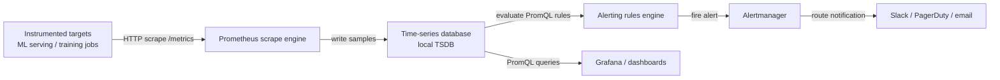

## Definition

Prometheus is an open-source systems monitoring and alerting toolkit originally built at SoundCloud and now a graduated CNCF project. It stores all data as time-series: streams of timestamped floating-point values identified by a metric name and a set of key-value labels. This model is a natural fit for operational data — CPU usage, request counts, error rates — and for ML-specific signals such as prediction latency, throughput, and feature value distributions over time.

The defining architectural choice in Prometheus is its **pull-based scraping model**. Rather than requiring instrumented applications to push metrics to a central collector, Prometheus periodically scrapes HTTP endpoints (by default `/metrics`) exposed by targets. This inversion of control makes service discovery, access control, and debugging significantly simpler: you can curl any target's metrics endpoint directly to see what Prometheus will collect. Targets are discovered via static configuration or dynamic service discovery (Kubernetes, Consul, EC2, etc.).

Prometheus is not a long-term storage solution by design. Its local time-series database (TSDB) is optimized for fast ingest and query of recent data, typically retaining 15 days. For long-term storage, Prometheus can remote-write to systems like Thanos, Cortex, or VictoriaMetrics. In ML contexts, Prometheus is the collection and alerting layer; [Grafana](/docs/mlops/monitoring/grafana) provides the visualization and dashboarding layer on top.

## How it works

### Target instrumentation

Applications expose metrics via an HTTP `/metrics` endpoint in the Prometheus exposition format — a plain-text format of `metric_name{label="value"} numeric_value timestamp` lines. In Python, the `prometheus_client` library provides Counter, Gauge, Histogram, and Summary types that handle the exposition format automatically. An ML serving process typically exposes counters for total prediction requests, histograms for request latency, and gauges for currently loaded model versions and resource utilization.

### Scrape and storage

Prometheus evaluates its configuration file to determine which targets to scrape and at what interval (default: 15 seconds). On each scrape it fetches the `/metrics` endpoint, parses the exposition format, and writes the samples to its local TSDB in compressed chunks. The TSDB uses a write-ahead log (WAL) for durability and compacts data into blocks over time. Label cardinality is the main performance lever: each unique combination of label values creates a separate time series, so unbounded labels (e.g., user IDs) must be avoided.

### PromQL querying and alerting

PromQL (Prometheus Query Language) is a functional query language for selecting and aggregating time-series data. Instant vectors select the current value of a set of series; range vectors select a window of samples; functions compute rates, averages, quantiles, and predictions over those vectors. Alerting rules are PromQL expressions evaluated at a configurable interval; when an expression returns a non-empty result, the alert fires and is sent to Alertmanager.

### Alertmanager

Alertmanager receives alerts from Prometheus (and other sources), deduplicates them, applies grouping and routing rules, and dispatches notifications to receivers (PagerDuty, Slack, email, webhooks). Silences and inhibition rules prevent alert storms during known maintenance windows or cascading failures. In ML systems, Alertmanager routes model degradation alerts to the ML team's Slack channel while infrastructure alerts (high CPU, OOM kills) go to the platform team.

### Remote storage and federation

For multi-cluster or long-retention scenarios, Prometheus remote-writes samples to a durable backend. Federation allows a global Prometheus to scrape aggregated metrics from regional Prometheus instances. Both patterns are common in large ML platforms where training clusters and serving clusters each run their own Prometheus, and a central instance aggregates service-level metrics.



## When to use / When NOT to use

| Use when | Avoid when |
|----------|------------|
| You need operational metrics for ML serving infrastructure (latency, throughput, error rate) | You need to store raw prediction logs or high-cardinality event data |
| You want a pull-based, self-hosted monitoring stack with no vendor lock-in | Your team lacks infrastructure experience to operate and tune a Prometheus stack |
| You are running on Kubernetes and want native service discovery | You need long-term retention (>15 days) without additional remote storage setup |
| You need powerful alerting with deduplication and routing via Alertmanager | You need sub-second scrape intervals; Prometheus is designed for 10–60 second intervals |
| You want a standard backend for Grafana dashboards | Your application generates unbounded label cardinality, which will degrade TSDB performance |

## Comparisons

Prometheus and Grafana are complementary, not competing tools. The table below describes when to use them together versus alternatives.

| Criterion | Prometheus | Grafana |
|-----------|-----------|---------|
| Role | Collect, store, and alert on metrics | Visualize and explore metrics from any data source |
| Query language | PromQL (metrics-optimized functional language) | Per-datasource (PromQL for Prometheus, SQL for others) |
| Alerting | Built-in alerting rules + Alertmanager | Grafana Alerting (unified, multi-datasource) |
| Data sources | Self (TSDB) | Prometheus, InfluxDB, Loki, Elasticsearch, databases, etc. |
| Storage | Local TSDB, remote-write for long-term | No storage — purely a query and visualization layer |
| When to use together | Always — Prometheus collects, Grafana shows | Always — use Grafana as the UI for Prometheus data |

## Pros and cons

| Aspect | Pros | Cons |
|--------|------|------|
| Pull-based architecture | Simple debugging, access control at target level | Requires targets to expose HTTP endpoints |
| PromQL | Expressive, composable, purpose-built for metrics | Steep learning curve compared to SQL |
| Local TSDB | Fast ingest and query for recent data | Limited retention; needs remote storage for long-term |
| Label model | Flexible multi-dimensional filtering and aggregation | High cardinality labels cause memory and query performance issues |
| Alertmanager | Rich routing, grouping, and silencing | Separate component to operate; configuration can become complex |
| Ecosystem | Huge library of exporters and client libraries | Operational overhead for self-hosted deployments |

## Code examples

```python
# ml_metrics_server.py
# Exposes ML model metrics via prometheus_client for Prometheus scraping.
# Run: pip install prometheus_client flask scikit-learn numpy
# Then configure Prometheus to scrape localhost:8000

import time
import threading
import random
import numpy as np
from prometheus_client import (
    Counter,
    Histogram,
    Gauge,
    start_http_server,
    REGISTRY,
)
from sklearn.datasets import load_iris
from sklearn.ensemble import RandomForestClassifier

# --- Define metrics ---

PREDICTION_COUNTER = Counter(
    "ml_predictions_total",
    "Total number of prediction requests",
    ["model_name", "model_version", "status"],  # labels
)

PREDICTION_LATENCY = Histogram(
    "ml_prediction_latency_seconds",
    "Prediction request latency in seconds",
    ["model_name", "model_version"],
    buckets=[0.005, 0.01, 0.025, 0.05, 0.1, 0.25, 0.5, 1.0, 2.5],
)

MODEL_CONFIDENCE = Histogram(
    "ml_prediction_confidence",
    "Distribution of model prediction confidence scores",
    ["model_name", "model_version"],
    buckets=[0.1, 0.2, 0.3, 0.4, 0.5, 0.6, 0.7, 0.8, 0.9, 1.0],
)

ACTIVE_MODEL_VERSION = Gauge(
    "ml_active_model_version",
    "Currently active model version (encoded as numeric)",
    ["model_name"],
)

DATA_DRIFT_SCORE = Gauge(
    "ml_data_drift_score",
    "Current data drift score (PSI) for the primary feature set",
    ["model_name", "feature_set"],
)

# --- Load and train a simple model ---
X, y = load_iris(return_X_y=True)
clf = RandomForestClassifier(n_estimators=50, random_state=42)
clf.fit(X, y)

MODEL_NAME = "iris-classifier"
MODEL_VERSION = "1.0.0"
ACTIVE_MODEL_VERSION.labels(model_name=MODEL_NAME).set(1)


def simulate_prediction(features: np.ndarray) -> dict:
    """Run a prediction and record Prometheus metrics."""
    start = time.time()
    try:
        proba = clf.predict_proba(features.reshape(1, -1))[0]
        predicted_class = int(np.argmax(proba))
        confidence = float(np.max(proba))

        # Record latency and confidence
        duration = time.time() - start
        PREDICTION_LATENCY.labels(
            model_name=MODEL_NAME, model_version=MODEL_VERSION
        ).observe(duration)
        MODEL_CONFIDENCE.labels(
            model_name=MODEL_NAME, model_version=MODEL_VERSION
        ).observe(confidence)
        PREDICTION_COUNTER.labels(
            model_name=MODEL_NAME,
            model_version=MODEL_VERSION,
            status="success",
        ).inc()

        return {"class": predicted_class, "confidence": confidence}
    except Exception as exc:
        PREDICTION_COUNTER.labels(
            model_name=MODEL_NAME,
            model_version=MODEL_VERSION,
            status="error",
        ).inc()
        raise exc


def simulate_drift_monitoring():
    """Periodically update a synthetic drift score gauge."""
    while True:
        # In production this would run a real PSI/KS test
        drift_score = random.uniform(0.01, 0.35)
        DATA_DRIFT_SCORE.labels(
            model_name=MODEL_NAME, feature_set="sepal"
        ).set(drift_score)
        time.sleep(30)


def simulate_traffic():
    """Generate synthetic prediction traffic for demonstration."""
    samples = X[np.random.choice(len(X), size=10)]
    for sample in samples:
        simulate_prediction(sample)
        time.sleep(random.uniform(0.05, 0.3))


if __name__ == "__main__":
    # Start Prometheus metrics HTTP server on port 8000
    start_http_server(8000)
    print("Prometheus metrics server running on http://localhost:8000/metrics")
    print("Configure Prometheus to scrape this endpoint.")

    # Start background drift monitor
    drift_thread = threading.Thread(target=simulate_drift_monitoring, daemon=True)
    drift_thread.start()

    # Simulate continuous prediction traffic
    print("Simulating prediction traffic...")
    while True:
        simulate_traffic()
        time.sleep(1)
```

## Practical resources

- [Prometheus documentation](https://prometheus.io/docs/introduction/overview/) — Official docs covering architecture, configuration, PromQL, alerting, and best practices.
- [prometheus_client Python library](https://github.com/prometheus/client_python) — Official Python client for instrumenting applications; covers all metric types and the exposition format.
- [PromQL cheat sheet](https://promlabs.com/promql-cheat-sheet/) — Concise reference for PromQL operators, functions, and common patterns.
- [Robust Perception — Monitoring with Prometheus](https://www.robustperception.io/blog/) — Brian Brazil's in-depth blog covering Prometheus internals, PromQL patterns, and operational advice.
- [Awesome Prometheus](https://github.com/roaldnefs/awesome-prometheus) — Curated list of Prometheus exporters, dashboards, and community resources.

## See also

- [Grafana](/docs/mlops/monitoring/grafana)
- [ML monitoring](/docs/mlops/monitoring)
- [Model serving](/docs/mlops/deployment/model-serving)
