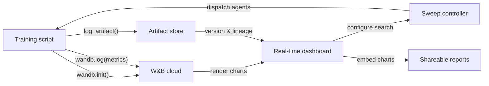

## Definition

Weights & Biases (commonly abbreviated W&B or wandb) is a cloud-native MLOps platform that provides experiment tracking, dataset and model versioning, hyperparameter optimization, and interactive reporting in a single integrated product. Founded in 2017 and adopted widely in both academic research and industry, W&B is particularly popular among teams training deep learning models that produce rich media outputs — images, audio, video, point clouds — that benefit from visual inspection during training.

W&B's core value proposition is that it requires almost no infrastructure to get started: you sign up for a free account, install the `wandb` Python package, add `wandb.init()` to your script, and everything is logged automatically to W&B's cloud. The platform is organized into **projects** (collections of related runs), **runs** (individual training executions), **artifacts** (versioned datasets and model files), **sweeps** (automated hyperparameter search), and **reports** (shareable narrative documents embedding live charts).

Unlike self-hosted solutions such as MLflow, W&B manages all backend infrastructure. This eliminates operational burden but means data leaves your premises — a relevant consideration for regulated industries. W&B offers private cloud and on-premise deployment options for enterprise customers who need data residency guarantees, though these require a paid plan.

## How it works

### Initialization and auto-logging

Calling `wandb.init(project="...", config={...})` starts a run, sends the config to W&B, and returns a run object. Many popular frameworks (PyTorch Lightning, Hugging Face Trainer, Keras, XGBoost, scikit-learn) offer W&B callbacks or integrations that auto-log gradients, learning rate schedules, and evaluation metrics without additional code. Under the hood, a background thread batches and compresses log data before sending it over HTTPS, minimizing training overhead.

### Real-time dashboards

The W&B UI renders metric curves, system utilization (GPU/CPU/memory), and media as the run progresses. Multiple runs can be overlaid on the same chart with automatic color coding. Runs can be filtered and grouped by any config dimension (e.g., group by learning rate to see its effect across all experiments at once), enabling rapid visual diagnosis.

### Sweeps

A sweep is defined by a YAML or Python dict specifying search space, search strategy (grid, random, or Bayesian), and stopping criteria (e.g., early termination of underperforming runs). The W&B sweep controller coordinates multiple agents running in parallel, each picking hyperparameter combinations from the controller and logging results back. Bayesian search adapts based on observed results, converging faster than grid search.

### Artifacts

W&B Artifacts version datasets, model checkpoints, and evaluation outputs as content-addressed objects. An artifact is linked to the run that produced it and to the runs that consumed it, creating a data lineage graph. You can download a specific artifact version with two lines of Python, making dataset and model reproducibility as simple as specifying a version string.

### Reports

Reports are interactive documents that embed live W&B charts, run comparisons, and markdown narrative. They are the primary collaboration surface: a researcher can link a report in a Slack message or GitHub PR to share reproducible experimental evidence without exporting static images.



## When to use / When NOT to use

| Use when | Avoid when |
|----------|------------|
| You train deep learning models and need rich media logging (images, audio, embeddings) | Data cannot leave your premises and you cannot afford the enterprise on-premise plan |
| Team collaboration, sharing results, and narrative reports are important | You need a fully open-source, self-hosted solution with no SaaS dependency |
| You want built-in hyperparameter optimization without additional tooling | Your experiments are simple and the overhead of a SaaS account is unwarranted |
| Your team works in research or academia and benefits from free-tier access | You are on a tight budget and the paid tier's features are necessary for your team size |

## Comparisons

| Criterion | W&B | MLflow |
|-----------|-----|--------|
| Ease of setup | Free SaaS account; no infra; `wandb login` + two lines of code | Self-hostable locally; no account needed; `mlflow ui` to start |
| UI quality | Polished, interactive; built for visual and media-heavy workloads | Clean and functional; better for tabular metric comparison |
| Collaboration | Native team workspaces, reports, sharing links, Slack integration | Requires shared server; no built-in collaboration features in OSS |
| Pricing | Free for individuals; paid for larger teams; enterprise for on-prem | Free and open-source; Databricks Managed MLflow costs extra |
| Hyperparameter optimization | Sweeps built in with Bayesian/grid/random + early stopping | Requires external tools (Optuna, Ray Tune) |

## Code examples

```python
# wandb_tracking_example.py
# W&B experiment tracking: logs config, metrics, images, and registers a model artifact.
# pip install wandb scikit-learn matplotlib Pillow

import wandb
import numpy as np
import matplotlib.pyplot as plt
from sklearn.ensemble import RandomForestClassifier
from sklearn.datasets import load_digits
from sklearn.model_selection import train_test_split
from sklearn.metrics import (
    accuracy_score, f1_score, confusion_matrix, ConfusionMatrixDisplay
)
import os, tempfile

# ── 1. Initialize the W&B run ─────────────────────────────────────────────────
run = wandb.init(
    project="digits-classification",
    name="random-forest-v1",
    config={                         # All hyperparameters go here
        "n_estimators": 150,
        "max_depth": 12,
        "min_samples_split": 4,
        "random_state": 7,
        "dataset": "sklearn-digits",
    },
)
cfg = wandb.config  # Access config values through this proxy

# ── 2. Data ───────────────────────────────────────────────────────────────────
X, y = load_digits(return_X_y=True)
X_train, X_test, y_train, y_test = train_test_split(
    X, y, test_size=0.2, stratify=y, random_state=cfg.random_state
)

# ── 3. Train ──────────────────────────────────────────────────────────────────
clf = RandomForestClassifier(
    n_estimators=cfg.n_estimators,
    max_depth=cfg.max_depth,
    min_samples_split=cfg.min_samples_split,
    random_state=cfg.random_state,
)
clf.fit(X_train, y_train)

# ── 4. Evaluate and log metrics ───────────────────────────────────────────────
y_pred = clf.predict(X_test)
metrics = {
    "accuracy": accuracy_score(y_test, y_pred),
    "f1_macro": f1_score(y_test, y_pred, average="macro"),
    "n_train": len(X_train),
    "n_test": len(X_test),
}
wandb.log(metrics)

# ── 5. Log a confusion matrix image ──────────────────────────────────────────
cm = confusion_matrix(y_test, y_pred)
fig, ax = plt.subplots(figsize=(8, 8))
ConfusionMatrixDisplay(cm).plot(ax=ax)
ax.set_title("Confusion Matrix – digits RF")
wandb.log({"confusion_matrix": wandb.Image(fig)})
plt.close(fig)

# ── 6. Save model as a versioned W&B Artifact ─────────────────────────────────
import joblib

with tempfile.TemporaryDirectory() as tmp:
    model_path = os.path.join(tmp, "model.joblib")
    joblib.dump(clf, model_path)

    artifact = wandb.Artifact(
        name="digits-rf-model",
        type="model",
        description="Random Forest trained on sklearn digits dataset",
        metadata=dict(metrics),
    )
    artifact.add_file(model_path)
    run.log_artifact(artifact)

# ── 7. Finish the run ─────────────────────────────────────────────────────────
run.finish()
print(f"Accuracy: {metrics['accuracy']:.4f} | F1 macro: {metrics['f1_macro']:.4f}")
print(f"View run at: {run.url}")
```

## Practical resources

- [W&B Official Documentation](https://docs.wandb.ai/) — Full reference covering the Python SDK, integrations, sweeps, artifacts, and reports.
- [W&B Quickstart](https://docs.wandb.ai/quickstart) — Log your first W&B run in under five minutes with a minimal example.
- [W&B Sweeps Documentation](https://docs.wandb.ai/guides/sweeps) — Comprehensive guide to configuring and running distributed hyperparameter searches.
- [W&B Fully Connected Blog](https://wandb.ai/fully-connected) — Practitioner blog with in-depth tutorials, benchmark reports, and ML engineering articles.
- [Hugging Face + W&B Integration](https://docs.wandb.ai/guides/integrations/huggingface) — Guide to auto-logging all Hugging Face Trainer metrics with a single `report_to="wandb"` argument.

## See also

- [Experiment tracking](/docs/mlops/experiment-tracking)
- [MLflow](/docs/mlops/mlflow)
- [MLOps](/docs/mlops)
