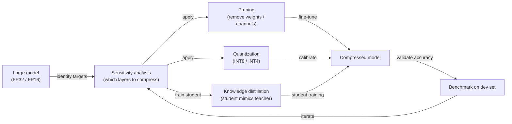

## Definition

Model compression is the collective term for a family of techniques that reduce the size, memory footprint, inference latency, or energy consumption of trained neural networks without substantially degrading their accuracy. The primary methods are [pruning](/docs/pruning) (removing redundant parameters), [quantization](/docs/quantization) (reducing numerical precision), and [knowledge distillation](/docs/knowledge-distillation) (training a smaller model to imitate a larger one). These techniques are often combined — for instance, a distilled model that is then quantized and pruned achieves significantly smaller size than any single method alone.

The motivation for model compression has intensified with the growth of [LLMs](/docs/llms): a frontier model in FP16 may require 80–320 GB of GPU memory, making deployment on anything other than a high-end server impractical. Compression enables the same or similar knowledge to be expressed in a form that fits within a consumer GPU (16–48 GB), a mobile device (4–12 GB RAM), or even a microcontroller (hundreds of KB). The challenge is managing the accuracy-compression trade-off across diverse downstream tasks.

Compression is applied at different stages: **post-training** (applied after training is complete, no access to training data required), **training-aware** (simulation of compression during training so the model adapts), and **structured search** (neural architecture search or iterative pruning with fine-tuning). The choice of method depends on the target hardware, acceptable accuracy budget, and whether retraining is feasible.

## How it works

### Compression pipeline



### Method comparison

| Method | How it reduces size | Training required | Speedup type |
|--------|-------------------|-------------------|-------------|
| Unstructured pruning | Zeros out individual weights | Fine-tune after | Memory (sparse storage) |
| Structured pruning | Removes channels, heads, or layers | Fine-tune after | Wall-clock (dense ops) |
| Quantization (PTQ) | Lower precision (INT8, INT4) | No (calibration only) | Memory + compute |
| Quantization (QAT) | Lower precision with training adaptation | Yes | Memory + compute |
| Knowledge distillation | Train smaller model end-to-end | Yes (full training) | All dimensions |

## When to use / When NOT to use

| Scenario | Use model compression | Do NOT use model compression |
|----------|----------------------|------------------------------|
| Deploying LLMs on consumer GPUs or edge devices | Yes — quantization makes it feasible | |
| Reducing inference latency in production | Yes — INT8 or structured pruning reduce latency | |
| Sharing a distilled model for downstream fine-tuning | Yes — distillation transfers knowledge efficiently | |
| Accuracy is the primary constraint (no hardware limit) | | Serve the full model; compression introduces accuracy risk |
| Model will be retrained frequently on new data | | Retraining overhead may outweigh compression gains |
| Hardware natively supports FP16 efficiently | | Quantization may offer minimal benefit on FP16 hardware |

## Pros and cons

| Pros | Cons |
|------|------|
| Enables deployment on constrained hardware | Accuracy degradation — especially at aggressive compression ratios |
| Reduces inference cost and energy consumption | Calibration and fine-tuning require effort and expertise |
| Multiple methods can be combined for maximum compression | Structured pruning often requires architecture-specific tuning |
| PTQ requires no retraining (fast to apply) | QAT and distillation require access to training data and compute |

## Code examples

```python
# Post-training quantization with PyTorch (dynamic INT8)
import torch
import torch.quantization

# Load a trained model
model = MyModel()
model.load_state_dict(torch.load("model.pt"))
model.eval()

# Apply dynamic quantization to Linear layers (no calibration data needed)
quantized_model = torch.quantization.quantize_dynamic(
    model,
    qconfig_spec={torch.nn.Linear},
    dtype=torch.qint8,
)

# Check size reduction
original_size = sum(p.numel() for p in model.parameters()) * 4  # FP32 bytes
quantized_size = sum(p.numel() for p in quantized_model.parameters()) * 1  # INT8 bytes
print(f"Size reduction: {original_size / quantized_size:.1f}x")

# Save compressed model
torch.save(quantized_model.state_dict(), "quantized_model.pt")
```

## Tips for effective use

- Run a sensitivity analysis before compressing: not all layers tolerate the same compression ratio — early and final layers are usually more sensitive.
- Combine methods in sequence: distill first (new architecture), then prune (remove redundant structure), then quantize (reduce precision) for maximum compression.
- Always validate on a held-out dev set after each compression step — accuracy can degrade non-monotonically.
- Use INT8 quantization as the default first step; it is the easiest to apply and recovers most of the memory benefit with minimal accuracy loss.
- For LLMs, GPTQ or AWQ INT4 quantization often provides a better accuracy-compression ratio than magnitude pruning.

## Practical resources

- [PyTorch — Quantization](https://pytorch.org/docs/stable/quantization.html) — PTQ, QAT, and dynamic quantization
- [TensorFlow — Model optimization toolkit](https://www.tensorflow.org/model_optimization) — Pruning, quantization, and clustering
- [HuggingFace — PEFT and GPTQ](https://huggingface.co/docs/peft) — Parameter-efficient fine-tuning with quantized LLMs
- [llm.int8() paper](https://arxiv.org/abs/2208.07339) — 8-bit inference for large language models

## See also

- [Quantization](/docs/quantization)
- [Pruning](/docs/pruning)
- [Knowledge distillation](/docs/knowledge-distillation)
- [Local inference](/docs/local-inference)
- [Edge reasoning](/docs/edge-reasoning)
- [Infrastructure](/docs/infrastructure)
