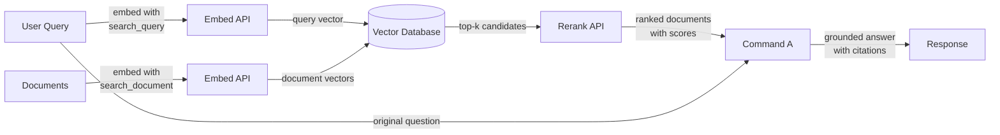

## Definition

**Cohere** is an enterprise AI company that builds language models and APIs purpose-built for business applications, with a distinct focus on search, information retrieval, and retrieval-augmented generation (RAG). Unlike general-purpose providers that offer a broad range of consumer and developer features, Cohere targets enterprise customers who need reliable, production-ready NLP infrastructure — particularly for use cases where *finding and surfacing the right information* is the core problem.

Cohere's model lineup as of May 2026 reflects this focus:

**Command models (generative):**

| Model | API Model ID | Context Window | Notes |
|-------|-------------|----------------|-------|
| Command A | `command-a-03-2025` | 256K tokens | 111B params; flagship; 150% higher throughput vs Command R+ |
| Command A Translate | `command-a-translate-08-2025` | 8K tokens | Translation-specialized |
| Command A Reasoning | `command-a-reasoning-08-2025` | 256K tokens | Reasoning-specialized |
| Command A Vision | `command-a-vision-07-2025` | 128K tokens | Vision + text input |
| Command R7B | `command-r7b-12-2024` | 128K tokens | 7B params; lightweight |
| Command R+ 08-2024 | `command-r-plus-08-2024` | 128K tokens | $2.50/$10.00 per 1M; available but superseded |
| Command R 08-2024 | `command-r-08-2024` | 128K tokens | $0.15/$0.60 per 1M; available but superseded |

**Embed models:**

| Model | API Model ID | Context | Dimensions |
|-------|-------------|---------|-----------|
| Embed v4.0 | `embed-v4.0` | 128K tokens | 256–1536 |
| Embed English v3.0 | `embed-english-v3.0` | 512 tokens | 1024 |
| Embed Multilingual v3.0 | `embed-multilingual-v3.0` | 512 tokens | 1024 |

**Rerank models:**

| Model | API Model ID | Context |
|-------|-------------|---------|
| Rerank v4.0 Pro | `rerank-v4.0-pro` | 32K tokens |
| Rerank v4.0 Fast | `rerank-v4.0-fast` | 32K tokens |

**Aya models (multilingual):**

| Model | API Model ID | Params | Languages |
|-------|-------------|--------|-----------|
| Tiny Aya Global | `tiny-aya-global` | 3.35B | 70 |
| Aya Expanse 32B | `c4ai-aya-expanse-32b` | 32B | 23 |
| Aya Vision 32B | `c4ai-aya-vision-32b` | 32B | 23 (text + images) |

> **Deprecated / retired — do not reference:** `command-r-03-2024` / alias `command-r` (retired Sept 15, 2025); `command-r-plus-04-2024` / alias `command-r-plus` (retired Sept 15, 2025); `command-light`, `command` (retired Sept 15, 2025); `embed-english-v2.0`, `embed-multilingual-v2.0` (retired April 4, 2026); `c4ai-aya-expanse-8b`, `c4ai-aya-vision-8b` (retired April 4, 2026); `rerank-english-v2.0`, `rerank-multilingual-v2.0` (retired April 30, 2025).

**Command A** is the current flagship generative model with 111B parameters, a 256K context window, and 150% higher throughput versus Command R+ 08-2024. It supports tool use, multi-step agents, RAG with citations, and 23 languages. Enterprise deployment on-premises requires only 2× A100/H100 GPUs.

## How it works

### Chat and Generate API

The Command A family is accessed via Cohere's Chat API and supports both conversational multi-turn interactions and single-turn generation tasks. Both models accept a `documents` parameter that allows you to pass retrieved context directly into the prompt, enabling a native RAG mode where the model is instructed to ground its answer in the supplied content and cite sources.

### Embed API (multilingual embeddings)

The Embed API converts text into dense vector representations suitable for semantic similarity search. Embed v4.0 supports 128K context and dimensions from 256 to 1536. Older Embed v3.0 models support 100+ languages in a single model. Embeddings can be generated with different `input_type` values — `search_document` for indexing content at rest, and `search_query` for encoding queries at runtime — a distinction that applies asymmetric training signals and typically improves retrieval accuracy compared to symmetric embedding schemes.

### Rerank API

The Rerank API accepts a query and a list of candidate documents (usually the top-k results from a vector or keyword search) and returns each document with a relevance score computed by a cross-encoder. Cross-encoders evaluate the query and document jointly in a single forward pass, giving much higher precision than bi-encoders that encode query and document separately. Reranking is most valuable when initial retrieval is cheap (BM25 or ANN search) but precision needs to be maximized before passing context to an LLM.

The v4.0 rerank models come in two variants: **Rerank v4.0 Pro** (quality-focused, multilingual) and **Rerank v4.0 Fast** (low-latency variant).

### RAG Integration

Cohere's RAG integration ties Embed, Rerank, and Command A together into a unified pipeline. The typical flow is: embed the query, run approximate nearest neighbor search in a vector database, rerank the top candidates to get the most relevant documents, then pass those documents to Command A with the original query for grounded generation. The model returns an answer along with citation objects that reference specific passages in the retrieved documents, making it straightforward to build auditable, source-cited AI applications.



## When to use / When NOT to use

| Use when | Avoid when |
|----------|------------|
| Building enterprise search or knowledge base Q&A where retrieval precision is critical | You need general-purpose chat assistance with no retrieval component |
| Your content spans multiple languages and you need a single embedding model for all of them | Your use case is primarily image, audio, or multimodal generation — Cohere is text-focused |
| You want to add a reranking step to improve precision after an initial vector or BM25 search | You need highly capable reasoning, math, or coding for standalone tasks (GPT-5.4 or Claude Sonnet 4.6 may outperform) |
| Data governance requirements mandate on-premises or private cloud deployment | Your project is a quick prototype and you want the broadest ecosystem of integrations |
| You need source citations and document grounding natively in the model output | Budget is extremely tight — Command A pricing is enterprise-oriented and not fully published |

## Comparisons

| Criteria | Cohere | OpenAI | Mistral |
|----------|--------|--------|---------|
| Embedding quality (MTEB) | Top-tier multilingual, Embed v4.0 supports 128K context | Strong English-first (text-embedding-3-large) | Competitive; mistral-embed available |
| Reranking | Native Rerank API v4.0 (cross-encoder, Pro + Fast variants) | No native reranking endpoint | No native reranking endpoint |
| RAG-native models | Command A designed for RAG with citations | GPT-5.4 works well with RAG prompts but not RAG-native | Mistral Large 3 works with RAG prompts |
| Open weights | No (proprietary API only) | No (proprietary API only) | Yes (Mistral models on Hugging Face) |
| On-premises / private cloud | Yes (enterprise contracts, Command A: 2× A100/H100) | Azure OpenAI (limited) | Yes (self-host open weights) |
| Multilingual embedding | Single model, 100+ languages | Separate or limited multilingual support | Limited multilingual embedding support |
| Pricing model | Enterprise / pay-per-token (Command A pricing not fully published) | Pay-per-token, well-documented | Pay-per-token; self-host option free |

## Pros and cons

| Pros | Cons |
|------|------|
| Best-in-class multilingual embeddings; Embed v4.0 supports 128K context | Smaller general ecosystem compared to OpenAI |
| Native Rerank API (v4.0 Pro/Fast) significantly improves retrieval precision | No open-weights option for self-hosting |
| Command A is purpose-built for grounded, cited RAG | Command A pricing not fully published — enterprise sales process required |
| Enterprise-grade deployment options including private cloud (2× A100/H100 on-prem) | Documentation and community resources thinner than OpenAI |
| RAG pipeline components (Embed + Rerank + Command A) work as a coherent stack | Retired aliases (`command-r-plus`, `command-r`) must be migrated to versioned IDs |

## Code examples

### Chat with Command A

```python
import cohere

co = cohere.Client("YOUR_COHERE_API_KEY")

response = co.chat(
    model="command-a-03-2025",
    message="Explain retrieval-augmented generation in plain English.",
)
print(response.text)
```

### Embeddings for semantic search

```python
import cohere

co = cohere.Client("YOUR_COHERE_API_KEY")

# Embed documents at indexing time
documents = [
    "Cohere specializes in enterprise NLP and semantic search.",
    "RAG combines retrieval with language model generation.",
    "Multilingual embeddings support over 100 languages.",
]
doc_embeddings = co.embed(
    texts=documents,
    model="embed-multilingual-v3.0",
    input_type="search_document",
).embeddings

# Embed a query at search time
query_embedding = co.embed(
    texts=["What does Cohere specialize in?"],
    model="embed-multilingual-v3.0",
    input_type="search_query",
).embeddings[0]

# Compute cosine similarity (or use a vector DB)
import numpy as np

doc_array = np.array(doc_embeddings)
query_array = np.array(query_embedding)
scores = doc_array @ query_array / (
    np.linalg.norm(doc_array, axis=1) * np.linalg.norm(query_array)
)
top_idx = int(np.argmax(scores))
print(f"Most relevant: '{documents[top_idx]}' (score: {scores[top_idx]:.4f})")
```

### Reranking retrieved candidates

```python
import cohere

co = cohere.Client("YOUR_COHERE_API_KEY")

query = "How does multilingual embedding work?"
candidates = [
    "Cohere Embed supports over 100 languages in a single model.",
    "Command A is optimized for RAG workflows with long context.",
    "Rerank re-scores retrieved documents with a cross-encoder.",
    "BM25 is a classic keyword-based retrieval algorithm.",
]

results = co.rerank(
    model="rerank-v4.0-pro",
    query=query,
    documents=candidates,
    top_n=3,
)

for hit in results.results:
    print(f"[{hit.relevance_score:.4f}] {candidates[hit.index]}")
```

### Full RAG pipeline with Command A citations

```python
import cohere

co = cohere.Client("YOUR_COHERE_API_KEY")

# Documents retrieved from your vector store (simplified)
retrieved_docs = [
    {"id": "doc1", "text": "Cohere Embed v4.0 supports 128K context for multilingual search."},
    {"id": "doc2", "text": "Command A is designed for grounded generation with source citations."},
    {"id": "doc3", "text": "Rerank v4.0 Pro improves precision by re-scoring candidates with a cross-encoder."},
]

response = co.chat(
    model="command-a-03-2025",
    message="How does Cohere's pipeline improve search quality?",
    documents=retrieved_docs,
)

print(response.text)
print("\n--- Citations ---")
for citation in response.citations:
    print(f"  [{citation.start}:{citation.end}] → {[doc['id'] for doc in citation.documents]}")
```

## Practical resources

- [Cohere models documentation](https://docs.cohere.com/docs/models) — Full model list with API IDs, context windows, and capability overview.
- [Cohere deprecations](https://docs.cohere.com/docs/deprecations) — Retirement schedule for legacy models and migration guidance.
- [Cohere Embed documentation](https://docs.cohere.com/docs/embeddings) — Detailed guide on embedding models, input types, and multilingual support.
- [Cohere Rerank documentation](https://docs.cohere.com/docs/reranking) — Guide to the Rerank API with examples and model selection advice.
- [Cohere RAG guide](https://docs.cohere.com/docs/retrieval-augmented-generation-rag) — End-to-end walkthrough of building a RAG pipeline with Command A.
- [MTEB Leaderboard](https://huggingface.co/spaces/mteb/leaderboard) — Independent benchmark comparing embedding models including Cohere Embed.

## See also

- [Model providers](/docs/model-providers)
- [RAG](/docs/rag)
- [Embeddings](/docs/rag/embeddings)
- [Semantic search](/docs/semantic-search)
