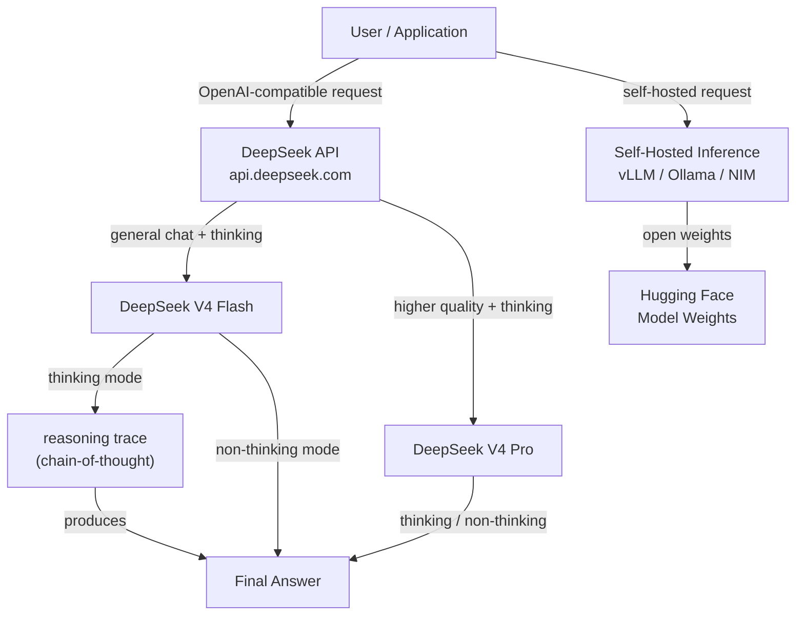

## Definition

**DeepSeek** is a Chinese AI research lab and commercial platform that has gained significant international attention for producing models that achieve performance competitive with the best proprietary models while releasing the weights openly and operating at a fraction of the cost. Founded in 2023 as a subsidiary of High-Flyer (a quantitative hedge fund), DeepSeek's approach is characterized by rigorous research into training efficiency — including innovations in mixture-of-experts (MoE) architectures, reinforcement learning from human feedback, and novel approaches to reasoning.

The current model lineup as of May 2026 is the **DeepSeek V4 series**, which supersedes all V3 models:

| Model | API Model ID | Context Window | Max Output | Cache Hit Input ($/1M) | Cache Miss Input ($/1M) | Output ($/1M) |
|-------|-------------|----------------|------------|----------------------|------------------------|---------------|
| DeepSeek V4 Flash | `deepseek-v4-flash` | 1M tokens | 384K tokens | $0.0028 | $0.14 | $0.28 |
| DeepSeek V4 Pro | `deepseek-v4-pro` | 1M tokens | 384K tokens | $0.003625* | $0.435* | $0.87* |

*DeepSeek V4 Pro is offered at a 75% discount extended through **2026-05-31 15:59 UTC**. Post-discount pricing is not yet confirmed.

Both models support:
- **Thinking mode** (extended reasoning with chain-of-thought traces)
- **Non-thinking mode** (standard fast responses)
- JSON output, tool calls, chat prefix completion (beta), FIM completion (non-thinking only)
- Compatible with both OpenAI ChatCompletions and Anthropic API formats

> **Deprecated — do not reference:** `deepseek-chat` and `deepseek-reasoner` (legacy aliases for V4-Flash, deprecated **2026-07-24**); DeepSeek V3 (`deepseek-v3`); DeepSeek V3.2 (`deepseek-v3.2`) — all superseded by the V4 series.

DeepSeek's open-weights approach means that models are available on Hugging Face and can be self-hosted on your own infrastructure — a critical capability for organizations with data sovereignty requirements. The DeepSeek platform also exposes an API that is wire-compatible with the OpenAI API format, meaning that any application built with the OpenAI Python SDK can switch to DeepSeek models by changing the `base_url` and API key.

## How it works

### API platform

DeepSeek hosts a cloud inference API at `api.deepseek.com` that accepts requests in the OpenAI Chat Completions format. This compatibility layer means the integration overhead is minimal — developers familiar with the OpenAI SDK can migrate or test DeepSeek models in minutes. The platform supports streaming responses, function calling, and system prompts.

### Thinking mode (extended reasoning)

DeepSeek V4 models support an extended thinking mode. When enabled, the model generates a reasoning trace before the final answer. This explicit scratchpad allows the model to perform multi-step deduction, check its work, and back-track from incorrect paths — behaviors that dramatically improve performance on math, formal logic, and complex coding tasks. The `reasoning_content` field in the API response contains the thinking trace.

### Non-thinking mode

Both V4 models also support a standard non-thinking mode for low-latency tasks where chain-of-thought reasoning is unnecessary. FIM (fill-in-the-middle) completion is available in non-thinking mode, making V4 Flash suitable as a code completion backend.

### Open-weights deployment

DeepSeek V4 model weights are released on Hugging Face under permissive licenses, enabling self-hosted inference. The MoE architecture means only a subset of parameters are activated per token, reducing inference cost significantly compared to dense models of comparable quality. Popular deployment options include vLLM, Ollama (for quantized versions), and NVIDIA NIM containers.



## When to use / When NOT to use

| Use when | Avoid when |
|----------|------------|
| Cost is a primary constraint — DeepSeek V4 API pricing is dramatically lower than equivalent-tier proprietary models | You need a provider with an established enterprise SLA, compliance certifications (SOC 2, HIPAA), or US-based data processing |
| Tasks require deep multi-step reasoning: math, logic, formal proofs, complex coding | Your task is primarily multimodal — DeepSeek V4 models are text-only |
| You want to self-host open-weight models for data sovereignty or custom fine-tuning | You need the broadest possible plugin/tool ecosystem and third-party integrations |
| Building high-volume batch pipelines where per-token cost reduction compounds significantly | Latency-critical consumer applications where thinking mode adds response time |
| Code generation, code review, FIM completion, or debugging are your primary use cases | You are in a jurisdiction with regulatory requirements around AI model origin |

## Comparisons

| Criteria | DeepSeek (V4 Flash / V4 Pro) | OpenAI (GPT-5.4 / GPT-5.5) | Meta / Llama 4 |
|----------|-----------------------------|----------------------------|----------------|
| Reasoning performance | V4 Pro competitive on math/logic with thinking mode | GPT-5.5 (xhigh mode) top-tier | Llama 4 Maverick competitive but below V4 Pro on hard reasoning |
| General chat quality | V4 Flash strong for cost; V4 Pro frontier-competitive | GPT-5.4 / GPT-5.5 best-in-class | Llama 4 Scout/Maverick competitive |
| Open weights | Yes (all models on Hugging Face) | No (proprietary only) | Yes (Meta open-sources Llama 4) |
| API cost | Very low ($0.14/M cache-miss input for V4 Flash) | High ($2.50/M for GPT-5.4 input) | Free (self-host); Fireworks/Together API affordable |
| Ecosystem & integrations | Growing; OpenAI-compatible API eases adoption | Largest ecosystem, most integrations | Large open-source ecosystem |
| Data sovereignty | Self-host possible; API data processed in China | Azure OpenAI for US-region processing | Full self-host possible |
| Multimodal | Text only | Yes (text, image, audio, video) | Text + images (Llama 4) |

## Pros and cons

| Pros | Cons |
|------|------|
| Dramatically lower API cost than OpenAI/Anthropic | API data routed through Chinese servers — concern for some regulated industries |
| V4 Pro with thinking mode delivers frontier-level reasoning performance | Thinking mode adds latency and token usage |
| OpenAI-compatible API — near-zero switching cost | Smaller trust/brand recognition in Western enterprise sales cycles |
| Open weights allow self-hosting and fine-tuning | V4 models are text-only; no native image or audio capabilities |
| 1M context window with up to 384K max output tokens | Legacy aliases (`deepseek-chat`, `deepseek-reasoner`) deprecated July 2026 — update integrations now |

## Code examples

### Chat completion with DeepSeek V4 Flash (OpenAI-compatible)

```python
import os
from openai import OpenAI

# Reads DEEPSEEK_API_KEY from the environment; set it with:
#   export DEEPSEEK_API_KEY="..."
client = OpenAI(
    api_key=os.environ["DEEPSEEK_API_KEY"],
    base_url="https://api.deepseek.com",
)

response = client.chat.completions.create(
    model="deepseek-v4-flash",
    messages=[
        {"role": "system", "content": "You are a helpful AI assistant."},
        {"role": "user", "content": "Explain the difference between MoE and dense transformer architectures."},
    ],
    temperature=0.7,
    max_tokens=1024,
)

print(response.choices[0].message.content)
```

### Reasoning with DeepSeek V4 Pro (thinking mode)

```python
import os
from openai import OpenAI

client = OpenAI(
    api_key=os.environ["DEEPSEEK_API_KEY"],
    base_url="https://api.deepseek.com",
)

response = client.chat.completions.create(
    model="deepseek-v4-pro",
    messages=[
        {
            "role": "user",
            "content": (
                "A train leaves City A at 08:00 and travels at 120 km/h. "
                "Another train leaves City B (300 km away) at 09:00 and travels "
                "toward City A at 80 km/h. At what time do they meet?"
            ),
        }
    ],
    # Enable thinking mode via extra_body (DeepSeek API parameter)
    extra_body={"thinking": {"type": "enabled"}},
)

# V4 Pro exposes the reasoning trace in reasoning_content
message = response.choices[0].message
if hasattr(message, "reasoning_content") and message.reasoning_content:
    print("=== Reasoning trace ===")
    print(message.reasoning_content)
    print()

print("=== Final answer ===")
print(message.content)
```

### Streaming response with DeepSeek V4 Flash

```python
import os
from openai import OpenAI

client = OpenAI(
    api_key=os.environ["DEEPSEEK_API_KEY"],
    base_url="https://api.deepseek.com",
)

stream = client.chat.completions.create(
    model="deepseek-v4-flash",
    messages=[
        {"role": "user", "content": "Write a Python function that implements binary search."},
    ],
    stream=True,
)

for chunk in stream:
    delta = chunk.choices[0].delta
    if delta.content:
        print(delta.content, end="", flush=True)
print()
```

### Self-hosted inference with vLLM

```python
# Start vLLM server (run in terminal):
# vllm serve deepseek-ai/DeepSeek-V4-Flash --tensor-parallel-size 4 --port 8000

from openai import OpenAI

# Point to your local vLLM server instead of DeepSeek cloud
client = OpenAI(
    api_key="not-needed",  # vLLM does not require a real key
    base_url="http://localhost:8000/v1",
)

response = client.chat.completions.create(
    model="deepseek-ai/DeepSeek-V4-Flash",
    messages=[
        {"role": "user", "content": "Summarize the key advantages of mixture-of-experts models."},
    ],
)

print(response.choices[0].message.content)
```

## Practical resources

- [DeepSeek API pricing](https://api-docs.deepseek.com/quick_start/pricing/) — Official per-token pricing for V4 Flash and V4 Pro, including cache hit/miss rates and discount schedule.
- [DeepSeek API updates](https://api-docs.deepseek.com/updates) — Release notes for new model versions and API changes.
- [DeepSeek GitHub](https://github.com/deepseek-ai) — Open-source repositories for DeepSeek models, training code, and research papers.
- [DeepSeek models on Hugging Face](https://huggingface.co/deepseek-ai) — Model weights, benchmark results, and deployment instructions for self-hosted inference.
- [vLLM DeepSeek deployment guide](https://docs.vllm.ai/en/latest/models/supported_models.html) — Instructions for self-hosting DeepSeek models with vLLM for production inference.

## See also

- [Model providers](/docs/model-providers)
- [DeepSeek case study](/docs/case-studies/deepseek)
- [Reasoning patterns](/docs/reasoning-patterns)
