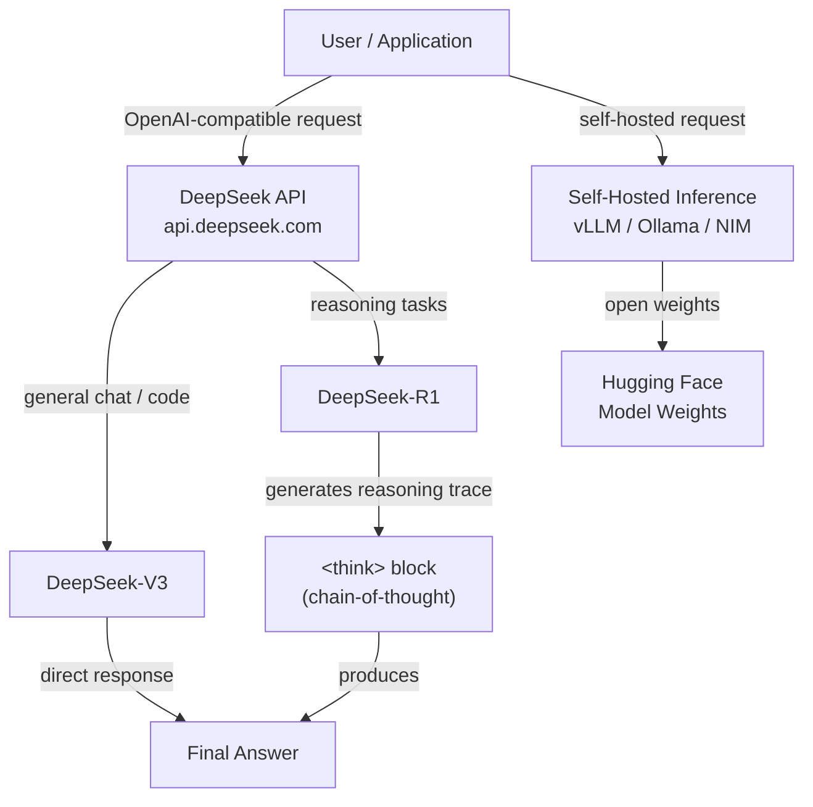

## Definition

**DeepSeek** is a Chinese AI research lab and commercial platform that has gained significant international attention for producing models that achieve performance competitive with the best proprietary models while releasing the weights openly and operating at a fraction of the cost. Founded in 2023 as a subsidiary of High-Flyer (a quantitative hedge fund), DeepSeek's approach is characterized by rigorous research into training efficiency — including innovations in mixture-of-experts (MoE) architectures, reinforcement learning from human feedback, and novel approaches to reasoning that do not rely on massive compute budgets.

The model lineup spans three major capability areas. **DeepSeek-V3** is a general-purpose chat and instruction-following model that rivals GPT-4o and Claude 3.5 Sonnet on standard benchmarks while being dramatically cheaper to access via API. **DeepSeek-R1** is a dedicated reasoning model that uses extended chain-of-thought (CoT) — the model generates explicit reasoning traces before producing a final answer — making it particularly strong on mathematics, logical deduction, and multi-step problem solving. **DeepSeek-Coder** (and its successor variants integrated into V3/R1) specializes in code generation, completion, and debugging across a wide range of programming languages.

DeepSeek's open-weights approach means that all major models are available on Hugging Face and can be self-hosted on your own infrastructure — a critical capability for organizations with data sovereignty requirements or those seeking to avoid per-token API costs at scale. The DeepSeek platform also exposes an API that is wire-compatible with the OpenAI API format, meaning that any application built with the OpenAI Python SDK can switch to DeepSeek models by changing the `base_url` and API key with no other code changes.

## How it works

### API platform

DeepSeek hosts a cloud inference API at `api.deepseek.com` that accepts requests in the OpenAI Chat Completions format. This compatibility layer means the integration overhead is minimal — developers familiar with the OpenAI SDK can migrate or test DeepSeek models in minutes. The platform supports streaming responses, function calling, and system prompts. Pricing is token-based and publicly listed, with rates that are typically 90–95% lower than equivalent-tier OpenAI models, making high-volume production deployments substantially cheaper.

### Reasoning models (DeepSeek-R1)

DeepSeek-R1 is trained using a multi-stage process that incorporates reinforcement learning to reward the model for producing correct final answers — crucially, without relying on supervised chain-of-thought data at the core training stage. The model generates a `<think>` block containing its reasoning trace before the final answer. This explicit scratchpad allows the model to perform multi-step deduction, check its work, and back-track from incorrect paths — behaviors that dramatically improve performance on math olympiad problems, formal logic, and complex coding tasks that require planning across many steps.

### Code models and DeepSeek-Coder

DeepSeek's code-specialized models are pre-trained on large corpora of source code (GitHub, competitive programming platforms, documentation) and fine-tuned for instruction following on coding tasks. They support fill-in-the-middle (FIM) completion, which is the standard format used by IDE autocomplete tools like Copilot. DeepSeek-Coder achieves top performance on HumanEval, MBPP, and SWE-bench, often outperforming models several times larger from other providers. The coding capabilities are also integrated into DeepSeek-V3 and R1, so general-purpose models also perform well on code tasks.

### Open-weights deployment

All major DeepSeek models have their weights released on Hugging Face under permissive licenses, enabling self-hosted inference on consumer or enterprise GPU hardware. DeepSeek-V3 uses a mixture-of-experts architecture where only a subset of parameters are activated per token, reducing inference cost significantly compared to dense models of comparable capability. Popular deployment options include vLLM, Ollama (for quantized versions), and NVIDIA NIM containers. Self-hosted deployment is particularly attractive for large-scale batch workloads, fine-tuning on proprietary data, or scenarios where all data must remain on-premises.



## When to use / When NOT to use

| Use when | Avoid when |
|----------|------------|
| Cost is a primary constraint — DeepSeek API is 90%+ cheaper than GPT-4o at comparable quality | You need a provider with an established enterprise SLA, compliance certifications (SOC 2, HIPAA), or US-based data processing |
| Tasks require deep multi-step reasoning: math, logic, formal proofs, complex coding | Your task is primarily multimodal — DeepSeek-V3/R1 are text-only models |
| You want to self-host open-weight models for data sovereignty or custom fine-tuning | You need the broadest possible plugin/tool ecosystem and third-party integrations |
| Building high-volume batch pipelines where per-token cost reduction compounds significantly | Latency-critical consumer applications where R1's reasoning trace adds response time |
| Code generation, code review, or debugging are your primary use cases | You are in a jurisdiction with regulatory requirements around AI model origin |

## Comparisons

| Criteria | DeepSeek (V3 / R1) | OpenAI (GPT-4o / o1) | Meta / Llama |
|----------|--------------------|----------------------|--------------|
| Reasoning performance | R1 competitive with o1 on math/logic benchmarks | o1 is top-tier; GPT-4o strong on general reasoning | Llama 3.x competitive but below R1/o1 on hard reasoning |
| General chat quality | V3 competitive with GPT-4o | GPT-4o best-in-class general quality | Llama 3.3 70B competitive for size |
| Open weights | Yes (all models on Hugging Face) | No (proprietary only) | Yes (Meta open-sources Llama) |
| API cost | Very low (~$0.27/M input tokens for V3) | High (~$2.50/M for GPT-4o input) | Free (self-host); Fireworks/Together API affordable |
| Ecosystem & integrations | Growing; OpenAI-compatible API eases adoption | Largest ecosystem, most integrations | Large open-source ecosystem |
| Data sovereignty | Self-host possible; API data processed in China | Azure OpenAI for US-region processing | Full self-host possible |
| Multimodal | Text only (V3/R1) | Yes (GPT-4o, DALL-E) | Llama 3.2 has vision capabilities |

## Pros and cons

| Pros | Cons |
|------|------|
| Dramatically lower API cost than OpenAI/Anthropic | API data routed through Chinese servers — concern for some regulated industries |
| R1 delivers frontier-level reasoning performance | R1 reasoning traces add latency and token usage |
| OpenAI-compatible API — near-zero switching cost | Smaller trust/brand recognition in Western enterprise sales cycles |
| Open weights allow self-hosting and fine-tuning | V3/R1 are text-only; no native image or audio capabilities |
| Strong code generation across most mainstream languages | Community and documentation primarily in Chinese; English resources still catching up |

## Code examples

### Chat completion with DeepSeek-V3 (OpenAI-compatible)

```python
from openai import OpenAI

# DeepSeek uses the OpenAI SDK with a custom base_url
client = OpenAI(
    api_key="YOUR_DEEPSEEK_API_KEY",
    base_url="https://api.deepseek.com",
)

response = client.chat.completions.create(
    model="deepseek-chat",  # maps to DeepSeek-V3
    messages=[
        {"role": "system", "content": "You are a helpful AI assistant."},
        {"role": "user", "content": "Explain the difference between MoE and dense transformer architectures."},
    ],
    temperature=0.7,
    max_tokens=1024,
)

print(response.choices[0].message.content)
```

### Reasoning with DeepSeek-R1 (chain-of-thought)

```python
from openai import OpenAI

client = OpenAI(
    api_key="YOUR_DEEPSEEK_API_KEY",
    base_url="https://api.deepseek.com",
)

response = client.chat.completions.create(
    model="deepseek-reasoner",  # maps to DeepSeek-R1
    messages=[
        {
            "role": "user",
            "content": (
                "A train leaves City A at 08:00 and travels at 120 km/h. "
                "Another train leaves City B (300 km away) at 09:00 and travels "
                "toward City A at 80 km/h. At what time do they meet?"
            ),
        }
    ],
)

# R1 exposes the reasoning trace in reasoning_content
message = response.choices[0].message
if hasattr(message, "reasoning_content") and message.reasoning_content:
    print("=== Reasoning trace ===")
    print(message.reasoning_content)
    print()

print("=== Final answer ===")
print(message.content)
```

### Streaming response with DeepSeek-V3

```python
from openai import OpenAI

client = OpenAI(
    api_key="YOUR_DEEPSEEK_API_KEY",
    base_url="https://api.deepseek.com",
)

stream = client.chat.completions.create(
    model="deepseek-chat",
    messages=[
        {"role": "user", "content": "Write a Python function that implements binary search."},
    ],
    stream=True,
)

for chunk in stream:
    delta = chunk.choices[0].delta
    if delta.content:
        print(delta.content, end="", flush=True)
print()
```

### Self-hosted inference with vLLM

```python
# Start vLLM server (run in terminal):
# vllm serve deepseek-ai/DeepSeek-V3 --tensor-parallel-size 4 --port 8000

from openai import OpenAI

# Point to your local vLLM server instead of DeepSeek cloud
client = OpenAI(
    api_key="not-needed",  # vLLM does not require a real key
    base_url="http://localhost:8000/v1",
)

response = client.chat.completions.create(
    model="deepseek-ai/DeepSeek-V3",
    messages=[
        {"role": "user", "content": "Summarize the key advantages of mixture-of-experts models."},
    ],
)

print(response.choices[0].message.content)
```

## Practical resources

- [DeepSeek API documentation](https://platform.deepseek.com/api-docs/) — Official reference for the DeepSeek platform API including models, parameters, and pricing
- [DeepSeek GitHub](https://github.com/deepseek-ai) — Open-source repositories for DeepSeek models, training code, and research papers
- [DeepSeek-R1 on Hugging Face](https://huggingface.co/deepseek-ai/DeepSeek-R1) — Model card with weights, benchmark results, and deployment instructions
- [DeepSeek-V3 technical report](https://arxiv.org/abs/2412.19437) — Research paper detailing the V3 architecture, training approach, and benchmark comparisons
- [vLLM DeepSeek deployment guide](https://docs.vllm.ai/en/latest/models/supported_models.html) — Instructions for self-hosting DeepSeek models with vLLM for production inference

## See also

- [Model providers](/docs/model-providers)
- [DeepSeek case study](/docs/case-studies/deepseek)
- [Reasoning patterns](/docs/reasoning-patterns)
