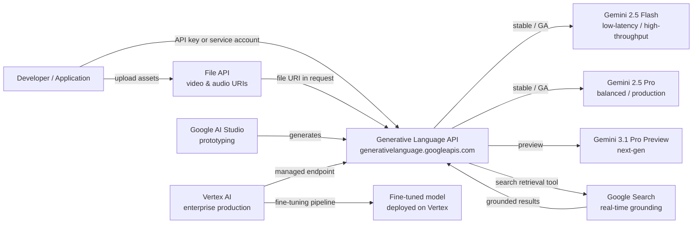

## Definition

Google Gemini is Google's flagship family of multimodal large language models and the platform surrounding them. Announced in late 2023 and succeeding the PaLM 2 family, Gemini was designed from the ground up to reason across text, images, video, audio, and code within a single unified model architecture. Unlike systems that bolt on vision through separate pipelines, Gemini's native multimodality means the model processes all modalities jointly during training and inference, allowing richer cross-modal reasoning.

The Gemini family as of May 2026 has two active generations:

**Gemini 2.5 (Stable/GA)** — the production-ready generation:

| Model | API Model ID | Context Window | Input ($/1M) | Output ($/1M) |
|-------|-------------|----------------|--------------|---------------|
| Gemini 2.5 Pro | `gemini-2.5-pro` | 1M tokens | $1.25–$2.50 | $10.00–$15.00 |
| Gemini 2.5 Flash | `gemini-2.5-flash` | 1,048,576 tokens | $0.30 | $2.50 |
| Gemini 2.5 Flash-Lite | `gemini-2.5-flash-lite` | — | $0.10 | $0.40 |

**Gemini 3.x (Preview)** — the next-generation preview series:

| Model | API Model ID | Input ($/1M) | Output ($/1M) |
|-------|-------------|--------------|---------------|
| Gemini 3.1 Pro Preview | `gemini-3.1-pro-preview` | $2.00–$4.00 | $12.00–$18.00 |
| Gemini 3.1 Flash-Lite | `gemini-3.1-flash-lite` | $0.25 | $1.50 |
| Gemini 3 Flash Preview | `gemini-3-flash-preview` | $0.50 | $3.00 |

> **Deprecated — do not reference:** Gemini 1.5 Pro, Gemini 1.5 Flash (superseded); Gemini 1.0 Ultra (superseded); Gemini 2.0 Flash-Lite (shutdown June 1, 2026); Gemini 3 Pro Preview (shut down March 9, 2026). The "Ultra" brand tier no longer exists.

Specialized models include **Imagen 4** (image generation), **Veo 3.1** (video, $0.05–$0.60/sec), **Lyria 3 Pro** (music, $0.04–$0.08/song), and **Gemini Embedding 2** (multimodal embeddings, $0.15–$12.00/1M).

Developers access Gemini through two complementary surfaces. **Google AI Studio** is a free, browser-based prototyping environment that provides API keys and lets you experiment with prompts, system instructions, and multimodal inputs without any infrastructure setup. **Vertex AI** is Google Cloud's managed ML platform and the recommended path for production workloads — it adds enterprise controls like VPC Service Controls, IAM, audit logging, fine-tuning pipelines, and SLA-backed endpoints.

## How it works

### Generative Language API

The Generative Language API (`generativelanguage.googleapis.com`) is the unified REST interface for all Gemini models. Requests are structured as a `contents` array — each item has a `role` (`user` or `model`) and one or more `parts` (text, inline data, or file URIs). The API returns a `candidates` array with `content`, `finishReason`, and `safetyRatings`. Token counts, grounding metadata, and function-call responses are returned in the same envelope. API keys from AI Studio work for development; production workloads use service-account credentials through Vertex AI.

### Multimodal inputs — image, video, and audio

Gemini 2.5 Flash accepts text, images, video, audio, and code in a single request. Images can be sent as inline base64 data or via Cloud Storage URIs. For long videos, the File API uploads the asset asynchronously and returns a file URI that can be referenced in subsequent `generateContent` calls. The model internally tokenizes non-text modalities so the same context-window accounting and attention mechanisms apply uniformly.

### Thinking mode (Adaptive/Extended Thinking)

Gemini 2.5 Flash supports an extended thinking mode that allows the model to reason step-by-step before responding. This is especially effective for math, coding, and multi-step analysis tasks. Thinking mode is configured via the `thinkingConfig` parameter in the request.

### Grounding with Google Search

Gemini supports retrieval-grounded generation through an optional `tools` parameter that enables `google_search_retrieval`. When this tool is active, the model can issue search queries mid-generation, retrieve real-time web results, and synthesize them into its response — returning citations alongside the generated text. Tool use also supports function calling, code execution, Google Maps grounding, and URL context.

### Vertex AI integration

On Vertex AI, Gemini is accessed through the `vertexai` Python SDK (`aiplatform`). Vertex adds fine-tuning (supervised fine-tuning pipelines), model evaluation datasets, deployment to dedicated endpoints with autoscaling, and Vertex AI Pipelines for orchestrating end-to-end ML workflows. Enterprise customers benefit from data residency guarantees, private networking via VPC Service Controls, and Cloud Audit Logs.



## When to use / When NOT to use

| Use when | Avoid when |
|----------|------------|
| You need native multimodal reasoning over images, video, or audio alongside text | Your workload is text-only and you prefer a provider with a longer public API track record |
| You are already on Google Cloud and want deep Vertex AI / GCP integration (IAM, VPC, Audit Logs) | You have strict data residency requirements in regions where Vertex AI is not yet available |
| You require real-time grounding through Google Search | Your application needs deterministic, reproducible outputs (grounding introduces variability from live search) |
| Cost efficiency at scale matters — Gemini 2.5 Flash is highly competitive on price-per-token | You need an extensively documented open-weights model you can run on-premise |
| You want a free, frictionless prototyping environment with no credit card (AI Studio free tier) | Your team is already deeply invested in the OpenAI API surface and migration cost is high |

## Comparisons

| Criterion | Google Gemini | OpenAI GPT-5.4 | Anthropic Claude Sonnet 4.6 |
|-----------|--------------|----------------|------------------------------|
| Multimodal capability | Native — text, image, video, audio in one model | Text + image; audio via GPT Realtime 2 | Text + image; no native video/audio |
| Enterprise / cloud integration | Deep GCP integration via Vertex AI — IAM, VPC, Audit Logs, fine-tuning | Azure OpenAI Service for enterprise | AWS Bedrock and direct API |
| Grounding / real-time retrieval | Built-in Google Search grounding tool | Built-in web search tool | No built-in search; relies on user-provided RAG |
| Context window | 1M tokens (Gemini 2.5 Pro / Flash) | 1,050K tokens | 1M tokens |
| Open-weights availability | Closed API only (Gemma is separate) | Closed API only | Closed API only |
| Pricing model | Per-token; Flash tier very competitive | Per-token; mid-range | Per-token; comparable to GPT-5.4 |
| Fine-tuning | Supervised fine-tuning on Vertex AI | Fine-tuning API for applicable models | No public fine-tuning API |

## Code examples

```python
# google_gemini_examples.py
# Demonstrates text generation, multimodal image input, and embeddings
# using the google-generativeai SDK.
# pip install google-generativeai pillow

import google.generativeai as genai
import pathlib

# ── Configuration ─────────────────────────────────────────────────────────────
# Set your API key from https://aistudio.google.com/app/apikey
genai.configure(api_key="YOUR_API_KEY")


# ── 1. Text generation ────────────────────────────────────────────────────────
def text_generation_example():
    """Simple single-turn text completion with Gemini 2.5 Flash."""
    model = genai.GenerativeModel(
        model_name="gemini-2.5-flash",
        system_instruction="You are a concise technical writer.",
    )

    response = model.generate_content(
        "Explain the difference between supervised and unsupervised learning "
        "in three sentences.",
        generation_config=genai.GenerationConfig(
            temperature=0.4,
            max_output_tokens=256,
        ),
    )

    print("=== Text Generation ===")
    print(response.text)
    print(f"Finish reason : {response.candidates[0].finish_reason}")
    print(f"Total tokens  : {response.usage_metadata.total_token_count}")


# ── 2. Multimodal — image input ───────────────────────────────────────────────
def multimodal_image_example(image_path: str):
    """
    Send a local image alongside a text prompt to Gemini 2.5 Pro.
    The model reasons over both modalities jointly.
    """
    model = genai.GenerativeModel("gemini-2.5-pro")

    image_data = pathlib.Path(image_path).read_bytes()
    # Inline image part
    image_part = {
        "mime_type": "image/jpeg",  # adjust to image/png, image/webp as needed
        "data": image_data,
    }

    response = model.generate_content(
        [image_part, "Describe this image and identify any text present in it."]
    )

    print("\n=== Multimodal Image Input ===")
    print(response.text)


# ── 3. Embeddings ─────────────────────────────────────────────────────────────
def embeddings_example(texts: list[str]):
    """
    Generate text embeddings using the Gemini Embedding 2 model.
    Embeddings can be used for semantic search, clustering, and classification.
    """
    result = genai.embed_content(
        model="models/gemini-embedding-2",
        content=texts,
        task_type="retrieval_document",  # or retrieval_query, semantic_similarity
    )

    print("\n=== Embeddings ===")
    for text, embedding in zip(texts, result["embedding"]):
        print(f"Text    : {text[:60]}...")
        print(f"Dims    : {len(embedding)}")
        print(f"First 5 : {embedding[:5]}\n")


# ── 4. Multi-turn chat ────────────────────────────────────────────────────────
def multi_turn_chat_example():
    """Maintain conversational context using the chat interface."""
    model = genai.GenerativeModel("gemini-2.5-flash")
    chat = model.start_chat(history=[])

    turns = [
        "What is gradient descent?",
        "How does the learning rate affect it?",
        "What is Adam optimizer and how does it improve on basic gradient descent?",
    ]

    print("\n=== Multi-turn Chat ===")
    for user_message in turns:
        response = chat.send_message(user_message)
        print(f"User  : {user_message}")
        print(f"Model : {response.text}\n")


# ── Entry point ───────────────────────────────────────────────────────────────
if __name__ == "__main__":
    text_generation_example()

    # Provide a path to a local JPEG/PNG for multimodal demo
    # multimodal_image_example("path/to/your/image.jpg")

    embeddings_example([
        "Machine learning is a subset of artificial intelligence.",
        "Deep learning uses neural networks with many layers.",
        "Reinforcement learning trains agents through reward signals.",
    ])

    multi_turn_chat_example()
```

## Practical resources

- [Google AI Studio](https://aistudio.google.com/) — Free browser-based environment for prototyping with Gemini; generates API keys and lets you tune prompts interactively with no infrastructure required.
- [Gemini API Documentation — Models](https://ai.google.dev/gemini-api/docs/models) — Official reference covering all current model IDs, context windows, and capabilities.
- [Gemini API Documentation — Pricing](https://ai.google.dev/gemini-api/docs/pricing) — Per-token pricing for all Gemini models including batch discounts.
- [Vertex AI — Generative AI documentation](https://cloud.google.com/vertex-ai/generative-ai/docs/overview) — Enterprise path: fine-tuning, model evaluation, deployment, and GCP security controls.
- [google-generativeai Python SDK on PyPI](https://pypi.org/project/google-generativeai/) — SDK source, changelog, and usage examples.

## See also

- [Model Providers](/docs/model-providers)
- [Multimodal AI](/docs/multimodal-ai)
- [Case Studies — Gemini](/docs/case-studies/gemini)
