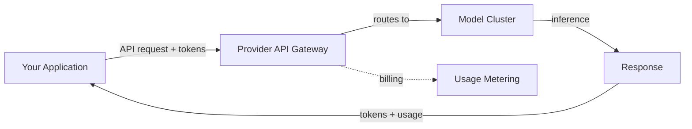
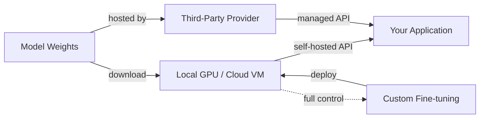

## Definition

A model provider is an organization that offers access to large language models, either through hosted APIs, downloadable open weights, or both. The choice of provider shapes your application's capabilities, cost structure, data privacy posture, and deployment flexibility. Understanding the provider landscape is a prerequisite for any production AI system.

The market divides into three categories. **API-based providers** like OpenAI, Anthropic, and Google offer models exclusively through managed APIs — you send requests, they handle inference infrastructure. **Open-weights providers** like Meta and Mistral release model weights that you can download and run on your own hardware or through third-party hosting. **Hybrid providers** like Mistral and DeepSeek offer both open-weights models and commercial API access, giving developers flexibility to choose based on their needs.

Choosing a provider involves tradeoffs across multiple dimensions: model quality, pricing, context window size, multimodal capabilities, data privacy, fine-tuning support, and ecosystem maturity. No single provider dominates across all criteria, which is why most production systems evaluate multiple options and sometimes use different providers for different tasks within the same application.

## How it works

### API-based providers

API providers host models on their infrastructure and expose them through REST APIs. You authenticate with an API key, send a request with your prompt and configuration parameters, and receive a response. The provider handles scaling, GPU allocation, model updates, and uptime. This is the simplest path to production — no infrastructure to manage — but you send your data to a third party and pay per token.



### Open-weights providers

Open-weights providers release model files (typically on Hugging Face) that you download and run locally or on your cloud infrastructure. You control the full stack: hardware selection, quantization, serving framework (vLLM, TGI, llama.cpp), and scaling. This gives maximum privacy and customization but requires ML infrastructure expertise. Third-party inference providers (Together AI, Groq, Fireworks) offer a middle ground — they host open models with an API interface.



### Choosing a provider

The decision tree depends on your constraints. Start with your requirements — data privacy, budget, latency, model quality — and narrow from there. Many teams start with API providers for prototyping and evaluate open-weights alternatives for production cost optimization or data sovereignty requirements.

## When to use / When NOT to use

| Use when | Avoid when |
|----------|------------|
| **API providers**: rapid prototyping, no ML infra team, need cutting-edge models immediately | Data cannot leave your infrastructure (regulated industries, PII) |
| **Open-weights**: data privacy requirements, need fine-tuning control, high-volume cost optimization | You lack GPU infrastructure and ML ops expertise |
| **Third-party hosted open models**: want open model flexibility without managing infrastructure | You need guaranteed SLAs and enterprise support (use first-party APIs) |
| **Multiple providers**: different tasks have different quality/cost requirements | Your use case is simple enough that one provider covers everything |

## Comparisons

| Criteria | OpenAI | Anthropic | Google Gemini | Meta Llama | Mistral | Cohere | DeepSeek |
|----------|--------|-----------|---------------|------------|---------|--------|----------|
| Model access | API only | API only | API + Vertex AI | Open weights + Llama API | Open + API | API only | Open + API |
| Flagship tier | GPT-5.5 (`gpt-5.5`) | Claude Opus 4.7 (`claude-opus-4-7`) | Gemini 2.5 Pro (`gemini-2.5-pro`) | Llama 4 Maverick (17B active / 400B) | Mistral Large 3 (`mistral-large-2512`, 41B active / 675B) | Command A (`command-a-03-2025`, 111B) | DeepSeek V4 Pro (`deepseek-v4-pro`) |
| Context window | 1,050K (GPT-5.5 / GPT-5.4) | 1M (Opus 4.7, Sonnet 4.6); 200K (Haiku 4.5) | 1M (Gemini 2.5 Pro / Flash) | 10M (Scout), 1M (Maverick) | 256K (Mistral Large 3) | 256K (Command A) | 1M (V4 Flash / Pro) |
| Flagship input pricing | $5.00/1M (GPT-5.5) | $5.00/1M (Opus 4.7) | $1.25–$2.50/1M (Gemini 2.5 Pro) | Free (self-host) | $0.50/1M (Mistral Large 3) | Not published (enterprise) | $0.435/1M cache-miss (V4 Pro) |
| Multimodal | Text, image, audio, video | Text, image | Text, image, audio, video | Text + images (up to 5) | Text + image (Large 3) | Text + image (Command A Vision) | Text only |
| Specialty | Broadest ecosystem, agent tooling | Safety, long context, thinking | Multimodal, Google Search grounding | Open-weights, customization, huge context | Efficiency, EU sovereignty, multilingual | Embeddings, reranking, enterprise RAG | Reasoning, very low cost |
| Fine-tuning | API fine-tuning | Not available | Vertex AI tuning | Full weight access | Open-weights LoRA/QLoRA; API fine-tuning beta | Not available | Full weight access |
| Pricing model | Per token | Per token | Per token + free tier | Free (self-host) or third-party API | Per token + free open-weights | Per token (enterprise) | Per token (very low cost) |

## Code examples

### Side-by-side API calls (Python)

```python
# OpenAI
from openai import OpenAI

openai_client = OpenAI()
openai_response = openai_client.chat.completions.create(
    model="gpt-5.4",
    messages=[{"role": "user", "content": "Explain RAG in one sentence."}],
)
print("OpenAI:", openai_response.choices[0].message.content)
```

```python
# Anthropic
import anthropic

anthropic_client = anthropic.Anthropic()
anthropic_response = anthropic_client.messages.create(
    model="claude-sonnet-4-6",
    max_tokens=256,
    messages=[{"role": "user", "content": "Explain RAG in one sentence."}],
)
print("Anthropic:", anthropic_response.content[0].text)
```

```python
# Google Gemini
import google.generativeai as genai

model = genai.GenerativeModel("gemini-2.5-flash")
gemini_response = model.generate_content("Explain RAG in one sentence.")
print("Gemini:", gemini_response.text)
```

### Unified interface with LiteLLM (Python)

```python
from litellm import completion

# Same interface, different providers
providers = {
    "OpenAI": "gpt-5.4",
    "Anthropic": "claude-sonnet-4-6",
    "Gemini": "gemini/gemini-2.5-flash",
}

for name, model in providers.items():
    response = completion(
        model=model,
        messages=[{"role": "user", "content": "Explain RAG in one sentence."}],
    )
    print(f"{name}: {response.choices[0].message.content}")
```

## Practical resources

- [Artificial Analysis](https://artificialanalysis.ai/) — Independent LLM benchmarks and pricing comparison
- [LiteLLM](https://docs.litellm.ai/) — Unified API for 100+ LLM providers
- [OpenRouter](https://openrouter.ai/) — Single API gateway to multiple providers
- [Hugging Face Open LLM Leaderboard](https://huggingface.co/spaces/open-llm-leaderboard/open_llm_leaderboard) — Open model benchmarks
- [LMSYS Chatbot Arena](https://chat.lmsys.org/) — Crowdsourced LLM rankings via blind human evaluation

## See also

- [OpenAI](/docs/model-providers/openai)
- [Anthropic](/docs/model-providers/anthropic)
- [Google Gemini](/docs/model-providers/google-gemini)
- [Meta Llama](/docs/model-providers/meta-llama)
- [Mistral](/docs/model-providers/mistral)
- [Cohere](/docs/model-providers/cohere)
- [DeepSeek](/docs/model-providers/deepseek)
- [LLMs](/docs/llms)
- [Infrastructure](/docs/infrastructure)
- [Local inference](/docs/local-inference)
