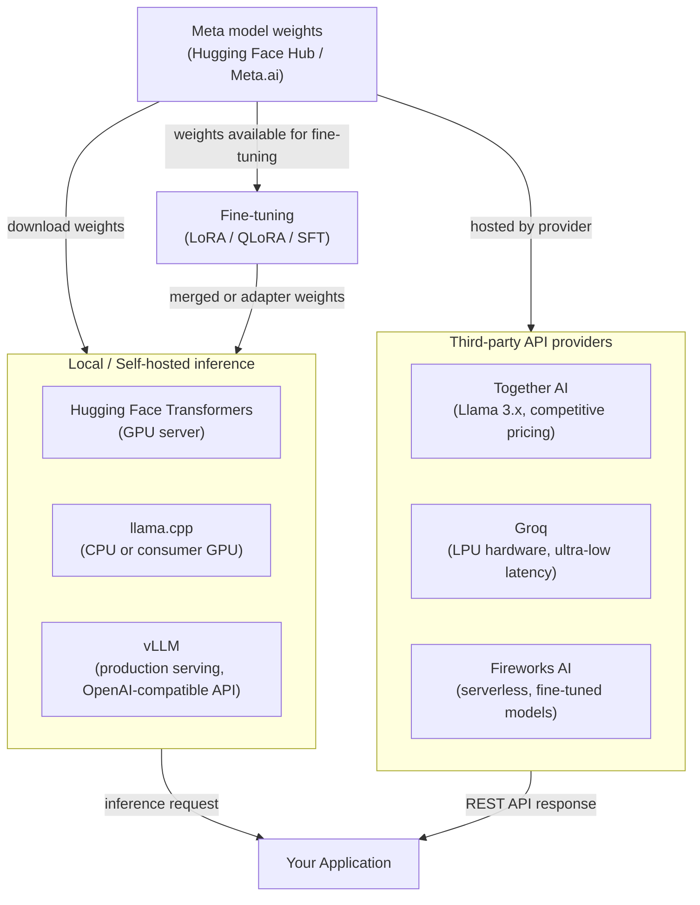

## Definition

Meta's Llama (Large Language Model Meta AI) is a family of open-weights large language models released by Meta AI Research. Unlike fully proprietary models distributed only through a paid API, Llama models are released with weights that developers can download, inspect, modify, and redistribute under Meta's custom community license. This means organizations can run inference entirely within their own infrastructure, without routing data through a third-party cloud service — a significant advantage for privacy-sensitive workloads. The series began in 2023 with Llama 1 and Llama 2, and reached a major milestone with the **Llama 3** generation.

The **Llama 3 family** spans multiple sizes and specializations. The base Llama 3 release included 8B and 70B parameter instruct-tuned and base variants. Subsequent releases introduced **Llama 3.1** (with 405B parameters, extended 128k context window, and multilingual improvements), **Llama 3.2** (lightweight 1B and 3B models for on-device use, plus 11B and 90B multimodal vision variants), and **Llama 3.3** (a 70B model with significantly improved multilingual and reasoning performance). Together these cover a wide spectrum from edge deployment to near-frontier performance.

The open-weights model space sits at the intersection of a philosophical and practical debate: **open vs. closed**. Advocates of open weights argue that transparency, auditability, community innovation, and cost control outweigh the convenience of a managed API. Critics point out that large open-weights models are expensive to serve at scale, require engineering expertise to deploy and secure, and that "open weights" is not the same as "open source" — the training data and full methodology remain proprietary. In practice, most organizations end up in a hybrid: using open-weights models for sensitive or cost-sensitive workloads while still relying on closed API providers for cutting-edge capability.

## How it works

### Local deployment — transformers, llama.cpp, vLLM

The most direct way to run Llama models is locally using Hugging Face **Transformers**, which provides a unified Python interface over hundreds of model architectures. For smaller models (7B–13B) on consumer hardware, **llama.cpp** is the gold standard: it is a pure C/C++ inference engine with GGUF quantization support that can run Llama 3 8B in 4-bit quantization on a laptop CPU or modest GPU with acceptable latency. For production serving at scale, **vLLM** is the recommended solution — it implements PagedAttention for efficient KV-cache management, enables continuous batching, and exposes an OpenAI-compatible REST API, making it easy to swap Llama in for any GPT-4 integration with minimal code changes. Each option occupies a different point on the latency/throughput/hardware tradeoff curve.

### Third-party API providers — Together AI, Groq, Fireworks AI

For teams that want the flexibility of open-weights models without the infrastructure burden, several specialized providers host Llama models via managed APIs. **Together AI** offers Llama 3.x models with competitive per-token pricing and a Python SDK that mirrors the OpenAI interface. **Groq** runs Llama models on custom LPU (Language Processing Unit) hardware, delivering extremely low latency (often single-digit milliseconds per token) suitable for interactive applications. **Fireworks AI** focuses on fine-tuned and serverless model deployments with a strong focus on developer experience. These providers are particularly valuable for proof-of-concept work, burst workloads, or teams with no GPU infrastructure.

### Fine-tuning open weights

One of the most compelling advantages of open-weights models is full fine-tuning access. Organizations can adapt Llama to domain-specific tasks, style requirements, or safety profiles using supervised fine-tuning (SFT) and reinforcement learning from human feedback (RLHF). In practice, most practitioners use parameter-efficient fine-tuning via **LoRA** (Low-Rank Adaptation) or **QLoRA** (LoRA on quantized weights), which reduces GPU memory requirements by 4–10x. The fine-tuned adapter weights are tiny compared to the base model and can be merged or loaded separately. Tools like **Hugging Face TRL**, **Axolotl**, and **LLaMA-Factory** provide high-level training loops for Llama fine-tuning with minimal boilerplate.



## When to use / When NOT to use

| Use when | Avoid when |
|----------|------------|
| Data privacy is paramount — regulated industries, PII, confidential IP that must not leave your infrastructure | You need cutting-edge frontier capability (GPT-4o / Claude 3.5 still outperform Llama 3 on many complex reasoning benchmarks) |
| Cost control at high volume — per-token API costs compound quickly; self-hosting large models can be significantly cheaper above certain QPS thresholds | You lack the ML engineering capacity to manage GPU infrastructure, keep models updated, and handle security patching |
| You need to fine-tune the model on proprietary data to deeply customize behavior or style | You need a production-ready managed API with SLAs, auto-scaling, and zero operational overhead today |
| You want full auditability and the ability to inspect model weights for compliance or red-teaming purposes | Your workload requires real-time web grounding or native multimodal video/audio (Llama 3.2 adds vision but is not on par with Gemini 1.5) |
| You want to run inference on-device with no network dependency (Llama 3.2 1B/3B, llama.cpp) | Your team is evaluating models quickly and iteration speed matters more than data control |

## Comparisons

| Criterion | Meta Llama 3.x | OpenAI GPT-4o | Mistral (open-weights) |
|-----------|---------------|--------------|------------------------|
| Weights availability | Open-weights download (community license) | Closed API only | Open-weights for 7B / Mixtral; closed for Mistral Large |
| Largest model size | 405B (Llama 3.1) | Undisclosed | ~141B effective (Mixtral 8x22B) |
| Self-hosting | Fully supported; llama.cpp, vLLM, Transformers | Not possible | Fully supported; same toolchain as Llama |
| Managed API options | Together AI, Groq, Fireworks, AWS Bedrock, Azure AI | OpenAI direct, Azure OpenAI | La Plateforme (mistral.ai), Together AI |
| Fine-tuning | Yes — LoRA, QLoRA, SFT on full weights | Fine-tuning API for GPT-3.5/4o-mini only | Yes — same open-weights toolchain |
| Multimodal | Llama 3.2 (11B/90B vision) | GPT-4o (text + image, audio natively) | Text-only for open models; Pixtral via API |
| European data sovereignty | Possible with EU-region self-hosting | Limited (Azure EU regions only) | Native EU-based provider (Paris HQ) |

## Code examples

```python
# meta_llama_examples.py
# Demonstrates two deployment paths:
#   1. Local inference with Hugging Face Transformers
#   2. Third-party API via Together AI (OpenAI-compatible interface)
#
# pip install transformers accelerate torch together

# ─────────────────────────────────────────────────────────────────────────────
# Path 1: Local inference with Hugging Face Transformers
# Requires a GPU with enough VRAM (e.g. RTX 3090 for 8B in bfloat16,
# or use load_in_4bit=True with bitsandbytes for lower VRAM).
# ─────────────────────────────────────────────────────────────────────────────
from transformers import AutoTokenizer, AutoModelForCausalLM
import torch


def local_llama_inference(prompt: str, model_id: str = "meta-llama/Meta-Llama-3.1-8B-Instruct"):
    """
    Run Llama 3.1 8B Instruct locally.
    Requires a Hugging Face token with access granted at meta-llama/Meta-Llama-3.1-8B-Instruct.
    Set HF_TOKEN environment variable or pass token= to from_pretrained.
    """
    tokenizer = AutoTokenizer.from_pretrained(model_id)
    model = AutoModelForCausalLM.from_pretrained(
        model_id,
        torch_dtype=torch.bfloat16,
        device_map="auto",          # automatically distribute across available GPUs
        # load_in_4bit=True,        # uncomment for QLoRA / low VRAM inference
    )

    # Llama 3 instruct models use a chat template
    messages = [
        {"role": "system", "content": "You are a helpful data science assistant."},
        {"role": "user", "content": prompt},
    ]
    input_ids = tokenizer.apply_chat_template(
        messages,
        add_generation_prompt=True,
        return_tensors="pt",
    ).to(model.device)

    outputs = model.generate(
        input_ids,
        max_new_tokens=512,
        temperature=0.6,
        top_p=0.9,
        do_sample=True,
        eos_token_id=tokenizer.eos_token_id,
    )

    # Decode only the generated tokens (skip the input)
    generated = outputs[0][input_ids.shape[-1]:]
    return tokenizer.decode(generated, skip_special_tokens=True)


# ─────────────────────────────────────────────────────────────────────────────
# Path 2: Together AI — managed Llama API (OpenAI-compatible)
# Requires a Together AI account: https://api.together.ai
# pip install together
# ─────────────────────────────────────────────────────────────────────────────
from together import Together


def together_ai_inference(prompt: str):
    """
    Call Llama 3.1 405B via Together AI's managed inference API.
    Together AI uses an OpenAI-compatible interface, so the openai SDK
    also works — just point base_url at https://api.together.xyz/v1.
    """
    client = Together(api_key="YOUR_TOGETHER_API_KEY")

    response = client.chat.completions.create(
        model="meta-llama/Meta-Llama-3.1-405B-Instruct-Turbo",
        messages=[
            {"role": "system", "content": "You are a helpful data science assistant."},
            {"role": "user", "content": prompt},
        ],
        max_tokens=512,
        temperature=0.6,
        top_p=0.9,
    )

    return response.choices[0].message.content


# ─────────────────────────────────────────────────────────────────────────────
# Path 3: vLLM — production-grade OpenAI-compatible server (run separately)
# Start server: vllm serve meta-llama/Meta-Llama-3.1-8B-Instruct --port 8000
# Then query it as if it were the OpenAI API:
# ─────────────────────────────────────────────────────────────────────────────
from openai import OpenAI


def vllm_server_inference(prompt: str, base_url: str = "http://localhost:8000/v1"):
    """
    Query a locally running vLLM server.
    vLLM exposes an OpenAI-compatible API at /v1/chat/completions.
    """
    client = OpenAI(api_key="not-needed-for-local", base_url=base_url)

    response = client.chat.completions.create(
        model="meta-llama/Meta-Llama-3.1-8B-Instruct",
        messages=[{"role": "user", "content": prompt}],
        max_tokens=256,
        temperature=0.7,
    )
    return response.choices[0].message.content


# ─────────────────────────────────────────────────────────────────────────────
if __name__ == "__main__":
    test_prompt = "Explain the bias-variance tradeoff in machine learning."

    # Uncomment to run local inference (requires GPU + HF access)
    # print("=== Local (Transformers) ===")
    # print(local_llama_inference(test_prompt))

    print("=== Together AI ===")
    print(together_ai_inference(test_prompt))

    # Uncomment if you have a vLLM server running
    # print("=== vLLM Server ===")
    # print(vllm_server_inference(test_prompt))
```

## Practical resources

- [Llama GitHub Repository (Meta)](https://github.com/meta-llama/llama-models) — Official model cards, download instructions, and the community license for the full Llama 3 family.
- [Llama 3 on Hugging Face](https://huggingface.co/meta-llama) — Model weights, tokenizer files, and community fine-tunes; requires a Hugging Face account with access granted.
- [llama.cpp](https://github.com/ggerganov/llama.cpp) — Lightweight C/C++ inference engine with GGUF quantization; the go-to tool for CPU and consumer GPU deployment.
- [Together AI Documentation](https://docs.together.ai/) — Managed Llama API reference, pricing, and fine-tuning guides for hosted open-weights models.
- [vLLM Documentation](https://docs.vllm.ai/) — Production serving framework with PagedAttention, continuous batching, and OpenAI-compatible server.

## See also

- [Model Providers](/docs/model-providers)
- [Local Inference](/docs/local-inference)
- [Infrastructure](/docs/infrastructure)
- [LLMs — Fine-tuning](/docs/llms/fine-tuning)
- [Meta Llama → Mistral comparison](/docs/model-providers/mistral)
