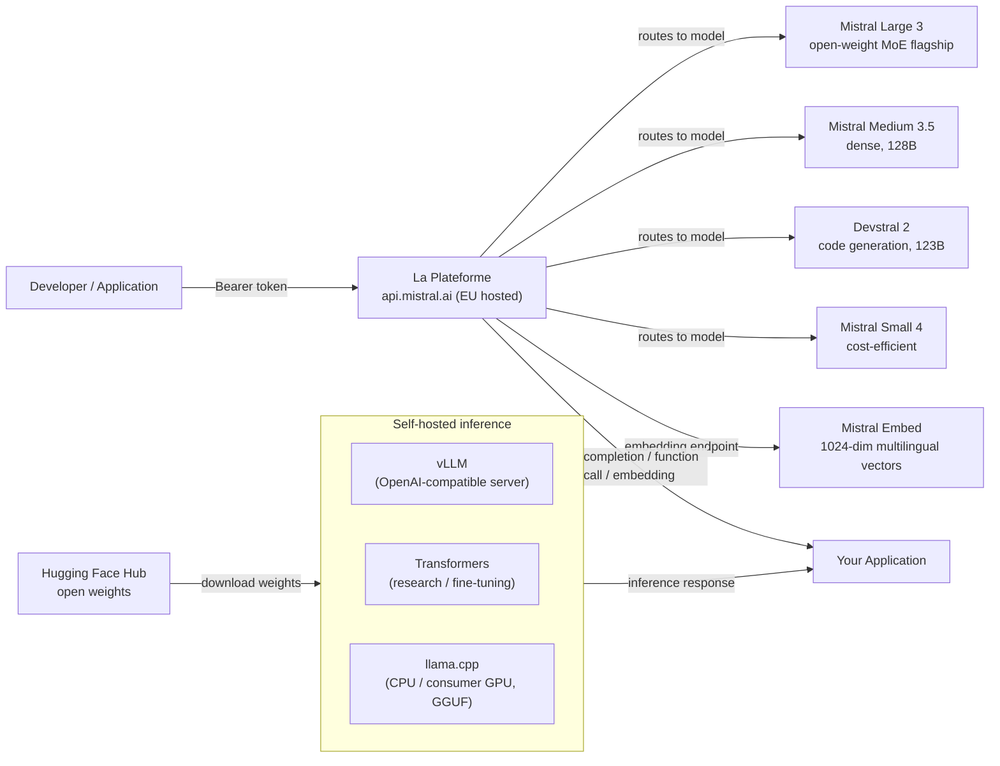

## Definition

Mistral AI is a French AI startup founded in 2023 that has quickly established itself as one of the most influential players in the European AI ecosystem. The company's defining philosophy is a **dual approach**: release efficient open-weights models to the research community and developer ecosystem, while simultaneously offering a commercial API platform (**La Plateforme**) with premium models and enterprise features. This combination has made Mistral particularly popular with developers who want to experiment freely before committing to a paid deployment, and with European enterprises seeking a sovereign AI provider with GDPR-compliant infrastructure hosted in EU data centers.

As of May 2026, the current model lineup is built around large Mixture-of-Experts (MoE) and dense architectures:

| Model | API Model ID | Context Window | Architecture | Input ($/1M) | Output ($/1M) |
|-------|-------------|----------------|--------------|--------------|---------------|
| Mistral Large 3 | `mistral-large-2512` | 256K tokens | 41B active / 675B total (MoE) | $0.50 | $1.50 |
| Mistral Medium 3.5 | `mistral-medium-3-5` | 256K tokens | 128B dense | — | — |
| Devstral 2 | `devstral-2512` | 256K tokens | 123B dense | — | — |
| Mistral Small 4 | `mistral-small-2603` | 256K tokens | — | — | — |
| Ministral 14B | `ministral-14b-2512` | — | 14B | — | — |
| Ministral 8B | `ministral-8b-2512` | — | 8B | — | — |
| Ministral 3B | `ministral-3b-2512` | — | 3B | — | — |

Specialist models include **Voxtral TTS** (`voxtral-tts-2603`) for text-to-speech with voice cloning, **Codestral** for code generation, **OCR 3** for document OCR, and **Mistral Moderation 2** (`mistral-moderation-2603`) for content moderation and jailbreak detection.

> **Deprecated — do not reference:** Mistral 7B (superseded by Mistral Small 4); Mixtral 8x7B and 8x22B (superseded by Mistral Large 3); older Mistral Small versions (deprecated November 2025); Mistral Large 2.0 (`mistral-large-2407`, superseded by Mistral Large 3).

Mistral's strengths cluster around efficiency, multilingual performance (particularly in European languages — French, Spanish, German, Italian), and a developer-friendly API that closely follows the OpenAI interface. The company actively participates in EU AI Act discussions and positions itself as a responsible, European alternative to US-based frontier lab APIs.

## How it works

### La Plateforme API

La Plateforme (`api.mistral.ai`) is Mistral's managed inference API, built around the OpenAI chat completions interface. Requests are structured as `{"model": "...", "messages": [...]}` — any client library built for the OpenAI API can be redirected with a single `base_url` change. The API serves both proprietary commercial models and open-weights models. Authentication uses Bearer tokens. La Plateforme is hosted in European data centers, making it a natural choice for organizations with EU data residency requirements.

### Open-weights models

Mistral Large 3 is available as an open-weight model under a Modified MIT License, distributed via Hugging Face. It can be self-hosted using the standard Transformers, vLLM, or llama.cpp (GGUF format) toolchain. The MoE architecture (41B active / 675B total, 256K context) makes it feasible to serve at lower compute cost than a dense model of equivalent quality. Mistral Medium 3.5 and Devstral 2 (both dense) are also open-weight.

### Function calling

Mistral supports structured function calling (also called tool use) on both the open-weights instruct models and all La Plateforme models. The interface mirrors the OpenAI `tools` parameter: you pass a list of JSON Schema-defined tool definitions, the model returns a `tool_calls` array specifying which function to invoke and with what arguments, your application executes the function, and the result is returned as a `tool` role message to continue the conversation.

### Embeddings

La Plateforme provides a text embedding endpoint (`/v1/embeddings`) backed by Mistral Embed, a dedicated embedding model producing 1024-dimensional dense vectors. The embedding model excels at semantic similarity, retrieval, and classification tasks across multiple European languages. The interface is identical to the OpenAI embeddings API.



## When to use / When NOT to use

| Use when | Avoid when |
|----------|------------|
| You need EU data residency and GDPR-compliant AI infrastructure out of the box | You require the absolute highest capability on complex multi-step reasoning — Mistral Large 3 is strong but may trail top-tier closed models on the hardest benchmarks |
| You want an OpenAI-compatible API with minimal migration cost from existing GPT integrations | You need an extensive ecosystem of third-party fine-tunes and community support (Meta Llama has a larger open community) |
| Efficiency matters — Mistral Large 3 MoE (41B active params) delivers high quality at lower active compute cost than equivalently performing dense models | Your workload requires real-time web grounding or native image-generation endpoints |
| Multilingual European languages (French, Spanish, German, Italian) are core to your use-case | You need on-device / edge inference with sub-1B parameter models |
| You want to self-host an open-weights model under a permissive license (Modified MIT) and potentially fine-tune on proprietary data | Your workload requires extensive audio I/O beyond TTS |

## Comparisons

| Criterion | Mistral AI | Meta Llama 4 | OpenAI GPT-5.4 |
|-----------|-----------|-------------|----------------|
| Weights availability | Open for Mistral Large 3, Medium 3.5, Devstral 2; some closed | Open for all released sizes | Closed API only |
| API provider location | EU (Paris); GDPR-native | US-based third-party hosts (Together, Groq) | US (Azure EU regions available) |
| MoE architecture | Yes (Mistral Large 3: 41B active / 675B total) | Yes (Llama 4 Scout/Maverick) | Undisclosed |
| Function calling | Full tool-use on all instruct/API models | Yes (Llama 4) | Yes (mature, most documented) |
| Multilingual (EU languages) | Strong — core design goal | Good but US-centric training emphasis | Strong across all major languages |
| Fine-tuning support | Open-weights: LoRA/QLoRA; API fine-tuning beta | Open-weights: full fine-tuning available | Fine-tuning API for applicable models |
| Embedding API | Mistral Embed (1024-dim, multilingual) | Not available via Meta directly | text-embedding-3-small/large |
| Context window | 256K tokens (Mistral Large 3) | 10M (Scout), 1M (Maverick) | 1,050K tokens |

## Pros and cons

| Pros | Cons |
|------|------|
| EU-hosted API with strong GDPR positioning; appeals to European enterprise customers | Smaller community ecosystem and fewer community fine-tunes compared to Llama |
| OpenAI-compatible interface minimizes migration effort | Mistral Large 3 context window (256K) is shorter than Llama 4 Scout's 10M |
| Genuinely useful open-weights releases under a permissive Modified MIT License | Pricing for many newer models (Medium 3.5, Devstral 2, Small 4) is not publicly listed |
| MoE architecture (Mistral Large 3) delivers high quality at lower active-parameter cost | No native image/video generation in production-ready models |

## Code examples

```python
# mistral_examples.py
# Demonstrates chat completion and function calling with the mistralai Python SDK.
# pip install mistralai

import os
import json
from mistralai import Mistral

# ── Configuration ─────────────────────────────────────────────────────────────
# Get your API key at: https://console.mistral.ai/api-keys
# Set it with: export MISTRAL_API_KEY="..."
client = Mistral(api_key=os.environ["MISTRAL_API_KEY"])


# ── 1. Chat completion ─────────────────────────────────────────────────────────
def chat_completion_example():
    """Standard multi-turn chat with Mistral Large 3."""
    response = client.chat.complete(
        model="mistral-large-2512",
        messages=[
            {
                "role": "system",
                "content": (
                    "You are a senior machine learning engineer. "
                    "Provide concise, technically accurate answers."
                ),
            },
            {
                "role": "user",
                "content": "What are the key differences between MoE and dense transformer architectures?",
            },
        ],
        temperature=0.4,
        max_tokens=512,
    )

    print("=== Chat Completion ===")
    print(response.choices[0].message.content)
    print(f"\nModel : {response.model}")
    print(f"Usage : {response.usage}")


# ── 2. Function calling ────────────────────────────────────────────────────────
def function_calling_example():
    """
    Mistral function calling (tool use).
    The model decides which tool to call and with what arguments.
    Your application executes the function and returns the result.
    """
    # Define available tools with JSON Schema
    tools = [
        {
            "type": "function",
            "function": {
                "name": "get_model_benchmark",
                "description": (
                    "Retrieves benchmark scores for a specified language model "
                    "on a given benchmark suite."
                ),
                "parameters": {
                    "type": "object",
                    "properties": {
                        "model_name": {
                            "type": "string",
                            "description": "The name of the model, e.g. 'mistral-large-2512'",
                        },
                        "benchmark": {
                            "type": "string",
                            "enum": ["MMLU", "HumanEval", "GSM8K", "HellaSwag"],
                            "description": "The benchmark suite to query.",
                        },
                    },
                    "required": ["model_name", "benchmark"],
                },
            },
        }
    ]

    # First turn — model decides to call a tool
    messages = [
        {
            "role": "user",
            "content": "What is Mistral Large 3's score on the MMLU benchmark?",
        }
    ]

    response = client.chat.complete(
        model="mistral-large-2512",
        messages=messages,
        tools=tools,
        tool_choice="auto",
    )

    assistant_message = response.choices[0].message
    print("=== Function Calling — Step 1: model requests tool call ===")
    print(f"Tool calls: {assistant_message.tool_calls}")

    # Simulate executing the tool
    if assistant_message.tool_calls:
        tool_call = assistant_message.tool_calls[0]
        function_args = json.loads(tool_call.function.arguments)
        print(f"\nExecuting: {tool_call.function.name}({function_args})")

        # Simulated function result
        tool_result = {
            "model": function_args["model_name"],
            "benchmark": function_args["benchmark"],
            "score": 84.0,
            "source": "Mistral AI official benchmarks",
        }

        # Second turn — return the tool result and get the final response
        messages.append({"role": "assistant", "content": None, "tool_calls": assistant_message.tool_calls})
        messages.append({
            "role": "tool",
            "tool_call_id": tool_call.id,
            "content": json.dumps(tool_result),
        })

        final_response = client.chat.complete(
            model="mistral-large-2512",
            messages=messages,
            tools=tools,
        )

        print("\n=== Function Calling — Step 2: final answer ===")
        print(final_response.choices[0].message.content)


# ── 3. Embeddings ──────────────────────────────────────────────────────────────
def embeddings_example(texts: list[str]):
    """
    Generate multilingual embeddings with Mistral Embed.
    Returns 1024-dimensional dense vectors suitable for semantic search and RAG.
    """
    response = client.embeddings.create(
        model="mistral-embed",
        inputs=texts,
    )

    print("\n=== Embeddings ===")
    for i, embedding_obj in enumerate(response.data):
        vec = embedding_obj.embedding
        print(f"Text    : {texts[i][:60]}...")
        print(f"Dims    : {len(vec)}")
        print(f"First 5 : {vec[:5]}\n")


# ── Entry point ────────────────────────────────────────────────────────────────
if __name__ == "__main__":
    chat_completion_example()
    function_calling_example()
    embeddings_example([
        "L'intelligence artificielle transforme l'industrie.",
        "Machine learning models require careful evaluation.",
        "Die Verarbeitung natürlicher Sprache verbessert sich rasant.",
    ])
```

## Practical resources

- [Mistral AI Documentation](https://docs.mistral.ai/) — Complete API reference covering chat, embeddings, function calling, fine-tuning, and all available models.
- [Mistral Large 3 model card](https://docs.mistral.ai/models/mistral-large-3-25-12) — Official model card for Mistral Large 3 (`mistral-large-2512`).
- [Mistral changelog](https://docs.mistral.ai/getting-started/changelog/) — Release history and model updates.
- [La Plateforme Console](https://console.mistral.ai/) — API key management, usage dashboards, and model playground for interactive testing.
- [Mistral models on Hugging Face](https://huggingface.co/mistralai) — Official model weights for Mistral Large 3, Medium 3.5, Devstral 2, and Ministral variants.
- [mistralai Python SDK on PyPI](https://pypi.org/project/mistralai/) — SDK source, changelog, and code examples for all API features.

## See also

- [Model Providers](/docs/model-providers)
- [Meta Llama](/docs/model-providers/meta-llama)
- [Local Inference](/docs/local-inference)
- [RAG — Embeddings](/docs/rag/embeddings)
