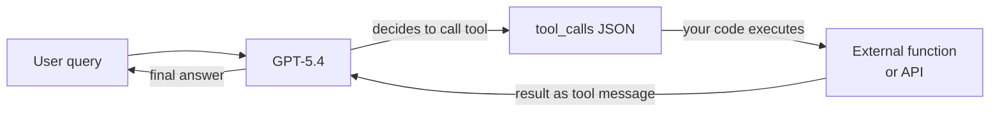

## Definition

**OpenAI** is an AI research company and developer platform headquartered in San Francisco. Founded in 2015 and widely known for releasing ChatGPT in late 2022, OpenAI operates one of the most widely used model APIs in the industry. The platform gives developers programmatic access to a family of models spanning language, vision, audio, and image generation — making it a one-stop shop for most generative AI use cases.

The OpenAI model lineup as of May 2026 centers on the **GPT-5.x family**. **GPT-5.5** (`gpt-5.5`) is the flagship model with a 1,050,000-token context window at $5.00/$30.00 per 1M tokens (input/output). **GPT-5.4** (`gpt-5.4`) is the balanced mid-tier at $2.50/$15.00 per 1M tokens with the same 1M context. **GPT-5.4 mini** (`gpt-5.4-mini`) is the cost-optimized variant at $0.75/$1.25 per 1M tokens with a 400K context window. For image generation, **GPT Image 2** (`gpt-image-2`) and GPT Image 1.5 replace the retired DALL-E series. **Sora 2** handles video generation. **GPT Realtime 2** provides real-time audio I/O.

> Note: GPT-4o, o1, o3-mini, DALL-E 2/3, and GPT-3.5 Turbo are all scheduled for full shutdown on **2026-10-23** and should not be used in new integrations.

From a platform perspective, OpenAI offers a tiered API with usage-based pricing, a Playground for interactive testing, a Batch API for async bulk inference at 50% cost reduction, fine-tuning for applicable models, and an Evals framework for systematic model evaluation. The Python SDK (`openai`) and a TypeScript/Node.js SDK are the primary client libraries.

## How it works

### Chat completions API

The chat completions endpoint (`POST /v1/chat/completions`) is the core of the OpenAI platform. You send an array of messages with roles (`system`, `user`, `assistant`) and receive a completion. The `system` message sets the assistant's persona and constraints; `user` messages carry user input; `assistant` messages represent prior model turns for multi-turn conversation. Streaming is supported via server-sent events so the response can be displayed token-by-token. Temperature and top-p control response randomness; `max_tokens` caps output length.

GPT-5.4 and GPT-5.5 support five reasoning modes — `none`, `low`, `medium`, `high`, and `xhigh` — letting you trade compute for reasoning quality.

> **Long-context pricing note:** Inputs exceeding 272K tokens on GPT-5.5 incur a 2x input / 1.5x output surcharge. Cached input pricing: $0.50/1M (GPT-5.5), $0.25/1M (GPT-5.4).

```mermaid
flowchart LR
  Client[Client app] -->|POST messages array| ChatAPI[/v1/chat/completions]
  ChatAPI -->|model routing| Selector{Model<br/>selector}
  Selector -->|flagship| GPT55[GPT-5.5]
  Selector -->|balanced| GPT54[GPT-5.4]
  Selector -->|cost-optimized| Mini[GPT-5.4 mini]
  GPT55 -->|stream or complete| Resp[JSON response]
  GPT54 --> Resp
  Mini --> Resp
  Resp --> Client
```

### Function calling and tools

Function calling (also called "tool use") lets the model invoke external tools by outputting structured JSON instead of free text. You declare tool schemas in the request; the model decides when to call a tool and populates its arguments. Your code executes the function and returns the result as a `tool` message; the model then uses that result to produce its final answer. This is the foundation of most agent frameworks: the model acts as a reasoning and routing layer while actual computation happens in your code.

GPT-5.4 and GPT-5.5 also support built-in tools: web search, file search, code interpreter, computer use, and image generation.



### Embeddings API

The embeddings endpoint (`POST /v1/embeddings`) converts text into dense numerical vectors. These vectors encode semantic meaning: similar texts produce similar vectors. `text-embedding-3-large` (3072 dimensions) delivers the best retrieval quality; `text-embedding-3-small` (1536 dimensions) is faster and cheaper. Embeddings are the backbone of [RAG](/docs/rag) pipelines: you embed documents at index time and embed queries at search time, then retrieve documents by cosine similarity.

### Image and video APIs

**GPT Image 2** (`POST /v1/images/generations`, model `gpt-image-2`) generates images from text prompts at $8.00 input / $30.00 output per 1M tokens. **Sora 2** handles video generation at $0.10/sec (720p) or $0.30–$0.70/sec (Pro). These APIs share the same authentication and billing model as the text APIs.

## When to use / When NOT to use

| Use OpenAI when | Avoid or consider alternatives when |
|-----------------|--------------------------------------|
| You need the broadest ecosystem: libraries, tutorials, and community support all default to OpenAI | Your workload involves highly sensitive or regulated data and you cannot send it to a third-party US provider |
| You want multimodal support (text + image + audio + video) from a single vendor | You need to fine-tune deeply or control every aspect of the model — open-weights models offer more flexibility |
| You need advanced reasoning on math, code, or logic problems (GPT-5.4 / GPT-5.5 with high/xhigh reasoning mode) | Costs at scale are prohibitive — at very high token volumes, open-weights hosting often beats per-token pricing |
| You are building function-calling or agent workflows — OpenAI's structured outputs and tool calling are mature | You need a non-English-first experience — Qwen or Mistral may outperform on certain languages |
| You want computer use or built-in web search tooling at the API level | You need reproducible deterministic outputs from a frozen model version — OpenAI updates models on a rolling basis |

## Comparisons

| Criteria | OpenAI | Anthropic | Google Gemini |
|----------|--------|-----------|---------------|
| Flagship model | GPT-5.5 | Claude Opus 4.7 | Gemini 2.5 Pro |
| Reasoning model | GPT-5.5 (xhigh mode) | Adaptive thinking (Opus 4.7) | Gemini 2.5 Pro (thinking) |
| Context window | 1,050K (GPT-5.5 / GPT-5.4) | 1M (Opus 4.7, Sonnet 4.6) | 1M (Gemini 2.5 Pro) |
| Multimodal input | Text, image, audio, video | Text, image | Text, image, audio, video |
| Open-weights option | No | No | Gemma (partial) |
| Function / tool calling | Mature, widely adopted | Strong, with computer use | Mature, Google ecosystem |
| Pricing (flagship input) | $5.00/1M (GPT-5.5) | $5.00/1M (Opus 4.7) | $1.25–$2.50/1M (Gemini 2.5 Pro) |
| Safety approach | Moderation API, usage policies | Constitutional AI, refusal tuning | Responsible AI guidelines |
| Data residency | US (default), enterprise options | US (default), enterprise options | Multi-region, Google Cloud |
| Best for | Broadest ecosystem, agent tooling, reasoning | Long docs, safety, nuanced instruction | Long context, multimodal, Google Cloud users |

## Pros and cons

| Pros | Cons |
|------|------|
| Industry-standard API adopted by most frameworks and libraries | Closed model — no visibility into weights or training data |
| Widest model lineup: language, vision, audio, image, video in one platform | US-hosted by default; data residency is limited |
| GPT-5.x reasoning modes excel at math, code, and logic | Pricing can be high at scale compared to self-hosted open models |
| Strong ecosystem: cookbook, evals, fine-tuning, batch API | Model versions change on a rolling basis — behavior may shift without notice |
| Reliable rate limits and enterprise SLAs | No true open-weights offering |

## Code examples

### Chat completion with streaming

```python
import os
from openai import OpenAI

# Reads OPENAI_API_KEY from the environment; set it with:
#   export OPENAI_API_KEY="sk-..."
client = OpenAI(api_key=os.environ["OPENAI_API_KEY"])

# Basic completion
response = client.chat.completions.create(
    model="gpt-5.4",
    messages=[
        {"role": "system", "content": "You are a concise technical assistant."},
        {"role": "user", "content": "Explain embeddings in two sentences."},
    ],
    temperature=0.2,
    max_tokens=256,
)
print(response.choices[0].message.content)

# Streaming response
with client.chat.completions.stream(
    model="gpt-5.4",
    messages=[{"role": "user", "content": "Write a haiku about APIs."}],
) as stream:
    for text in stream.text_stream:
        print(text, end="", flush=True)
```

### Function calling

```python
import json
from openai import OpenAI

client = OpenAI()

# Define a tool schema
tools = [
    {
        "type": "function",
        "function": {
            "name": "get_weather",
            "description": "Get the current weather for a city",
            "parameters": {
                "type": "object",
                "properties": {
                    "city": {"type": "string", "description": "City name"},
                    "unit": {"type": "string", "enum": ["celsius", "fahrenheit"]},
                },
                "required": ["city"],
            },
        },
    }
]

messages = [{"role": "user", "content": "What's the weather in Tokyo?"}]

# First call — model may decide to call a tool
response = client.chat.completions.create(
    model="gpt-5.4",
    messages=messages,
    tools=tools,
    tool_choice="auto",
)

msg = response.choices[0].message
messages.append(msg)

# If the model called a tool, execute it and return the result
if msg.tool_calls:
    for tc in msg.tool_calls:
        args = json.loads(tc.function.arguments)
        # Simulated function execution
        result = {"city": args["city"], "temp": "18°C", "condition": "Partly cloudy"}
        messages.append({
            "role": "tool",
            "tool_call_id": tc.id,
            "content": json.dumps(result),
        })

# Second call — model uses the tool result to answer
final = client.chat.completions.create(model="gpt-5.4", messages=messages)
print(final.choices[0].message.content)
```

### Embeddings for semantic search

```python
from openai import OpenAI
import numpy as np

client = OpenAI()

def embed(texts: list[str], model: str = "text-embedding-3-small") -> list[list[float]]:
    response = client.embeddings.create(input=texts, model=model)
    return [item.embedding for item in response.data]

# Index documents
docs = [
    "Python is a high-level programming language.",
    "OpenAI provides a REST API for language models.",
    "RAG combines retrieval with generation.",
]
doc_vectors = embed(docs)

# Query
query = "How do I call OpenAI from Python?"
query_vector = embed([query])[0]

# Cosine similarity
def cosine_sim(a, b):
    a, b = np.array(a), np.array(b)
    return float(np.dot(a, b) / (np.linalg.norm(a) * np.linalg.norm(b)))

scores = [(cosine_sim(query_vector, dv), doc) for dv, doc in zip(doc_vectors, docs)]
scores.sort(reverse=True)
for score, doc in scores:
    print(f"{score:.3f}  {doc}")
```

## Practical resources

- [OpenAI API reference](https://developers.openai.com/api/docs/models) — Current model IDs, context windows, capabilities, and deprecation timelines
- [OpenAI pricing](https://developers.openai.com/api/docs/pricing) — Per-token pricing for all models including batch discounts and cached input rates
- [OpenAI deprecations](https://developers.openai.com/api/docs/deprecations) — Retirement schedule for legacy models
- [OpenAI Cookbook](https://cookbook.openai.com/) — Practical examples covering function calling, RAG, fine-tuning, evals, and more
- [OpenAI Python SDK on GitHub](https://github.com/openai/openai-python) — Source, changelog, and migration guides

## See also

- [Model providers](/docs/model-providers) — Overview and comparison of all providers
- [Case study: ChatGPT](/docs/case-studies/chatgpt) — For a deeper look at model architecture, see the ChatGPT case study
- [Anthropic](/docs/model-providers/anthropic) — Claude model family, tool use, long context
- [Prompt engineering](/docs/prompt-engineering) — Techniques that apply across all OpenAI models
- [Agents](/docs/agents) — Building agentic workflows with function calling
- [RAG](/docs/rag) — Using OpenAI embeddings in retrieval-augmented generation
