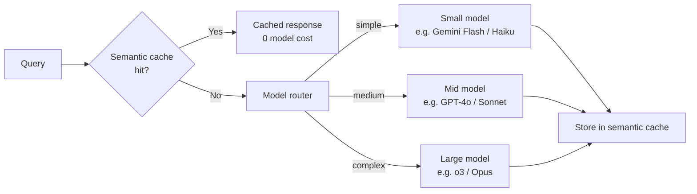

## Definition

**Model routing** is the practice of directing each LLM request to the most appropriate model in a pool, based on the characteristics of the request. A router acts as a proxy layer sitting between the application and one or more LLM provider APIs; it evaluates each incoming query and dispatches it to the cheapest or fastest model that can answer it correctly.

Model routing has become critical infrastructure as enterprises move from single-model deployments to heterogeneous stacks. Gartner's Hype Cycle for Generative AI 2025 classifies AI gateways as having shifted from optional tooling to **critical infrastructure**; by 2026, 37% of enterprises use five or more LLM models in production.

Routing is distinct from cascading (which always starts at the cheapest tier and escalates) and from semantic caching (which bypasses all models on a cache hit). A complete production architecture combines all three:

## Routing strategies

### Classifier-based routing

A lightweight classifier (small fine-tuned model, embedding similarity, or rule set) scores query complexity before invoking the target model. **RouteLLM** (LMSys, 2024) trains a router on human preference data, reducing premium model calls by 40–85% with < 5% win-rate degradation. The classifier itself must be fast (< 20 ms) and cheap — typically a 1–7B model or a logistic regression over query embeddings.

### Cascading (sequential fallback)

The request is first sent to the cheapest model. If the response confidence or a self-critique score falls below a threshold, the original query is re-sent to the next tier. Cascading is simpler than classification (no separate classifier) but less efficient because Tier 1 always runs. True fallback (provider outage / timeout) is a separate concern: LiteLLM's fallback list handles API errors independently of quality-based escalation.

### Semantic caching

Queries are embedded and compared against a cache of previously answered queries. On a cosine similarity hit (typically ≥ 0.92), the cached response is returned without invoking any model. Semantic caching delivers 100% cost savings on cache hits and is complementary to routing — it sits upstream and eliminates the routing decision entirely for repeated queries. Real-world hit rates range from 15–30% for general assistants to 50–70% for FAQ and support bots.

### Provider fallback and load balancing

LiteLLM's router supports:
- **Fallback lists:** if primary provider fails (rate limit, timeout), automatically retry on a secondary provider.
- **Load balancing:** distribute requests across multiple API keys or provider endpoints to stay within rate limits.
- **Retries with exponential backoff:** configurable per-provider retry logic.

## LiteLLM

LiteLLM is the dominant open-source LLM gateway (2024–2026), providing a unified OpenAI-compatible API over 100+ models from 20+ providers. Key capabilities:

| Feature | Description |
|---|---|
| Unified API | OpenAI-format calls to any provider |
| Router | Classifier, fallback, and load-balancing routing |
| Budget limits | Per-user and per-team spend caps |
| Logging | Unified request/response logging to observability tools |
| Prompt management | Centralised prompt versioning |
| Semantic cache | Via Redis integration |

## When to use / When NOT to use

| Scenario | Use model routing | Skip |
|---|---|---|
| Production app with mixed-complexity queries | Yes — 40–70% cost reduction | No — if all queries genuinely need the frontier model |
| Multi-provider resilience required | Yes — fallback routing provides automatic failover | No — single-provider commitment for contractual reasons |
| High query repetition (FAQ, support) | Yes — semantic caching above the router | No — unique-per-user creative tasks won't cache |
| Strict latency SLA < 200 ms | Semantic cache (no model call); routing adds classifier latency | Measure classifier overhead before enabling |
| Prototype / low volume | No — routing complexity not justified | Yes — use a single model directly |

## Sources

- [LiteLLM – routing and load balancing documentation](https://docs.litellm.ai/docs/routing-load-balancing)
- [LLM routing and model cascades — TianPan](https://tianpan.co/blog/2025-11-03-llm-routing-model-cascades)
- [Top 5 LLM routing techniques — Maxim](https://www.getmaxim.ai/articles/top-5-llm-routing-techniques/)
- [Dynamic model routing and cascading for efficient LLM inference — arXiv 2603.04445](https://arxiv.org/html/2603.04445v2)
- [Top 5 LLM router solutions in 2026 — Maxim](https://www.getmaxim.ai/articles/top-5-llm-router-solutions-in-2026/)

## See also

- [Cost optimization](/docs/cost-optimization)
- [Model tiering](/docs/cost-optimization/model-tiering)
- [Semantic search](/docs/semantic-search)
- [MLOps](/docs/mlops)
- [LLMs](/docs/llms)
