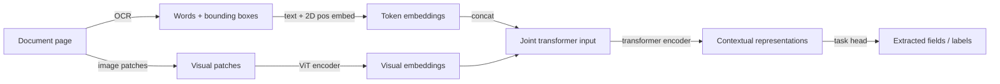

## Definition

Document AI encompasses the set of AI techniques for understanding documents that combine text, layout, tables, forms, charts, and images — PDFs, scanned forms, invoices, contracts, research papers, and presentations. Unlike plain-text NLP, documents carry rich structural information (bounding boxes, reading order, font size, tables) that must be modeled alongside linguistic content to accurately extract information.

The field has evolved through distinct phases:

1. **OCR + rule-based extraction** — Tesseract or commercial OCR engines extract raw text; regex and templates extract fields. Brittle on layout variation.
2. **LayoutLM family** (Microsoft, 2020-2022) — fine-tuned BERT-style models that embed token positions (x, y coordinates) alongside text and optionally image features. LayoutLMv3 combines text, layout, and image patches in a unified pretraining objective.
3. **End-to-end VLMs for documents** — models like Donut (Document Understanding Transformer), Qwen2-VL, and InternVL render the document as an image and generate structured output directly, bypassing OCR entirely.

## How it works

### LayoutLM approach (text + layout + image)

LayoutLMv3 uses a unified multimodal transformer. Text tokens carry 2D bounding-box positional encodings; image patches are extracted with ViT-style patch projection. A Word-Patch Alignment objective aligns text tokens with their corresponding image patches.

### OCR-free VLM approach (Donut / Qwen2-VL)

These models take the raw document image as input. A high-resolution ViT encoder processes the image at full resolution. A text decoder generates structured output (JSON, XML, plain text) directly using teacher-forced training on document-schema pairs. No external OCR engine is needed, reducing error propagation.

### Key document AI tasks

| Task | Example | Typical model |
|---|---|---|
| Document classification | Invoice vs. contract vs. report | LayoutLMv3 fine-tuned |
| Key-value extraction | Invoice number, date, total | Donut, LayoutLMv3 |
| Table extraction | Row-column parsing | TableFormer, Qwen2-VL |
| Document VQA | "What is the net amount?" | Donut, Qwen2-VL |
| Receipt / form parsing | Form field localization + value | LayoutLMv3, PaddleOCR |

## When to use / When NOT to use

| Scenario | Use | Avoid |
|---|---|---|
| Structured extraction from fixed-format documents (invoices, forms) | Fine-tuned LayoutLMv3 or Donut — high precision | General LLM — poor layout understanding |
| Arbitrary document VQA without labeled training data | Qwen2-VL or GPT-4o — zero-shot | Supervised model — requires annotated data |
| Scanned low-quality documents | Preprocess with PaddleOCR + LayoutLM | OCR-free VLM — may struggle with very poor scan quality |
| High-throughput batch processing (millions of pages) | Lightweight Donut or quantized LayoutLM | GPT-4o API — cost prohibitive at scale |
| On-premise, no external API | Open-source LayoutLMv3 or Donut (HuggingFace) | Proprietary API — data privacy concern |

## Sources

- [LayoutLMv3 — Pre-training for Document AI (Microsoft, 2022)](https://arxiv.org/abs/2204.08387)
- [Donut — OCR-free Document Understanding Transformer (2021)](https://arxiv.org/abs/2111.15664)
- [Qwen2-VL for document understanding (Alibaba, 2024)](https://arxiv.org/abs/2409.12191)
- [DocVQA benchmark — Mathew et al. (2021)](https://arxiv.org/abs/2007.00398)
- [PaddleOCR — open-source multilingual OCR](https://github.com/PaddlePaddle/PaddleOCR)

## See also

- [Multimodal AI](/docs/multimodal-ai)
- [Vision-language models](/docs/multimodal-ai/vision-language-models)
- [NLP](/docs/nlp)
- [Information extraction](/docs/nlp/information-extraction)
