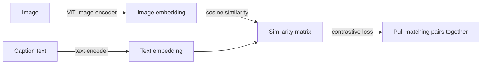
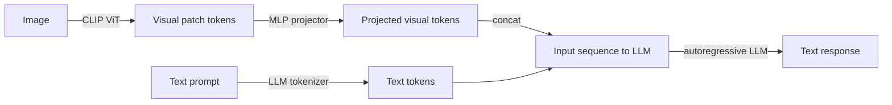

## Definition

Vision-language models (VLMs) are AI systems that can process both images and text, enabling tasks such as visual question answering (VQA), image captioning, visual grounding, document understanding, and image-conditioned reasoning. They cover a spectrum from alignment-only models to fully instruction-tuned chat models:

- **CLIP** (OpenAI, 2021) — a dual-encoder model trained with contrastive learning on 400M image-text pairs. CLIP learns a shared embedding space where images and their textual descriptions are pulled close together. It enables powerful zero-shot classification and cross-modal retrieval but does not generate text.
- **LLaVA** (Liu et al., 2023-2024) — connects a CLIP image encoder to a language model (Llama, Mistral, Qwen) via a lightweight projector (MLP or cross-attention). LLaVA-1.5 and LLaVA-NeXT achieve GPT-4V-level performance in open benchmarks at a fraction of the compute.
- **PaliGemma** (Google DeepMind, 2024) — a 3B VLM combining SigLIP (improved CLIP) and Gemma 2B. Designed as a transfer base: fine-tuning PaliGemma achieves state-of-the-art on dense tasks (captioning, VQA, object detection, segmentation) while fitting on a single consumer GPU.
- **Qwen-VL** (Alibaba, 2023-2024) — a series of VLMs (7B, 72B) supporting multi-image, high-resolution, and video inputs. Qwen2-VL adds 2D positional encoding (RoPE-2D) and native dynamic resolution, achieving top ranks on OCRBench and DocVQA.

## How it works

### CLIP: contrastive dual-encoder

A batch of (image, caption) pairs is encoded; the diagonal of the similarity matrix is maximized and off-diagonal entries are minimized. At inference, any text prompt can be used as a query to rank images or classify by comparing image embeddings to label embeddings.

### LLaVA-style VLM: projector + LLM

Visual tokens are projected into the LLM's token space and prepended to the text tokens. The LLM sees a mixed sequence of visual and text tokens and generates a response autoregressively. Training proceeds in two stages: (1) align the projector with image-caption pairs, (2) instruction-tune the full model with VQA, conversation, and task-specific data.

### Key benchmarks (May 2026 state)

| Benchmark | Task | Top open models |
|---|---|---|
| MMBench / MMStar | General VQA | Qwen2-VL-72B, LLaVA-NeXT-110B |
| DocVQA | Document understanding | Qwen2-VL-7B, PaliGemma-2 |
| OCRBench | Text recognition in images | Qwen2-VL-72B |
| MMMU | College-level multimodal reasoning | GPT-4o, Gemini 1.5 Pro |

## When to use / When NOT to use

| Scenario | Use | Avoid |
|---|---|---|
| Zero-shot image classification or retrieval | CLIP embeddings — fast, no fine-tuning | Full VLM — overkill for retrieval |
| Visual QA, image captioning, chart understanding | LLaVA-NeXT or Qwen2-VL (7B) | CLIP — cannot generate text |
| Dense tasks (segmentation, detection, grounding) | PaliGemma fine-tuned — state-of-the-art transfer | General VLM without fine-tuning |
| Multi-image and video understanding | Qwen2-VL — native video and multi-image support | LLaVA 1.5 — single image only |
| On-device or low-resource deployment | PaliGemma 3B (fits on 1 GPU) | 70B+ VLMs — infeasible |

## Sources

- [CLIP — Learning Transferable Visual Models From Natural Language (OpenAI, 2021)](https://arxiv.org/abs/2103.00020)
- [LLaVA — Visual Instruction Tuning (Liu et al., 2023)](https://arxiv.org/abs/2304.08485)
- [LLaVA-NeXT — Improved Baselines with Visual Instruction Tuning (2024)](https://arxiv.org/abs/2310.03744)
- [PaliGemma — A Versatile 3B VLM for Transfer (Google DeepMind, 2024)](https://arxiv.org/abs/2407.07726)
- [Qwen2-VL technical report (Alibaba, 2024)](https://arxiv.org/abs/2409.12191)

## See also

- [Multimodal AI](/docs/multimodal-ai)
- [Computer vision](/docs/cv)
- [Vision Transformers](/docs/cv/vision-transformers)
- [LLMs](/docs/llms)
- [Document AI](/docs/multimodal-ai/document-ai)
