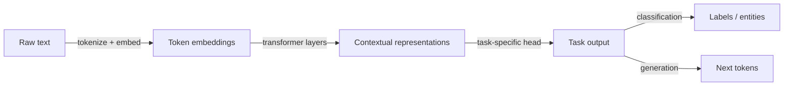

## Definition

Natural language processing (NLP) is the branch of AI that deals with the intersection of computers and human language — enabling machines to read, understand, interpret, and generate text and speech. The field covers a wide spectrum of tasks: text classification (spam detection, sentiment analysis), structured extraction (named entity recognition, relation extraction), question answering, summarization, translation, and open-ended generation. Each task requires a model that can map variable-length natural language inputs to useful outputs.

Modern NLP is dominated by pretrained [transformer](/docs/transformers) models. The pretraining-finetuning paradigm — training a large model on massive corpora to learn general language representations, then adapting it to specific tasks — has replaced hand-engineered feature pipelines and task-specific architectures. Models like BERT (bidirectional, good for classification and extraction) and GPT (autoregressive, good for generation) represent different ends of the transformer spectrum. [LLMs](/docs/llms) like GPT-4, Claude, and Llama 3 extend this further: a single model handles many tasks with the right prompt, reducing the need for separate fine-tuned models per task.

Inputs to NLP models are discrete tokens (subwords or words) produced by tokenization. Models learn rich contextual embeddings where the representation of a word depends on its context. [RAG](/docs/rag) and [agents](/docs/agents) extend NLP systems by adding retrieval and tool use on top of language models, enabling grounded question answering and multi-step task completion beyond what fits in a single context window.

## How it works

### Tokenization and embedding

Raw text is first split into subword tokens using algorithms like BPE (byte-pair encoding) or WordPiece. Each token is mapped to a learned embedding vector. Positional encodings are added to preserve word order. The result is a sequence of vectors that the transformer processes.

### Transformer encoding and task heads



Transformer layers apply multi-head self-attention and feed-forward sublayers to produce contextual representations — each token's embedding now reflects its full context. A task head maps these representations to outputs: a classification head adds a linear layer over the `[CLS]` token; a generation head predicts the next token autoregressively; a span head predicts start and end positions for QA.

### Pretraining and adaptation

Models are pretrained on large corpora using self-supervised objectives (masked language modeling for BERT-style, next-token prediction for GPT-style). Adaptation to downstream tasks happens via fine-tuning (updating all or some weights on labeled data) or prompting (providing instructions and examples in context without weight updates). Parameter-efficient methods like LoRA allow fine-tuning with far fewer trainable parameters.

## When to use / When NOT to use

| Use when | Avoid when |
|----------|------------|
| Input or output is natural language text at any scale | Data is purely numerical, tabular, or structured — classical ML may suffice |
| Tasks include classification, extraction, QA, summarization, or generation | Strict latency or memory constraints rule out transformer inference |
| You want to leverage pretrained models to reduce labeled data needs | You need symbolic, rule-based processing that must be 100% auditable |
| Building chatbots, search, or document understanding pipelines | Domain vocabulary is so specialized that pretrained models need extensive retraining |

## Comparisons

| Approach | Strengths | Limitations |
|----------|-----------|-------------|
| BERT-style encoders | Strong classification and extraction | Not generative; needs fine-tuning per task |
| GPT-style decoders (LLMs) | Generalist, few-shot, generative | Higher compute; harder to constrain output format |
| Fine-tuned task models | High performance on specific tasks | Requires labeled data; one model per task |
| Prompt engineering (zero/few-shot) | Fast iteration, no training | Less reliable for complex structured tasks |

## Pros and cons

| Pros | Cons |
|------|------|
| Pretrained models transfer well across tasks and domains | Large models are computationally expensive to run and fine-tune |
| A single LLM handles many tasks with prompting | Output quality depends heavily on prompt design and context |
| Rich ecosystem of open-source models and tooling | Tokenization introduces artifacts and limits handling of rare words |
| Strong zero-shot and few-shot capabilities | Hallucination and inconsistency remain challenges for generation tasks |

## Code examples

### Text classification with Hugging Face Transformers (Python)

```python
from transformers import pipeline

# Zero-shot classification — no fine-tuning needed
classifier = pipeline(
    "zero-shot-classification",
    model="facebook/bart-large-mnli",
)

text = "The new firmware update fixed the battery drain issue on the smartphone."
candidate_labels = ["technology", "sports", "finance", "politics"]

result = classifier(text, candidate_labels)
print(f"Text: {text}")
for label, score in zip(result["labels"], result["scores"]):
    print(f"  {label}: {score:.3f}")
```

## Practical resources

- [Hugging Face – NLP course](https://huggingface.co/learn/nlp-course/) — Hands-on course covering transformers, fine-tuning, and deployment
- [Stanford CS224N – NLP with Deep Learning](http://web.stanford.edu/class/cs224n/) — University course with lecture notes and assignments
- [Hugging Face Model Hub](https://huggingface.co/models) — Thousands of pretrained models for every NLP task
- [NLTK Book](https://www.nltk.org/book/) — Classic introduction to NLP fundamentals
- [The Illustrated Transformer (Jay Alammar)](https://jalammar.github.io/illustrated-transformer/) — Visual explanation of transformer architecture

## See also

- [Transformers](/docs/transformers)
- [LLMs](/docs/llms)
- [RAG](/docs/rag)
