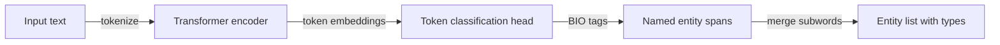

## Definition

Information extraction (IE) converts unstructured natural language text into structured facts that can be stored in databases, knowledge graphs, or spreadsheets. The three canonical IE tasks are:

- **Named entity recognition (NER)** — identifying and labeling mentions of entities such as persons (PER), organizations (ORG), locations (LOC), dates (DATE), and domain-specific types (genes, chemicals, products).
- **Relation extraction (RE)** — determining the semantic relationship between two detected entities, e.g., (`Apple`, `founded_by`, `Steve Jobs`).
- **Event extraction** — detecting event mentions (e.g., "acquisition", "explosion") and their arguments (who, what, when, where).

Traditional IE used rule-based systems (Spacy patterns, regex) and feature-engineered sequence labelers (CRF, HMM). Modern pipelines replace most of this with fine-tuned transformers: token classifiers for NER, span-pair classifiers or generative models for RE, and instruction-tuned LLMs for joint extraction of arbitrary schemas.

## How it works

### NER pipeline

Token classification assigns a BIO (Begin-Inside-Outside) label to each token. `B-PER` marks the first token of a person name, `I-PER` continues it, and `O` marks non-entity tokens. Post-processing merges subword tokens into full spans.

### Relation extraction pipeline

After NER, relation extraction takes pairs of entity spans and classifies the relation type. Approaches include:

1. **Cross-encoder** — concatenate entity markers (`[E1]…[/E1]`) into the input and classify with a linear head.
2. **Generative extraction** — prompt an LLM with the text and target schema; the model outputs structured triples as JSON or a template.
3. **End-to-end joint models** (REBEL, InstructIE) — predict both entities and relations in a single pass.

### Zero-shot extraction with LLMs

Instruction-tuned LLMs can extract arbitrary schemas from text using structured prompts — no annotated training data required. The trade-off is lower precision on domain-specific types versus fine-tuned models trained on annotated corpora.

## When to use / When NOT to use

| Scenario | Use IE | Avoid IE |
|---|---|---|
| Building knowledge graphs from documents | Yes — NER + RE populates entity-relation triples | No — if documents are already structured |
| Medical/legal entity tagging with domain ontology | Fine-tuned NER on annotated corpus | Generic off-the-shelf NER misses domain entities |
| Rapid prototyping with no labeled data | Zero-shot LLM extraction | Fine-tuned model — no labels yet |
| High-throughput production pipeline (millions of docs) | Lightweight fine-tuned encoder (GLiNER, SpanBERT) | Full LLM at scale — cost and latency |
| Strict schema with low tolerance for hallucination | Fine-tuned classifier with deterministic output | Generative LLM — may hallucinate relations |

## Sources

- [SpaCy — Named entity recognition](https://spacy.io/usage/linguistic-features#named-entities)
- [GLiNER — Generalist model for NER (2024)](https://arxiv.org/abs/2311.08526)
- [REBEL — Relation extraction by end-to-end language generation (2021)](https://arxiv.org/abs/2110.14202)
- [UniversalNER — Targeted distillation from LLMs for NER (2023)](https://arxiv.org/abs/2308.03279)
- [InstructIE — Instruction-tuned IE with LLMs (2023)](https://arxiv.org/abs/2305.11527)

## See also

- [NLP](/docs/nlp)
- [Text classification](/docs/nlp/text-classification)
- [Transformers](/docs/transformers)
- [RAG](/docs/rag)
