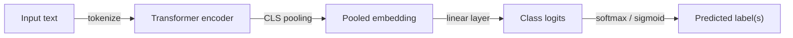

## Definition

Text classification is the task of mapping a piece of text to one or more predefined categories. Common sub-tasks include sentiment analysis (positive / negative / neutral), intent detection (book_flight, cancel_order), topic labeling (sports, politics, finance), spam detection, and toxicity filtering. Output can be binary, multi-class (exactly one label), or multi-label (any subset of labels).

Modern approaches fall into two families. **Fine-tuned encoders** (BERT, RoBERTa, DeBERTa) extract a `[CLS]` token representation and pass it through a classification head trained on labeled examples — typically reaching state-of-the-art on structured benchmarks when a few hundred to a few thousand labels are available. **Zero-shot or few-shot LLMs** (GPT-4, Claude, Llama 3) require no labeled training data: the model reads the candidate labels in the prompt and produces a decision, trading label efficiency for slightly lower accuracy on narrow domains.

Practical systems often layer both: an LLM for exploratory labeling or rare categories, and a fine-tuned encoder for high-throughput production classification once sufficient labels are collected.

## How it works

1. **Tokenize** — text is split into subword tokens (BPE, WordPiece) and mapped to embeddings with positional encodings.
2. **Encode** — transformer layers produce contextual representations; the `[CLS]` (or mean-pooled) embedding captures the full sequence.
3. **Classify** — a linear layer projects the pooled vector to the number of classes; softmax for single-label, sigmoid for multi-label.
4. **Train** — cross-entropy loss (single-label) or binary cross-entropy (multi-label) guides gradient updates; only the head is updated for feature extraction, or all layers for full fine-tuning.

### Zero-shot path

For zero-shot classification, the input text and candidate labels are formatted as a natural-language entailment premise + hypothesis (NLI) or a direct prompt, and the model scores each label based on probability or verbalized output.

## When to use / When NOT to use

| Scenario | Use | Don't use |
|---|---|---|
| Sentiment, spam, or intent detection with labeled data | Fine-tuned encoder — high accuracy, fast inference | LLM at scale — cost prohibitive for millions of requests |
| Novel taxonomy without labeled examples | Zero-shot LLM or NLI classifier | Fine-tuning — no labels available |
| Streaming high-throughput production traffic | Distilled encoder (DistilBERT, TinyBERT) on GPU/TPU | Full-sized LLM — latency and cost |
| Hierarchical or extremely fine-grained labels (>1000 classes) | Hierarchical classifier or embedding + kNN | Flat softmax over 1000+ classes |
| Active learning loop with human reviewers | LLM to label, fine-tune on confirmed labels | Static dataset only |

## Sources

- [Hugging Face — Text classification guide](https://huggingface.co/docs/transformers/tasks/sequence_classification)
- [RoBERTa paper — Liu et al. (2019)](https://arxiv.org/abs/1907.11692)
- [Zero-shot text classification via NLI — Yin et al. (2019)](https://arxiv.org/abs/1909.00161)
- [DeBERTa-v3 — He et al. (2021)](https://arxiv.org/abs/2111.09543)
- [SetFit — Efficient few-shot fine-tuning (2022)](https://arxiv.org/abs/2209.11055)

## See also

- [NLP](/docs/nlp)
- [Transformers](/docs/transformers)
- [Information extraction](/docs/nlp/information-extraction)
- [Prompt engineering](/docs/prompt-engineering)
