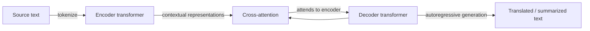

## Definition

**Machine translation (MT)** automatically converts text from a source language into a target language while preserving meaning. Modern neural MT uses encoder-decoder transformers trained on massive multilingual parallel corpora. Key models include NLLB-200 (Meta, 200 languages), mBART-50 (50 languages), and the Helsinki-NLP Opus-MT family of lightweight specialized models. Proprietary systems (Google Translate, DeepL) use similar architectures at larger scale.

**Automatic summarization** condenses a longer document into a shorter form. It splits into two paradigms: **extractive** summarization selects the most important sentences verbatim from the source (fast, factually grounded); **abstractive** summarization generates new text that may rephrase or fuse information (more fluent, but risks hallucination). Modern abstractive models (BART, Pegasus, T5, Llama 3) dramatically outperform extractive baselines on open-domain benchmarks, though extractive is still preferred in high-stakes domains (legal, medical) where faithfulness is paramount.

Both tasks share a seq2seq encoder-decoder architecture: the encoder reads the full source sequence and the decoder generates the target sequence token by token using cross-attention to the encoder output.

## How it works

1. **Encode** — the source tokens are processed by the encoder into rich contextual representations (one per token).
2. **Decode** — the decoder generates target tokens one at a time; at each step it attends to all encoder representations via cross-attention and to previously generated tokens via masked self-attention.
3. **Beam search or sampling** — at inference time, beam search (k=4 or k=5) or nucleus sampling is used to produce fluent output while balancing diversity and quality.
4. **Post-processing** — detokenization, language-specific normalization, and optional faithfulness checks are applied.

### Quality metrics

| Task | Metric | Notes |
|---|---|---|
| Translation | BLEU, chrF, COMET | COMET correlates best with human judgment |
| Summarization | ROUGE-1/2/L | Measures n-gram overlap; BERTSCORE for semantic similarity |
| Both | Human evaluation (MQM, Likert) | Gold standard but expensive |

## When to use / When NOT to use

| Scenario | Use | Don't use |
|---|---|---|
| Translating documents across 10+ languages at scale | NLLB-200 or mBART-50 (open-source, self-hosted) | Per-language fine-tuned model — maintenance overhead |
| High-quality single language pair in production | Fine-tuned Helsinki-NLP model or DeepL API | Generic multilingual model — specialized model wins |
| Summarizing long documents (>100K tokens) | Chunked summarization with map-reduce pipeline | Single-pass LLM — exceeds context window |
| Faithfulness-critical summarization (legal, clinical) | Extractive or LLM with faithfulness constraint | Pure abstractive — hallucination risk |
| On-device / offline translation | CTranslate2 + quantized NLLB — lightweight | Server LLM — requires connectivity |

## Sources

- [NLLB-200 — No Language Left Behind (Meta, 2022)](https://arxiv.org/abs/2207.04672)
- [BART — Denoising Sequence-to-Sequence Pre-training (Lewis et al., 2019)](https://arxiv.org/abs/1910.13461)
- [Pegasus — Pre-training with Extracted Gap-sentences (Zhang et al., 2019)](https://arxiv.org/abs/1912.08777)
- [Helsinki-NLP Opus-MT models on Hugging Face](https://huggingface.co/Helsinki-NLP)
- [COMET — A Neural Framework for MT Evaluation (2020)](https://arxiv.org/abs/2009.09025)

## See also

- [NLP](/docs/nlp)
- [Transformers](/docs/transformers)
- [Text classification](/docs/nlp/text-classification)
- [LLMs](/docs/llms)
