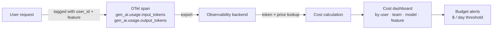

## Definition

**Cost attribution** is the practice of associating LLM token expenditure with the business entity that caused it — a user, a team, a product feature, or an experiment. Without attribution, cloud AI spend is a single opaque line item that grows unpredictably, making it impossible to identify waste, enforce budgets, or make informed model-selection decisions.

LLM costs are driven by two factors: **input tokens** (the prompt sent to the model) and **output tokens** (the completion returned). Output tokens are typically 3–5x more expensive per token than input tokens, and both are billed per-request. In multi-agent or RAG systems, a single user action can trigger dozens of LLM calls, making per-request cost attribution essential to understanding total cost-per-interaction.

The OpenTelemetry GenAI Semantic Conventions (stable in v1.37+) provide standard span attributes for token tracking:
- `gen_ai.usage.input_tokens`
- `gen_ai.usage.output_tokens`
- `gen_ai.request.model`
- `gen_ai.provider.name`

These attributes, combined with custom dimension tags (user ID, feature name, experiment ID), enable cost attribution dashboards in any OTel-compatible backend.

## How it works

At instrumentation time, custom span attributes tag each LLM call with business dimensions (`user.id`, `team.name`, `feature.name`, `experiment.id`). The observability backend multiplies token counts by the provider's per-token price table (updated periodically) to compute dollar cost. Aggregated dashboards and alerts fire when per-user or per-feature spend exceeds configured thresholds.

## When to use / When NOT to use

| Scenario | Attribute costs | Skip or defer |
|---|---|---|
| Multi-tenant SaaS product with per-seat pricing | Yes — attribute to tenant for bill reconciliation | No — unattributed spend leads to margin surprises |
| Internal platform with multiple teams sharing one API key | Yes — chargeback requires per-team attribution | No — without attribution, cost optimization is guesswork |
| Experimentation with multiple model variants | Yes — track cost-per-quality trade-off per experiment | No — comparing model outputs without cost ignores total value |
| Single-tenant prototype or personal project | Maybe — track total spend; per-user attribution optional | Yes — overhead is not worth it at small scale |
| Agent systems with long multi-hop chains | Yes — without per-call attribution, total cost is opaque | No — per-hop attribution is essential for optimization |

## Cost attribution dimensions

| Dimension | Span attribute / tag | Use case |
|---|---|---|
| User | `user.id` | Per-user billing, quota enforcement |
| Team / org | `team.id` | Internal chargeback |
| Feature | `feature.name` | Feature-level ROI analysis |
| Experiment | `experiment.id` | A/B cost-quality trade-offs |
| Model | `gen_ai.request.model` | Compare model cost vs. quality |
| Agent step | span name | Multi-hop cost breakdown |

## Cost optimization levers

Once attribution is in place, common optimization actions include:
- **Model routing**: Use a cheap fast model for simple queries; escalate to a large model only when needed.
- **Prompt compression**: Remove redundant context and whitespace; shorter prompts cut input costs directly.
- **Prefix caching**: System prompts and shared context billed once, not per request.
- **Output length limits**: `max_tokens` caps prevent runaway generation costs.
- **Caching responses**: Cache deterministic query/response pairs (semantic cache) to serve repeat queries for free.

## Sources

- [OpenTelemetry GenAI Semantic Conventions](https://opentelemetry.io/docs/specs/semconv/gen-ai/) — standard token and model attributes for cost attribution
- [Langfuse cost tracking](https://langfuse.com/docs/model-usage-and-cost) — per-model price tables and cost dashboard in Langfuse
- [OpenObserve — OTel for LLMs guide](https://openobserve.ai/blog/opentelemetry-for-llms/) — practical guide including cost attribution via OTel attributes
- [Uptrace — OTel AI systems](https://uptrace.dev/blog/opentelemetry-ai-systems) — cost and token dashboards with OTel backends

## See also

- [Observability](/docs/observability)
- [Tracing](/docs/observability/tracing)
- [Langfuse](/docs/observability/langfuse)
- [Inference optimization](/docs/inference-optimization)
- [MLOps](/docs/mlops)
