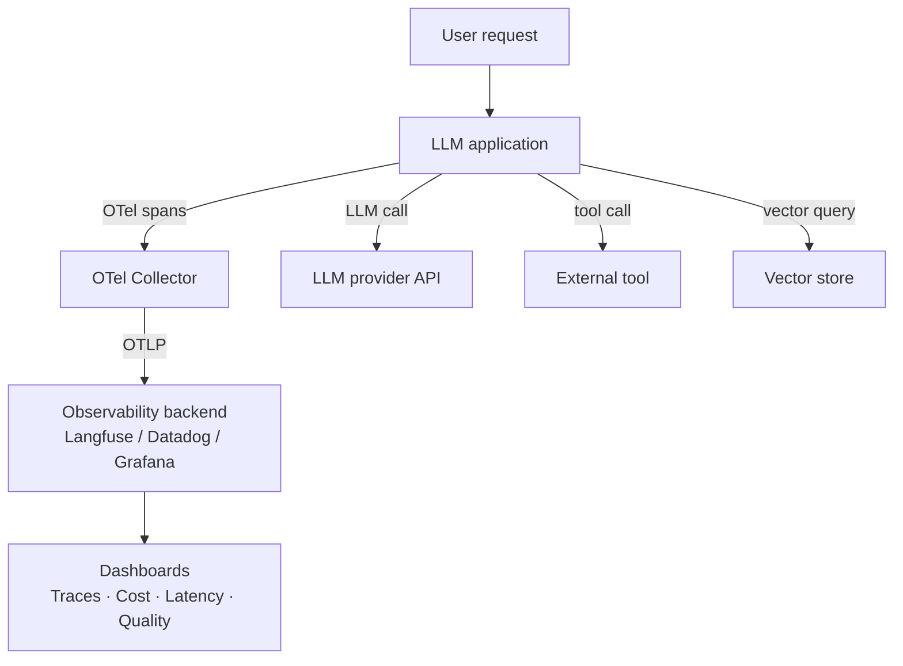

## Definition

**LLM observability** is the practice of instrumenting language model applications so that their internal behavior can be understood from their external outputs. Borrowed from distributed systems observability, the three pillars — **logs**, **metrics**, and **traces** — are extended with AI-specific signals: token counts, model names, prompt templates, retrieved chunks, tool calls, and latency per generation step.

Observability for AI systems is harder than for conventional services because LLM calls are non-deterministic, multi-step agent pipelines introduce branching execution paths, and a single user action can trigger dozens of nested LLM calls. Without structured tracing, debugging a bad output means replaying the entire session manually.

**OpenTelemetry (OTel)** has emerged as the standard foundation. The OTel GenAI Semantic Conventions (stable in OTel v1.37+, 2025) define canonical attribute names — `gen_ai.request.model`, `gen_ai.usage.input_tokens`, `gen_ai.provider.name` — so that traces from any instrumented framework can be ingested by any compatible backend (Langfuse, Datadog, New Relic, Grafana Tempo) without SDK changes.

## How it works

Each logical operation — an LLM call, a retrieval step, a tool invocation — is wrapped in an **OTel span**. Spans carry start/end timestamps, status, and attributes. Nested spans form a **trace tree** that represents the full execution path of a single request. Backends ingest traces over OTLP (HTTP or gRPC) and render them as waterfall diagrams, enabling root-cause analysis when a response is slow or incorrect.

## When to use / When NOT to use

| Scenario | Instrument | Defer or skip |
|---|---|---|
| Multi-step agent with tool calls | Yes — trace every span to debug loops and failures | No — logs alone cannot reconstruct agent reasoning |
| Production RAG pipeline | Yes — trace retrieval + generation separately | No — combined latency metrics hide retrieval vs. LLM bottlenecks |
| Cost management across teams | Yes — attribute tokens and spend per user/team | No — unattributed spend leads to surprise bills |
| Single-call script / prototype | Maybe — lightweight logging is sufficient | Yes — full OTel setup is overkill |
| Regulated environment (HIPAA, GDPR) | Yes — but scrub PII before export | No — never ship raw prompt/response content to third-party backends without review |

## Key concepts

| Concept | Description |
|---|---|
| Span | Single timed operation (one LLM call, one tool call) |
| Trace | Tree of spans representing one end-to-end request |
| OTel GenAI SIG | OpenTelemetry working group defining AI-specific semantic conventions |
| Token attribution | Tracking `input_tokens` and `output_tokens` per span for cost accounting |
| Session grouping | Linking traces that belong to the same user conversation |

## Sources

- [OpenTelemetry GenAI Semantic Conventions](https://opentelemetry.io/docs/specs/semconv/gen-ai/) — canonical attribute definitions for LLM and agent spans
- [OpenTelemetry blog — GenAI observability](https://opentelemetry.io/blog/2026/genai-observability/) — official OTel blog post on the GenAI SIG work
- [AI Agent Observability — OTel blog 2025](https://opentelemetry.io/blog/2025/ai-agent-observability/) — evolving standards for agent-specific tracing
- [Langfuse documentation](https://langfuse.com/docs) — open-source LLM observability platform with OTel backend support
- [Uptrace — OpenTelemetry for AI systems](https://uptrace.dev/blog/opentelemetry-ai-systems) — practical guide to OTel instrumentation for LLM apps

## See also

- [Tracing](/docs/observability/tracing)
- [Langfuse](/docs/observability/langfuse)
- [Cost attribution](/docs/observability/cost-attribution)
- [MLOps](/docs/mlops)
- [Agents](/docs/agents)
