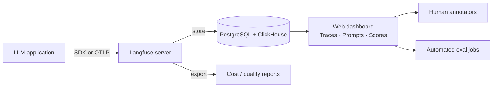

## Definition

**Langfuse** is an open-source platform for LLM observability, evaluation, and prompt management. It provides a self-hostable backend that ingests traces from LLM applications, lets teams annotate and score outputs, manage prompt versions, and monitor cost and quality metrics over time.

Langfuse differentiates itself from closed-source APM tools by being fully open-source (MIT license for the core), supporting self-hosting on any infrastructure, and actively aligning with the OpenTelemetry GenAI Semantic Conventions — meaning it can operate as a standard OTLP backend, receiving traces from any OTel-instrumented framework.

Key capabilities:
- **Tracing**: Captures nested spans for every LLM call, retrieval step, and tool invocation with full prompt/response logging.
- **Prompt management**: Versioned prompt templates with A/B comparison and deployment-safe rollout.
- **Scoring**: Attach human annotations or automated LLM-judge scores to any trace or span.
- **Analytics**: Token usage, cost attribution, latency p50/p95/p99, quality trends over time.
- **Datasets**: Create curated eval datasets from production traces for regression testing.

## How it works

Applications instrument calls using the Langfuse Python or JS/TS SDK, or by pointing their OTel exporter at the Langfuse OTLP endpoint (`/api/public/otel`). Langfuse stores traces in PostgreSQL (metadata, hierarchy) and ClickHouse (high-volume analytics). The web dashboard provides trace waterfall views, prompt diffs, and score trend charts.

## When to use / When NOT to use

| Scenario | Use Langfuse | Consider alternatives |
|---|---|---|
| Self-hosted observability required (data privacy) | Yes — self-host on your own infra | No — cloud-only tools (Helicone, LangSmith) won't work |
| Prompt versioning and A/B testing | Yes — first-class prompt management built in | No — if you manage prompts in code without UI tooling |
| Small team wanting one tool for tracing + eval | Yes — integrates both in a single platform | No — if you already have Datadog + a separate eval tool |
| High-volume production (>10M traces/month) | Yes — ClickHouse backend scales to this level | Maybe — benchmark self-hosted performance before committing |
| Need Braintrust-style human annotation queue | Yes — annotation queue and scoring are built in | No — Braintrust has a more polished annotation UX |

## Integration patterns

| Integration | Method |
|---|---|
| Python SDK | `langfuse.trace()` / `langfuse.generation()` context managers |
| JS/TS SDK | `langfuse.trace()` with callback and decorator patterns |
| LangChain | `CallbackHandler` — zero-code change, drop-in integration |
| LlamaIndex | `LlamaIndexInstrumentor` via one-line setup |
| OpenAI SDK | `langfuse.openai` drop-in wrapper |
| Any OTel framework | Point `OTEL_EXPORTER_OTLP_ENDPOINT` to Langfuse OTLP endpoint |

## Sources

- [Langfuse documentation](https://langfuse.com/docs) — full product documentation covering SDK, self-hosting, and integrations
- [Langfuse GitHub](https://github.com/langfuse/langfuse) — open-source repository (MIT license)
- [Langfuse OpenTelemetry integration](https://langfuse.com/integrations/native/opentelemetry) — guide to using Langfuse as an OTLP backend
- [Langfuse prompt management](https://langfuse.com/docs/prompts/get-started) — versioned prompt management with SDK retrieval

## See also

- [Observability](/docs/observability)
- [Tracing](/docs/observability/tracing)
- [Cost attribution](/docs/observability/cost-attribution)
- [Evals](/docs/evals)
