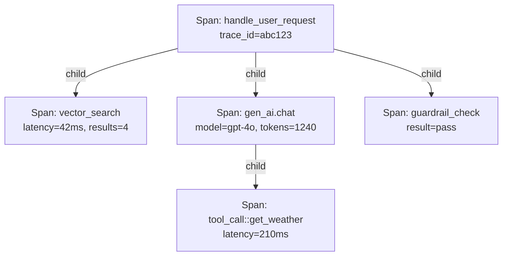

## Definition

**Tracing** in LLM applications is the practice of instrumenting every meaningful operation — an LLM call, a retrieval step, a tool invocation, a guardrail check — as a **span**, and linking related spans into a **trace** that represents the complete execution path of one user request.

Traces give engineers the ability to answer questions that logs and metrics alone cannot: Why did this response take 8 seconds? Which retrieval chunk was responsible for the hallucinated claim? Which agent step caused the cost spike? Without tracing, these questions require tedious manual log correlation.

**OpenTelemetry (OTel)** is the open standard for distributed tracing, and its **GenAI Semantic Conventions** (released as stable in OTel v1.37+, 2025) define the canonical attributes for AI spans: `gen_ai.request.model`, `gen_ai.usage.input_tokens`, `gen_ai.usage.output_tokens`, `gen_ai.provider.name`, `gen_ai.system`, and more. Standardization means that traces emitted by LangChain, LlamaIndex, or CrewAI can all be ingested by Datadog, Grafana, or Langfuse without format conversion.

## How it works

### Span anatomy

Each OTel span has:
- A **name** (e.g. `gen_ai.chat`, `db.vector_search`)
- **Start / end timestamps** for latency measurement
- A **status** (OK, ERROR)
- **Attributes** carrying structured metadata (model name, token counts, prompt template ID)
- Optional **events** (e.g. streaming chunk timestamps)
- A **parent span ID** linking it to the enclosing operation

### Trace assembly

The OTel SDK, instrumentation libraries (opentelemetry-instrumentation-openai, opentelemetry-instrumentation-langchain), or manual span creation propagate the `trace_id` through all nested calls. The OTel Collector receives spans, applies sampling and batching, and forwards them over OTLP to an observability backend.

## When to use / When NOT to use

| Scenario | Add tracing | Skip tracing |
|---|---|---|
| Multi-step agent with tool calls | Yes — essential for debugging which step failed | No — without tracing, debugging requires replay |
| RAG pipeline (retrieve + generate) | Yes — separate spans for retrieval vs. LLM reveal the bottleneck | No — a single latency metric hides where time is spent |
| Simple single-call chat endpoint | Maybe — lightweight span for latency; skip attribute-rich instrumentation | Yes — overkill for a one-call app |
| Regulated industry requiring audit trail | Yes — traces provide immutable call records | No — never skip in regulated contexts |
| Development / local testing | Maybe — sampling at 100% is fine locally | Yes — no need to export; use console exporter for debugging |

## OTel GenAI key attributes

| Attribute | Type | Description |
|---|---|---|
| `gen_ai.system` | string | LLM provider (`openai`, `anthropic`, `vertex_ai`) |
| `gen_ai.request.model` | string | Requested model ID |
| `gen_ai.response.model` | string | Actual model that served the request |
| `gen_ai.usage.input_tokens` | int | Prompt token count |
| `gen_ai.usage.output_tokens` | int | Completion token count |
| `gen_ai.operation.name` | string | Operation type (`chat`, `embeddings`, `rerank`) |
| `server.address` | string | API endpoint hostname |

## Sources

- [OpenTelemetry GenAI Semantic Conventions](https://opentelemetry.io/docs/specs/semconv/gen-ai/) — canonical attribute definitions for LLM and agent spans
- [OTel blog — GenAI observability 2026](https://opentelemetry.io/blog/2026/genai-observability/) — implementation guide for OTel GenAI tracing
- [OTel blog — AI agent observability 2025](https://opentelemetry.io/blog/2025/ai-agent-observability/) — evolving standards for agent-level spans and conventions
- [OpenTelemetry for AI — Zylos Research](https://zylos.ai/research/2026-02-28-opentelemetry-ai-agent-observability) — deep dive on agent framework-specific instrumentation
- [Langfuse OTel integration](https://langfuse.com/integrations/native/opentelemetry) — receiving OTel spans in Langfuse as an OTLP backend

## See also

- [Observability](/docs/observability)
- [Langfuse](/docs/observability/langfuse)
- [Cost attribution](/docs/observability/cost-attribution)
- [Agents](/docs/agents)
