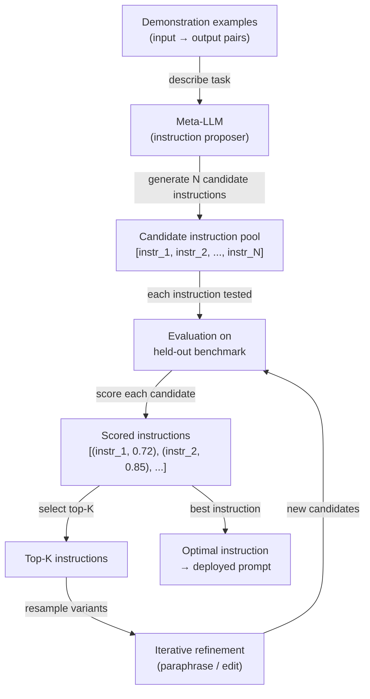

## Definition

Automatic Prompt Engineering (APE) is the practice of using a language model to generate and optimize prompt instructions rather than writing them by hand. Introduced by Zhou et al. (2022) in the paper *Large Language Models Are Human-Level Prompt Engineers*, APE frames prompt design as a program synthesis problem: given a set of input-output demonstration pairs, find the natural-language instruction that, when prepended to a prompt, maximizes task performance on a held-out evaluation set. The searching, scoring, and refinement of candidate instructions are all performed programmatically — the human's role shifts from prompt author to task definer and metric designer.

The motivation for automating prompt design is practical. Manual prompt engineering is time-consuming, brittle, and biased by the human engineer's intuitions about how language models process text. Small changes in wording — "Think step by step" vs "Let's think carefully step by step" — produce measurable accuracy differences that are impossible to predict without empirical testing. APE replaces this guesswork with systematic search: generate a large pool of candidate instructions, evaluate each on a benchmark, and keep the best performers. This is the same design philosophy behind hyperparameter search in classical ML — humans specify the objective, machines do the search.

APE is distinct from soft prompt tuning (which optimizes continuous token embeddings via gradient descent) and from fine-tuning (which updates model weights). APE operates entirely in natural-language space using frozen models. This makes it model-agnostic, interpretable — you can read and understand the winning instruction — and deployable without any training infrastructure. The trade-off is that the discrete search space of natural language is vast and non-differentiable, so APE relies on sampling, scoring heuristics, and iterative refinement rather than gradient-based optimization.

## How it works



### Candidate generation

The APE loop starts with a set of demonstration examples — input-output pairs that illustrate the target task. These examples are passed to a meta-LLM (the same or a different model) with a meta-prompt that asks it to infer the instruction that would produce the given outputs from the given inputs. Typical meta-prompts look like: *"Here are input-output pairs. What is the instruction that produces these outputs? Generate 10 diverse candidate instructions."* By sampling at temperature > 0, the meta-LLM produces a diverse pool of candidate instructions that differ in wording, framing, and specificity. The quality and diversity of this initial pool directly determines the ceiling of the optimization.

### Scoring

Each candidate instruction is instantiated as a prefix in the prompt (or as the system message) and evaluated against a held-out benchmark. The scoring function is task-specific: accuracy for classification, execution correctness for code generation, ROUGE or BERTScore for summarization, or a secondary LLM judge for open-ended tasks. The key design decision is whether the score is computed with the meta-LLM itself (using log-probability estimates of correct outputs) or with a separate task-specific evaluator. Log-probability scoring is faster but can overfit to the meta-LLM's calibration. Separate evaluator scoring is more reliable but requires labeled data.

### Iterative refinement

After the initial scoring, the top-K candidate instructions are selected for refinement. The meta-LLM is prompted to paraphrase, extend, or combine the best candidates — yielding a new pool of variants that are semantically related but textually distinct. This refinement loop runs for a fixed number of iterations or until a target score threshold is reached. Each iteration narrows the search around promising regions of instruction space, analogous to evolutionary search or hill climbing over a discrete landscape. In practice, one or two rounds of refinement after a large initial pool (N ≥ 50) tends to recover most of the achievable gain.

## Comparisons

| Criterion | APE | Manual prompt engineering | Fine-tuning |
|-----------|-----|--------------------------|-------------|
| Human effort | Low — define task and metric | High — iterative authoring and testing | High — data collection and training runs |
| Requires labeled data | Yes — for scoring | No — can be done empirically | Yes — typically thousands of examples |
| Model weights updated | No | No | Yes |
| Output interpretable | Yes — natural-language instruction | Yes | No — weight changes are opaque |
| Generalizes across models | Yes — re-run search per model | Partially | No — tied to base model |
| Latency at inference | None — no runtime overhead | None | None |
| Cost | Medium — N × M evaluation calls | Low | High — GPU time |
| Best for | Tasks with a clear metric and ≥ 50 examples | Novel tasks without a metric | High-volume tasks where accuracy gains justify training |

## When to use / When NOT to use

| Use when | Avoid when |
|----------|------------|
| You have a labeled evaluation set and can define a clear scoring metric | The task has no reliable automated metric — APE cannot search without a signal |
| Manual prompt iteration is taking more than a day and accuracy still plateaus | You need a result immediately — APE requires multiple LLM API calls for evaluation |
| You are deploying the same prompt to many users and even 1–2% accuracy gains matter | Your demonstration pool is too small (< 10 examples) — scoring will be noisy |
| You want to audit the best-found instruction for safety before deployment | The task requires creativity or subjective judgment where a single metric is misleading |
| You are using DSPy or a similar framework where prompt optimization is built in | Fine-tuning is already planned — APE optimizes prompts, not weights |

## Code examples

### Basic APE loop with OpenAI

```python
# Minimal APE implementation: generate instructions, score, return best
# pip install openai

import os
import re
from openai import OpenAI

client = OpenAI(api_key=os.environ["OPENAI_API_KEY"])

# ----- Task definition --------------------------------------------------------
# Demonstrations: pairs of (input, expected_output)
DEMOS = [
    ("The movie was absolutely fantastic, I loved every minute.", "positive"),
    ("Terrible film, waste of time and money.", "negative"),
    ("It was okay, nothing special but not bad either.", "neutral"),
    ("A masterpiece of modern cinema.", "positive"),
    ("I walked out after 20 minutes.", "negative"),
]

# Held-out evaluation set for scoring
EVAL_SET = [
    ("A stunning visual experience with weak writing.", "positive"),  # debatable but positive
    ("Boring, predictable, and too long.", "negative"),
    ("I enjoyed it more than I expected.", "positive"),
    ("Neither good nor bad — forgettable.", "neutral"),
    ("One of the best films of the decade.", "positive"),
]


# ----- Step 1: Generate candidate instructions --------------------------------
def generate_instructions(demos: list[tuple[str, str]], n: int = 10) -> list[str]:
    """Ask a meta-LLM to infer N candidate instructions from demo pairs."""
    demo_text = "\n".join(f'Input: "{inp}"\nOutput: "{out}"' for inp, out in demos)
    meta_prompt = (
        f"Here are input-output example pairs for a text classification task:\n\n"
        f"{demo_text}\n\n"
        f"Generate {n} diverse natural-language instructions that, when prepended to "
        f"an input text, would cause a language model to produce the correct output. "
        f"Return one instruction per line, numbered."
    )
    resp = client.chat.completions.create(
        model="gpt-4o-mini",
        messages=[{"role": "user", "content": meta_prompt}],
        temperature=0.9,
        max_tokens=800,
    )
    raw = resp.choices[0].message.content
    lines = [re.sub(r"^\d+[\.\)]\s*", "", l).strip() for l in raw.splitlines()]
    return [l for l in lines if len(l) > 20]  # filter out empty / too-short lines


# ----- Step 2: Score an instruction on the eval set --------------------------
def score_instruction(instruction: str, eval_set: list[tuple[str, str]]) -> float:
    """Return accuracy of the instruction on the eval set."""
    correct = 0
    for text, expected in eval_set:
        prompt = f"{instruction}\n\nText: {text}\nLabel:"
        resp = client.chat.completions.create(
            model="gpt-4o-mini",
            messages=[{"role": "user", "content": prompt}],
            temperature=0,
            max_tokens=5,
        )
        prediction = resp.choices[0].message.content.strip().lower()
        if expected.lower() in prediction:
            correct += 1
    return correct / len(eval_set)


# ----- Step 3: Iterative refinement of top-K instructions --------------------
def refine_instructions(top_instructions: list[str], n_variants: int = 5) -> list[str]:
    """Ask the meta-LLM to paraphrase the top instructions to get variants."""
    instr_text = "\n".join(f"- {i}" for i in top_instructions)
    refine_prompt = (
        f"Here are high-performing instructions for a sentiment classification task:\n"
        f"{instr_text}\n\n"
        f"Generate {n_variants} new instructions that paraphrase or combine the above "
        f"to potentially improve performance. Return one per line."
    )
    resp = client.chat.completions.create(
        model="gpt-4o-mini",
        messages=[{"role": "user", "content": refine_prompt}],
        temperature=0.7,
        max_tokens=500,
    )
    raw = resp.choices[0].message.content
    lines = [l.strip().lstrip("- ") for l in raw.splitlines()]
    return [l for l in lines if len(l) > 20]


# ----- APE main loop ---------------------------------------------------------
def run_ape(
    demos: list[tuple[str, str]],
    eval_set: list[tuple[str, str]],
    n_candidates: int = 10,
    top_k: int = 3,
    n_refinement_rounds: int = 1,
) -> dict:
    print("=== APE: Generating initial candidates ===")
    candidates = generate_instructions(demos, n=n_candidates)
    print(f"Generated {len(candidates)} candidates.\n")

    all_scored: list[tuple[str, float]] = []

    for round_num in range(n_refinement_rounds + 1):
        print(f"--- Round {round_num + 1}: Scoring {len(candidates)} instructions ---")
        round_scores = []
        for instr in candidates:
            score = score_instruction(instr, eval_set)
            round_scores.append((instr, score))
            print(f"  [{score:.0%}] {instr[:80]}{'...' if len(instr) > 80 else ''}")
        all_scored.extend(round_scores)

        if round_num < n_refinement_rounds:
            top = [i for i, _ in sorted(round_scores, key=lambda x: -x[1])[:top_k]]
            candidates = refine_instructions(top, n_variants=n_candidates // 2)
            print()

    best_instr, best_score = max(all_scored, key=lambda x: x[1])
    return {"instruction": best_instr, "score": best_score, "all_scored": all_scored}


if __name__ == "__main__":
    result = run_ape(DEMOS, EVAL_SET, n_candidates=8, top_k=3, n_refinement_rounds=1)
    print(f"\n=== Best instruction (accuracy {result['score']:.0%}) ===")
    print(result["instruction"])
```

### Using DSPy for structured APE

```python
# DSPy provides a higher-level abstraction for automatic prompt optimization.
# pip install dspy-ai

import dspy

# Configure DSPy with your LLM backend
lm = dspy.LM("openai/gpt-4o-mini", api_key=os.environ["OPENAI_API_KEY"])
dspy.configure(lm=lm)


# Define the task as a DSPy signature
class SentimentClassifier(dspy.Signature):
    """Classify the sentiment of a movie review as positive, negative, or neutral."""
    review: str = dspy.InputField(desc="A movie review text")
    sentiment: str = dspy.OutputField(desc="One of: positive, negative, neutral")


# Wrap in a module
class SentimentModule(dspy.Module):
    def __init__(self):
        self.classify = dspy.Predict(SentimentClassifier)

    def forward(self, review: str) -> dspy.Prediction:
        return self.classify(review=review)


# Training examples
trainset = [
    dspy.Example(review=inp, sentiment=out).with_inputs("review")
    for inp, out in [
        ("Absolutely loved it!", "positive"),
        ("Worst movie ever.", "negative"),
        ("It was fine, nothing memorable.", "neutral"),
    ]
]


# Use MIPROv2 optimizer to automatically engineer the prompt
def optimize_with_dspy():
    module = SentimentModule()
    optimizer = dspy.MIPROv2(metric=dspy.evaluate.answer_exact_match, auto="light")
    optimized = optimizer.compile(module, trainset=trainset)
    print(optimized.classify.extended_signature)  # shows the optimized instruction
    return optimized


if __name__ == "__main__":
    optimized_module = optimize_with_dspy()
    result = optimized_module(review="A surprisingly moving and well-acted drama.")
    print(result.sentiment)
```

## Practical resources

- [Large Language Models Are Human-Level Prompt Engineers (Zhou et al., 2022)](https://arxiv.org/abs/2211.01910) — The original APE paper; introduces the instruction induction formulation, the iterative Monte Carlo search, and benchmark results across 24 NLP tasks.
- [DSPy: Compiling Declarative Language Model Calls into Self-Improving Pipelines (Khattab et al., 2023)](https://arxiv.org/abs/2310.03714) — The framework that operationalizes APE-style optimization as a first-class abstraction; see also [dspy.ai](https://dspy.ai).
- [Automatic Prompt Optimization with "Gradient Descent" and Beam Search (Pryzant et al., 2023)](https://arxiv.org/abs/2305.03495) — Extends APE with a "textual gradient" approach that uses LLM-generated feedback as a proxy gradient signal.
- [PromptBreeder: Self-Referential Self-Improvement Via Prompt Evolution (Fernando et al., 2023)](https://arxiv.org/abs/2309.16797) — An evolutionary APE approach that also evolves the meta-prompts used for instruction generation.

## See also

- [Prompt engineering](/docs/prompt-engineering)
- [Self-evaluation and calibration](/docs/prompt-engineering/self-evaluation-calibration)
- [Fine-tuning](/docs/llms/fine-tuning)
